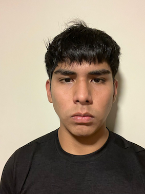
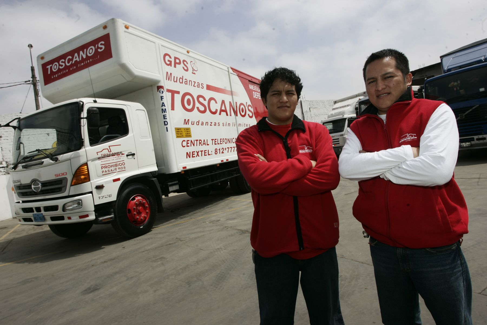
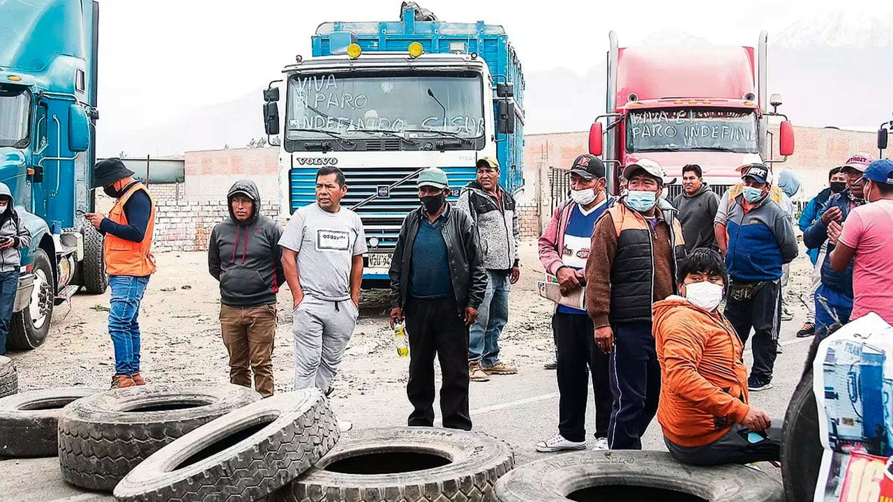



Universidad Peruana de Ciencias Aplicadas
# Informe de Trabajo Final

### 
Aplicaciones Web
 

Ciclo: 2025-01

Carrera: Ingenieria de Software
  

NRC: 2956
 

Profesor: Angel Augusto Velasquez Nuñez
 

"INFORME DE TRABAJO FINAL (TP1)"
 

### 
Startup: Bicas team

### 
Producto: MoviGestion

### Integrantes:

<table >
    <tr>
        <th>Nombre</th>
        <th>Codigo</th>
    </tr>
    <tr>
        <td>Huarcaya Chavez Miguel Alejandro Daniel</td>
        <td>u202116207</td>
    </tr>
    <tr>
        <td>Tarazona Medina Piero Abel</td>
        <td>u202217633</td>
    </tr>
    <tr>
        <td>Elias Torres Espinoza</td>
        <td>u20191A453</td>
    </tr>
    <tr>
        <td>Donayre Peña, Moises Rodolfo</td>
        <td>u202216021</td>
    </tr>
    <tr>
        <td>Chacon Martinez, Mauricio Sebastián</td>
        <td>u202212911</td>
    </tr>
    <tr>
        <td>Valenzuela Huillcaya, Aldhair Johan Juan</td>
        <td>u20201F572</td>
    </tr>
</table>

 mayo, 2025

---
---
---

**Registro de Versiones del Informe:**

En esta sección se resumen todas las modificaciones relevantes que sean realizadas sobre el informe durante el ciclo de vida del proyecto.

---
---
---

# Project Report Collaboration Insights
Link de Repositorio: https://github.com/upc-Soluciones-IOT-BicasTeam/upc-iot-BicasTeam-report.git

TB1: En esta etapa, el equipo se reunió para definir el alcance y los objetivos, asignando tareas específicas a cada miembro. Comenzamos recopilando datos y revisando información relevante, con cada miembro contribuyendo con investigaciones individuales que luego compartimos y discutimos en reuniones periódicas. En GitHub, establecimos un flujo de trabajo para colaborar en la redacción del informe, creando un repositorio dedicado con secciones divididas en archivos Markdown para facilitar la colaboración y revisión

TP1: Implementamos todo lo investigado en la anterior entrega en una aplicacion web, mas especificamente la capa de presentación. Utilizamos una "fake api" para emular un "back-end" de donde recoger datos y mostrar una simulacion realista de como se veria nuestra aplicacion.
Utilizamos GitHub Pages para desplegar el "front-end" de nuestra aplicación y "beeceptor" para la "fake api".
Po ultimo, corregimos ciertos puntos del figma de la entrega anterior

---
---
---

# Contenido

### [Capítulo I: Introducción](#capítulo-i-introducción-1)

---
---
---

# Student Outcome

**El curso contribuye al cumplimiento del Student Outcome ABET:**
**ABET – EAC - Student Outcome** 

Criterio: La capacidad de funcionar efectivamente en un equipo cuyos miembros
juntos proporcionan liderazgo, crean un entorno de colaboración e inclusivo,
establecen objetivos, planifican tareas y cumplen objetivos.
En el siguiente cuadro se describe las acciones realizadas y enunciados de
conclusiones por parte del grupo, que permiten sustentar el haber alcanzado el logro
del ABET – EAC - Student Outcome 5.

---
---
---

# Capítulo I: Introducción
## 1.1 Startup Profile
### 1.1.1 Descripción de la Startup
MoviGestion transforma la gestión de flotas tradicional en una operación inteligente y conectada. Combinamos una plataforma web, una aplicación móvil intuitiva, y la integración de dispositivos IoT para el monitoreo en tiempo real de la ubicación (GPS), temperatura y humedadde la carga y/o vehículo. Maximizamos la eficiencia, aseguramos la integridad de la carga y ofrecemos control total a las empresas de transporte.

Con esta combinación, ayudamos a las empresas de transporte a maximizar la eficiencia operativa, reducir costos, prevenir pérdidas por condiciones ambientales inadecuadas y tomar decisiones basadas en datos precisos. Nuestra plataforma permite una supervisión total del estado de los envíos, vehículos y conductores, con alertas inteligentes configuradas según los requisitos específicos de cada carga, lo que asegura una trazabilidad completa y la integridad del producto en cada etapa del proceso logístico.

Además, ofrecemos un modelo freemium escalable, ideal para empresas que deseen comenzar a digitalizar sus operaciones con la posibilidad de crecer según sus necesidades. Nuestro enfoque dual –administradores y conductores– garantiza que cada usuario cuente con herramientas especializadas y eficientes adaptadas a su rol en la operación.

**Misión**: Proporcionar a las empresas de trasnporte una solución tecnológica integral e inteligente que optimice la gestión de flotas, garantice la integridad de la carga mediante el monitoreo activo y la telemetría avanzada, y mejore la eficiencia operativa y la rentabilidad de nuestros clientes.

**Visión**: Ser la platafoma líder y el socio tecnológico preferido para la gestión inteligente de flotas, impulsando la transformación digital del sector transporte a través de la innovación continua en IoT y análisis de datos para un futuro logístico más eficiente, seguro y sostenible.

### 1.1.2 Perfiles de integrantes del equipo

| Integrante                               | Información                                                                                                                                                                                              | Foto                                                                  |
| :--------------------------------------- | :------------------------------------------------------------------------------------------------------------------------------------------------------------------------------------------------------- | :-------------------------------------------------------------------- |
| **Piero Abel Tarazona Medina** | `Código:` U202217633    `Carrera:` Ingeniería de Software   Estudiante de 7mo ciclo. Me caracterizo por mi pensamiento crítico y capacidad de encontrar soluciones viables para distintos problemas. Conocimientos en HTML, CSS, C++, Java, Javascript, C#. |     |
| **Mauricio Sebastián Chacon Martinez** | `Código:` U202212911   `Carrera:` Ingeniería de Software   Apasionado por la programación. Conocimientos en HTML, CSS, Javascript, y Astro. Persona responsable y comprometida con su desarrollo profesional. |  |
| **Miguel Huarcaya Chavez** | `Código:` U202116207   `Carrera:` Ingeniería de Software   Conocimientos en JavaScript, TypeScript, HTML, CSS, Vue y Angular. Persona responsable y colaborativa.                                  |     |
| **Elias Torres Espinoza** | `Código:` U20191A453   `Carrera:` Ingeniería de Software   Conocimientos en Angular, Vue, TypeScript, JavaScript, C++, C#, Python, HTML y CSS.                                                    |     |
| **Moises Rodolfo Donayre Peña** | `Código:` U202216021   `Carrera:` Ingeniería de Software   Apasionado por el desarrollo web y móvil. Conocimientos en Vue, Angular y Flutter. Persona empática y colaborativa.                     |     |
| **Aldhair Johan Juan Valenzuela Huillcaya**| `Código:` U20201F572   `Carrera:` Ingeniería de Software   Comunicativo y analítico. Conocimientos en Angular, Vue, React, Flutter y Kotlin.                                                  |   |

## 1.2 Solution Profile
### 1.2.1 Antecedentes y problemática

En el sector del transporte empresarial, la gestión de flotas representa un reto creciente que va más allá de la simple asignación de vehículos y conductores. La complejidad de mantener operaciones eficientes, seguras y rentables se ve agravada por la necesidad de monitorear en tiempo real variables críticas como la ubicación, la temperatura y la humedad, especialmente en cargas sensibles. Muchos sistemas actuales de gestión de fflotas se quedan cortos: carecen de flexibilidad, no ofrecen una integración real con tecnologías IoT y presentan interfaces poco amigables que limitan su adopción por parte de usuarios clave como gerentes de flota y conductores.
Esa falta de soluciones completas genera consecuencias importantes: pérdida de productos por condiciones ambientales no controladas, falta de visibilidad operativa, toma de decisiones reactivas en lugar de proactivas, y una gestión ineficiente de recursos humanos y logísticos. Además, los empresarios y transportistas necesitan herramientas diferenciadas y especializadas que se adapten a sus roles, y que, al mismo tiempo, trabajen en conjunto dentro de un ecosistema digital centralizado.

**Objetivo Principal**:
Desarrollar una solución tecnológica integral, denominada MoviGestion, que transforme la gestión de flotas tradicionales en una operación inteligente, conectada y proactiva, incorporando monitoreo ambiental en tiempo real, analítica avanzada, y funcionalidades especializadas tanto para gerentes como para conductores.

**Objetivos Específicos**:

1. Diseñar una plataforma web robusta orientada a gerentes de flota, que centralice la planificación, seguimiento, y análisis de operaciones logísticas con foco en eficiencia y control ambiental.
2. Desarrollar una aplicación móvil intuitiva para conductores, que facilite la gestión de sus envíos, el reporte de incidentes y el monitoreo de las condiciones de la carga.
3. Integrar tecnología IoT avanzada, que permita el seguimiento en tiempo real de la ubicación GPS, temperatura y humedad de los vehículos y su carga.
4. Incorporar un sistema de alertas preventivas e informes analíticos que permitan tomar decisiones informadas basadas en datos contextuales y actualizados.

**Restricciones**:

1. La plataforma debe ser accesible desde distintos dispositivos, priorizando la experiencia de uso tanto en escritorio como en móvil.
2. Todos los datos transmitidos y almacenados deben cumplir con estándares de seguridad y privacidad.
3. El sistema debe estar preparado para escalar y soportar múltiples usuarios concurrentes sin comprometer la estabilidad ni el rendimiento.

Utilizaremos la técnica de las 5W y 2Hs para desglosar el problema y entenderlo en detalle. Esta técnica nos proporcionará respuestas claras sobre qué, cuándo, dónde, quién, por qué, cómo y cuánto, lo que nos ayudará a encontrar soluciones efectivas.

**Técnica 5Ws y 2Hs**

### Técnica 5Ws y 2Hs

| Elemento      | Pregunta                                                                 | Descripción                                                                                                                                                                                |
|---------------|--------------------------------------------------------------------------|--------------------------------------------------------------------------------------------------------------------------------------------------------------------------------------------|
| **What?**     | ¿Cuál es el problema?                                                    | Las empresas de transporte enfrentan una gestión ineficiente de sus flotas, especialmente en lo relacionado al monitoreo ambiental, trazabilidad de envíos y control operativo en tiempo real. |
| **When?**     | ¿Cuándo se manifiesta el problema?                                       | Durante la operación diaria, especialmente en envíos críticos que requieren control ambiental o cuando hay múltiples vehículos y conductores involucrados simultáneamente.                  |
| **Where?**    | ¿Dónde ocurre el problema?                                               | En todo el ciclo de gestión de flotas: asignación de envíos, seguimiento, monitoreo ambiental, control de recursos y comunicación entre gerentes y conductores.                            |
| **Who?**      | ¿A quién afecta el problema?                                             | A los empresarios y gerentes de flota que requieren control y eficiencia, y a los conductores que necesitan herramientas claras para gestionar sus tareas y reportar novedades.            |
| **Why?**      | ¿Por qué sucede el problema?                                             | Por la falta de soluciones integrales que combinen monitoreo ambiental, control en tiempo real, comunicación efectiva y análisis estratégico en una misma plataforma accesible.            |
| **How?**      | ¿Cómo se diferencia del estado óptimo?                                   | En el estado actual, se presentan pérdidas por fallas en el control ambiental, decisiones tardías por falta de datos, y operaciones fragmentadas. El estado óptimo implicaría control total y proactividad. |
| **How much?** | ¿Cuánto impacto genera el problema?                                      | Genera costos adicionales, riesgo de pérdida de carga sensible, baja productividad operativa y menor satisfacción del cliente. MoviGestion busca reducir significativamente ese impacto.   |

### 1.2.2 Lean UX Process

#### 1.2.2.1 Lean UX Problem Statements

El estado actual del sector de gestión de flotas y logística en el Perú se basa principalmente en procesos tradicionales, manuales y sistemas fragmentados. La mayoría de las empresas de transporte pequeñas y medianas aún dependen de herramientas básicas como el GPS o registros en papel para gestionar sus envíos, lo que limita la visibilidad en tiempo real sobre el estado de los vehículos, las condiciones de la carga y la eficiencia de las rutas.
Lo que los productos o servicios existentes no logran resolver es la integración de monitoreo ambiental en tiempo real (temperatura, humedad), coordinación con los conductores y la toma de decisiones basada en datos, todo dentro de una solución accesible, simple y adaptada a las necesidades reales del mercado local. Las soluciones actuales suelen ser costosas, complejas o poco prácticas para empresas de menor escala.
Nuestro producto abordará esta brecha mediante una plataforma integrada que combina un panel web, una aplicación móvil y dispositivos IoT, permitiendo a las empresas de transporte monitorear en tiempo real la ubicación de sus vehículos, las condiciones de la carga y el comportamiento de los conductores. Con esta información, podrán reducir pérdidas, mejorar la seguridad y optimizar su operación logística a través de alertas inteligentes y datos accionables.
Nuestro enfoque inicial será atender a las pequeñas y medianas empresas de transporte en Perú que desean comenzar a digitalizar sus operaciones, pero que no cuentan con los recursos técnicos o financieros para implementar sistemas de gestión de flotas a gran escala.
Sabremos que hemos tenido éxito cuando veamos que estas empresas utilizan activamente nuestra plataforma para monitorear al menos el 80% de su flota en tiempo real, reportan un aumento del 15% en su eficiencia operativa y una reducción en incidentes relacionados a daños en la carga o retrasos por fallas logísticas durante los primeros seis meses de uso.

#### 1.2.2.2 Lean UX Assumptions

1. Bussiness Assumptions
  - Creeemos que las empresas de transporte pequeñas y medianas estarán dispuestas a invertir en una solución digital si esta reduce sus costos logísticos.
  - Creemos que ofrecer una versión gratuita (freemiun) atraerá a empresas interesadas en digitalizar su operación sin un compromiso económico inicial.
  - Creemos que mejorar la trazabilidad y el control de flotas aumentará la reputación de nuestros clientes ante sus propios clientes finales.
2. Outcome Assumptions
  - Creemos que al usar nuestra solución, los usuarios mejorarán su eficiencia operativa al menos en un 15% en los primeros seis meses.
  - Creemos que nuestros usuarios podrán reducir la cantidad de incidencias relacionadas con mal manejo de carga sensible en un 30%.
  - Creemos que contar con monitoreo en tiempo real motivará a los usuarios a tomar decisiones más rápidas y fundamentales ante desvíos o eventos inesperados.
3. User Assumptions
  - Creemos que los administradores logísticos buscan herramientas simples, con buena visualización de datos y alertas automatizadas que les ayudan a anticiparse a problemas.
  - Creemos que los conductores valoran una app que sea intuitiva, con pocas acciones manuales, y que facilite su comunicación con la base.
  - Creemos que ambos perfiles (administradores y conductores) están abiertos a usar tecnología móvil o web siempre que no requiera conocimientos técnicos avanzados.
4. Feature Assumptions
  - Creemos que el rastreo GPS en tiempo real permitirá a los administradores mejorar la supervisión de sus unidades y prevenir desviaciones no autorizadas.
  - Creemos que el monitoreo de temperatura y humedad será especialmente valioso para empresas que transportan alimentos, medicinas u otros productos sensibles.
  - Creemos que las alertas automaticas cuando se detectan variaciones críticas (temperatura, ruta, velocidad) ayudarán a prevenir pérdidas o daños en la carga.
  - Creemos que una app para conductores que incluya geolocalización, recepción de instrucciones y registro de entregas facilitará su trabajo y reducirá errores.
  - Creemos que un panel de control web con visualización de datos en tiempo real facilitará el seguimiento de múltiples vehículos de forma simultánea.
  - Creemos que permitir a los usuarios configurar sus propios umbrales de alerta hará que la plataforma se adapte mejor a diferentes tipos de carga y necesidad operativa.
5. User Outcome Assumptions
  - Creemos que los administradores sentirán mayor control y seguridad al saber en todo momento la ubicación y estado de sus unidades y cargas.
  - Creemos que los conductores se sentirán mas respaldados y organizados al usar una app que centraliza sus instrucciones y tareas diarias.
  - Creemos que nuestros usuarios experimentarán una reducción del estrés y una mejora en la percepción de profesionalismo al digitalizar su operación logística.

#### 1.2.2.3 Lean UX Hypothesis Statements

- **Creemos que lograremos** una reducción del 15% en desvíos no autorizados y tiempos de entrega. **Sí** los administradores de flota **obtienen** un mayor control en tiempo real sobre la ubicación de sus vehículos **con** la funcionalidad de rastreo GPS en tiempo real.
- **Creemos que lograremos** reducir las pérdidas por mal estado de productos sensibles en un 30%. **Sí** las empresas que transportan alimentos, medicinas u otras cargas delicadas **obtienen** la capacidad de prevenir daños por condiciones ambientales inadecuadas **con** el monitoreo en tiempo real de temperatura y humedad.
- **Creemos que lograremos** mejorar la capacidad de reacción ante incidentes logísticos. **Sí** los administradores logísticos **obtienen** notificaciones oportunas para actuar ante desvíos de ruta o cambios críticos en las condiciones de la carga **con** la funcionalidad de alertas automáticas configurables.
- **Creemos que lograremos** una reducción de errores en la ejecución de rutas y entregas. **Sí** los conductores **obtienen** una herramienta centralizada para seguir instrucciones, registrar entregas y ubicarse **con** una aplicación movil intuitiva que incluya geolocalización y tareas asignadas.
- **Creemos que lograremos** una operación logística más ágil y organizada. **Sí** los administradores de operaciones **obtienen** una visualización clara y centralizada del estado de múltiples vehículos en tiempo real **con** un panel web interactivo y actualizado automáticamente.
- **Creemos que lograremos** mayor adopción y satisfacción de los usuarios en distintos sectores logísticos. **Sí** los administradores **obtienen** una herramienta flexible que se adapta a sus necesidades particulares de operación y tipo de carga **con** la posibilidad de configurar umbrales personalizados de alerta.

#### 1.2.2.4 Lean UX Canvas

<table>
<tr>
<td>Business Problem  El estado actual del sector de gestión de flotas y logística en el Perú se basa principalmente en procesos tradicionales, manuales y sistemas fragmentados. La mayoría de las empresas de transporte pequeñas y medianas aún dependen de herramientas básicas como el GPS o registros en papel para gestionar sus envíos, lo que limita la visibilidad en tiempo real sobre el estado de los vehículos, las condiciones de la carga y la eficiencia de las rutas.
Lo que los productos o servicios existentes no logran resolver es la integración de monitoreo ambiental en tiempo real (temperatura, humedad), coordinación con los conductores y la toma de decisiones basada en datos, todo dentro de una solución accesible, simple y adaptada a las necesidades reales del mercado local. Las soluciones actuales suelen ser costosas, complejas o poco prácticas para empresas de menor escala.
Nuestro producto abordará esta brecha mediante una plataforma integrada que combina un panel web, una aplicación móvil y dispositivos IoT, permitiendo a las empresas de transporte monitorear en tiempo real la ubicación de sus vehículos, las condiciones de la carga y el comportamiento de los conductores. Con esta información, podrán reducir pérdidas, mejorar la seguridad y optimizar su operación logística a través de alertas inteligentes y datos accionables.
Nuestro enfoque inicial será atender a las pequeñas y medianas empresas de transporte en Perú que desean comenzar a digitalizar sus operaciones, pero que no cuentan con los recursos técnicos o financieros para implementar sistemas de gestión de flotas a gran escala.
Sabremos que hemos tenido éxito cuando veamos que estas empresas utilizan activamente nuestra plataforma para monitorear al menos el 80% de su flota en tiempo real, reportan un aumento del 15% en su eficiencia operativa y una reducción en incidentes relacionados a daños en la carga o retrasos por fallas logísticas durante los primeros seis meses de uso.</td>
<td rowspan="2">Solutions  - Plataforma web modular que permita monitoreo centralizado de vehículos, condiciones de carga y rendimiento de conductores. 
- Aplicación móvil para conductores con geolocalización, registro de entregas, incidencias y recepción de instrucciones. 
- Integración con sensores IoT para medir temperatura, humedad y ubicación GPS en tiempo real. 
- Sistema de alertas inteligentes personalizable según tipo de carga, condiciones de ruta y criterios del usuario. 
- Configuración de umbrales críticos y reglas de automatización según la operación logística de cada empresa. 
- Visualización de reportes dinámicos y descarga de informes operativos para análisis y toma de decisiones. 
- Plan freemium con funcionalidades básicas y opción de escalar a planes pagos con acceso completo.</td>
<td>Business Outcomes  - Los administradores visualizan el estado de al menos el 80% de su flota en tiempo real desde el panel web. 
- Los usuarios configuran alertas automáticas personalizadas para monitoreo ambiental.  
- Los conductores registran entregas e incidencias usando la app en al menos el 70% de los trayectos.  
- Los usuarios responden a alertas críticas en menos de 15 minutos desde su emisión.  
- Los administradores descargan o revisan reportes analíticos semanalmente.  
- Las empresas activas registran y monitorean al menos un envío por día en la plataforma.  
- Usuarios en plan gratuito comienzan a usar funciones avanzadas en los primeros 10 días.</td>
</tr>
<tr>
<td>Users - Administradores logísticos: Encargados de supervisar envíos, flota y eficiencia operativa. 
- Conductores: Ejecutores en campo que necesitan herramientas sencillas e instrucciones claras. 
- Empresarios/Propietarios: Tomadores de decisiones que buscan eficiencia, ahorro y trazabilidad. </td>
<td>User Outcomes & Benefits  - Los administradores desean sentirse en control de sus operaciones, tomar decisiones basadas en datos y reducir el riesgo de pérdida de productos. - Los conductores quieren cumplir sus rutas sin complicaciones, sentirse acompañados por la empresa y no tener que depender de instrucciones confusas o procesos manuales. 
- Los usuarios quieren una experiencia sin fricciones: que la herramienta sea confiable, clara, y que les permita cumplir su trabajo sin estrés adicional. 
- Los usuarios desean ahorrar tiempo en tareas rutinarias como reportes e incidencias.  
- Las empresas buscan que su equipo se sienta empoderado y respaldado por la tecnología.  
- El uso exitoso de la plataforma debe hacer que los usuarios se sientan más seguros, profesionales y valorados dentro de su organización.</td>
</tr>
<tr>
<td>Hypotheses  - Creemos que lograremos una reducción del 15% en desvíos no autorizados y tiempos de entrega. Sí los administradores de flota obtienen un mayor control en tiempo real sobre la ubicación de sus vehículos con la funcionalidad de rastreo GPS en tiempo real. 
- Creemos que lograremos reducir las pérdidas por mal estado de productos sensibles en un 30%. Sí las empresas que transportan alimentos, medicinas u otras cargas delicadas obtienen la capacidad de prevenir daños por condiciones ambientales inadecuadas con el monitoreo en tiempo real de temperatura y humedad. 
- Creemos que lograremos mejorar la capacidad de reacción ante incidentes logísticos. Sí los administradores logísticos obtienen notificaciones oportunas para actuar ante desvíos de ruta o cambios críticos en las condiciones de la carga con la funcionalidad de alertas automáticas configurables. 
- Creemos que lograremos una reducción de errores en la ejecución de rutas y entregas. Sí los conductores obtienen una herramienta centralizada para seguir instrucciones, registrar entregas y ubicarse con una aplicación movil intuitiva que incluya geolocalización y tareas asignadas. 
- Creemos que lograremos una operación logística más ágil y organizada. Sí los administradores de operaciones obtienen una visualización clara y centralizada del estado de múltiples vehículos en tiempo real con un panel web interactivo y actualizado automáticamente. 
- Creemos que lograremos mayor adopción y satisfacción de los usuarios en distintos sectores logísticos. Sí los administradores obtienen una herramienta flexible que se adapta a sus necesidades particulares de operación y tipo de carga con la posibilidad de configurar umbrales personalizados de alerta.</td>
<td>What’s the most important thing we need to learn first?  - ¿Los administradores y empresarios realmente perciben valor en una solución que combina rastreo, monitoreo ambiental y alertas inteligentes? 
- ¿Están dispuestos a cambiar su modelo actual (basado en herramientas tradicionales) por una solución digital como MoviGestion? 
- ¿Consideran que este tipo de solución es suficientemente prioritaria como para adoptarla en sus operaciones dentro de los próximos seis meses? 
Estas preguntas nos permitirán validar si el problema identificado es realmente significativo y si nuestra solución tiene cabida real en el mercado objetivo.</td>
<td>What’s the least amount of work we need to do to learn the next most important thing?  - Realizar entrevistas cualitativas con 5–8 administradores logísticos y empresarios. 
- Lanzar una encuesta online validando interés y funcionalidades clave. 
- Construir un MVP funcional (solo panel + una función de monitoreo + alertas) para 3–5 empresas. 
- Medir uso, retroalimentación y percepción de valor en 2 semanas.</td>
</tr>
</table>

## 1.3 Segmento Objetivo

Los segmentos objetivos de MoviGestion son:

**Empresarios**: Este segmento está compuesto por propietarios de empresas que gestionan flotas de transporte en diversos sectores como logística, transporte de mercancías y transporte de pasajeros. Los empresarios, cuyas edades suelen oscilar entre los 30 y los 60 años, pueden ser tanto hombres como mujeres y suelen tener un alto nivel educativo, con títulos en administración de empresas o campos relacionados.

En este contexto, según un informe de Infobae, una empresa de transporte en Perú reveló que el 70% de sus ingresos corresponde a empresas y atienden alrededor de 2 mil empresas mensualmente. Además, un estudio de flotas y movilidad reveló que más de un tercio de las empresas peruanas ya han adaptado o están considerando adaptar su política de movilidad debido al teletrabajo.

   

**Transportistas**: En el próspero mercado de transporte de carga por carretera en Perú, estimado en 8,31 mil millones de dólares en 2024 y proyectado a crecer a 10,75 mil millones en 2029 con una tasa anual del 6,5%, se encuentra un segmento fundamental: los transportistas. Este grupo, que incluye a conductores y operadores de vehículos de flota, se enfrenta a la necesidad de gestionar eficientemente sus tareas diarias de transporte. Las características demográficas de los transportistas varían ampliamente, con edades que van desde los 20 hasta los 60 años, predominantemente hombres aunque con una creciente presencia femenina. Además, todos ellos requieren licencias de conducir válidas y experiencia en la conducción de vehículos de flota.

  