

**Universidad Peruana de Ciencias Aplicadas FACULTAD DE INGENIERÍA** 

**2025-1** 

**Desarrollo de Soluciones IOT Sección:** 2956 

**Profesor:** Angel Augusto Velasquez Nuñez **Informe del Trabajo Final** 

**Nombre de la Startup:** BicasTeam **Nombre del Producto:** MoviGestión 

**Integrantes:** 

Huarcaya Chavez, Miguel Alejandro Daniel  - u202116207 Torres Espinoza, Elias - u20191A453 

Tarazona Medina, Piero Abel  - u202217633 
Chacon Martinez, Mauricio Sebastián  - u202212911      Donayre Peña, Moises Rodolfo - u202216021 
Valenzuela Huillcaya, Aldhair Johan Juan  - u20201F572 **Abril de 2025** 

**Registro de Versiones del Informe** 

En esta sección se resumen todas las modificaciones relevantes que sean realizadas sobre el informe durante el ciclo de vida del proyecto. 

|**Versión** |**Fecha **|**Autor** |**Descripción de modificación** |
| - | - | - | - |
|V0.1 |09/04/2025 |Huarcaya Chavez, Miguel Alejandro Daniel |Se Describió la Startup y su producto creado. |
|V0.2 |09/04/2025 |Torres Espinoza, Elias |Se agregó el perfil de los integrantes. |
|V0.3 |10/04/2025 |Tarazona Medina, Piero Abel  |Se describieron los antecedentes y problemática aplicando la técnica adecuada. |
|V0.4 |10/04/2025 |Chacon Martinez, Mauricio Sebastián |Se añadió Lean UX Process |
|V0.5 |12/04/2025 |Donayre Peña, Moises Rodolfo |Agregó Segmentos objetivos. |
|V0.6 |12/04/2025 |Valenzuela Huillcaya, Aldhair Johan Juan |Se añadió Análisis competitivo y estrategias frente a competidores. |
|V0.7 |12/04/2025 |Huarcaya Chavez, Miguel Alejandro Daniel |Se diseñó y realizó las entrevistas al segmento objetivo. |
|V0.8 |13/04/2025 |Torres Espinoza, Elias |Se construyó un User Persona. |
|V0.9 |14/04/2025 |Tarazona Medina, Piero Abel  |Se agregó el Task Matrix y Journey Mapping. |
|V0.10 |15/04/2025 |Chacon Martinez, Mauricio Sebastián |Se agregó el mapa de empatía y el As-is Scenario Mapping. |
|V0.11 |16/04/2025 |Donayre Peña, Moises Rodolfo |Se agregó Ubiquitous Language |
|V0.12 |16/04/2025 |Valenzuela Huillcaya, Aldhair Johan Juan |Se agregó los User Stories |
|V0.13 |17/04/2025 |Huarcaya Chavez, Miguel Alejandro Daniel |Se agregó el Impact Mapping |

|V0.14 |18/04/2025 |Torres Espinoza, Elias |Se agregó el Product Backlog. |
| - | - | - | - |
|V0.15 |18/04/2025 |Tarazona Medina, Piero Abel  |Se agrego Strategic-Level Domain-Driven Design |
|V0.16 |19/04/2025 |Chacon Martinez, Mauricio Sebastián |Se añadió el EventStorming |
|V0.17 |20/04/2025 |Donayre Peña, Moises Rodolfo |Se añadió el Context Mapping |
|V0.18 |20/04/2025 |Valenzuela Huillcaya, Aldhair Johan Juan |Se agregó el Software Architecture |
|V0.19 |20/04/2025 |Huarcaya Chavez, Miguel Alejandro Daniel |Se agrego el Tactical-Level Domain-Driven Design |

**Tabla de contenidos** 

1. [**Capítulo I: Introducción ..................................................................................................... 11**](#_page10_x69.00_y72.00)
1. [Startup Profile .............................................................................................................. 11](#_page10_x69.00_y100.00)
1. [Descripción de la Startup ..................................................................................... 11](#_page10_x69.00_y128.00)
1. [Perfiles de integrantes del equipo ......................................................................... 12](#_page11_x69.00_y128.00)
2. [Solution Profile ............................................................................................................ 15](#_page14_x69.00_y471.00)
1. [Antecedentes y problemática ................................................................................ 15 ](#_page14_x69.00_y498.00)[Tabla 1. ........................................................................................................ 16](#_page15_x69.00_y238.00)
1. [Lean UX Process ................................................................................................. 17](#_page16_x69.00_y235.00)
1. [Lean UX Problem Statements...................................................................... 17](#_page16_x69.00_y262.00)
1. [Lean UX Assumptions ................................................................................ 18](#_page17_x69.00_y238.00)
1. [Lean UX Hypothesis Statements ................................................................. 19](#_page18_x69.00_y431.00)
1. [Lean UX Canvas ......................................................................................... 22 ](#_page21_x69.00_y72.00)[Tabla 2. ........................................................................................................ 22](#_page21_x69.00_y100.00)
3. [Segmento Objetivo ....................................................................................................... 27](#_page26_x69.00_y72.00)
2. [**Capítulo II: Requirements Elicitation & Analysis ............................................................. 28**](#_page27_x69.00_y417.00)
1. [Competidores ............................................................................................................... 28](#_page27_x69.00_y445.00)
1. [Análisis competitivo ............................................................................................ 30 ](#_page29_x69.00_y72.00)[Tabla 3. ........................................................................................................ 30](#_page29_x69.00_y100.00)
1. [Estrategias y tácticas frente a competidores .......................................................... 34](#_page33_x69.00_y100.00)
2. [Entrevistas .................................................................................................................... 36](#_page35_x69.00_y155.00)
1. [Diseño de entrevistas ........................................................................................... 36](#_page35_x69.00_y404.00)
1. [Registro de entrevistas ......................................................................................... 38 ](#_page37_x69.00_y624.00)[Figura 1. ............................................................................................................ 39 ](#_page38_x69.00_y72.00)[Figura 2. ............................................................................................................ 40 ](#_page39_x69.00_y238.00)[Figura 3. ............................................................................................................ 41 ](#_page40_x69.00_y514.00)[Figura 4. ............................................................................................................ 43 ](#_page42_x69.00_y238.00)[Figura 5. ............................................................................................................ 44 ](#_page43_x69.00_y459.00)[Figura 6. ............................................................................................................ 46](#_page45_x69.00_y72.00)
1. [Análisis de entrevistas .......................................................................................... 47](#_page46_x69.00_y183.00)
3. [Needfinding .................................................................................................................. 49](#_page48_x69.00_y597.00)
1. [User Personas ...................................................................................................... 50 ](#_page49_x69.00_y348.00)[Figura 7. ............................................................................................................ 51 ](#_page50_x69.00_y128.00)[User Persona del primer segmento objetivo: Conductor...................................... 51](#_page50_x69.00_y155.00)
1. [User Task Matrix ................................................................................................. 53 ](#_page52_x69.00_y72.00)[Figura 9. ............................................................................................................ 54 ](#_page53_x69.00_y72.00)[User Task Matrix para el primer y segundo User Persona. .................................. 54](#_page53_x69.00_y100.00)
3. [User Journey Mapping ......................................................................................... 55 ](#_page54_x69.00_y210.00)[Figura 10............................................................................................................ 56 ](#_page55_x69.00_y72.00)[User Journey Mapping del primer User Persona. ................................................ 56 ](#_page55_x69.00_y100.00)[Figura 11............................................................................................................ 57](#_page56_x69.00_y72.00)
3. [Empathy Mapping................................................................................................ 58 ](#_page57_x69.00_y100.00)[Figura 12............................................................................................................ 58 ](#_page57_x69.00_y276.00)[Figura 13............................................................................................................ 59](#_page58_x69.00_y492.00)
3. [As-is Scenario Mapping ....................................................................................... 61 ](#_page60_x69.00_y72.00)[Figura 14............................................................................................................ 61 ](#_page60_x69.00_y100.00)[Figura 15............................................................................................................ 62](#_page61_x69.00_y72.00)
4. [Ubiquitous Language .................................................................................................... 63](#_page62_x69.00_y100.00)
3. [**Capítulo III: Requirements Specification .......................................................................... 63**](#_page62_x69.00_y620.00)
1. [To-Be Scenario Mapping .............................................................................................. 63 ](#_page62_x69.00_y648.00)[Figura 16............................................................................................................ 65 ](#_page64_x69.00_y72.00)[Figura 17............................................................................................................ 66](#_page65_x69.00_y72.00)
1. [User Stories .................................................................................................................. 67 ](#_page66_x69.00_y100.00)[Tabla 4. ........................................................................................................ 68 ](#_page67_x69.00_y72.00)[Tabla 5. ........................................................................................................ 70](#_page69_x69.00_y72.00)
1. [Impact Mapping ........................................................................................................... 82 ](#_page81_x69.00_y100.00)[Figura 18............................................................................................................ 82 ](#_page81_x69.00_y128.00)[Figura 20............................................................................................................ 82 ](#_page81_x69.00_y662.00)[Figura 21............................................................................................................ 83 ](#_page82_x69.00_y252.00)[Figura 22............................................................................................................ 83 ](#_page82_x69.00_y660.00)[Figura 23............................................................................................................ 84](#_page83_x69.00_y290.00)
1. [Product Backlog ........................................................................................................... 84 ](#_page83_x69.00_y564.00)[Figura 24............................................................................................................ 85 ](#_page84_x69.00_y431.00)[Tabla 6. ........................................................................................................ 87](#_page86_x69.00_y72.00)
4. [**Capítulo IV: Solution Software Design .............................................................................. 89**](#_page88_x69.00_y72.00)
1. [Strategic-Level Domain-Driven Design ........................................................................ 89](#_page88_x69.00_y100.00)
1. [EventStorming ..................................................................................................... 89](#_page88_x69.00_y128.00)
1. [Candidate Context Discovery ...................................................................... 99](#_page98_x69.00_y88.00)
1. [Domain Message Flows Modeling............................................................. 102](#_page101_x69.00_y440.00)
1. [Bounded Context Canvases...................................................................... 106 ](#_page105_x69.00_y506.00)
2. [Context Mapping ............................................................................................... 110](#_page108_x69.00_y387.00)
3. [Software Architecture ........................................................................................ 112](#_page112_x69.00_y104.00)
1. [Software Architecture System Landscape Diagram ................................... 112](#_page112_x69.00_y132.00)
1. [Software Architecture Context Level Diagrams ......................................... 112](#_page113_x69.00_y72.00)
1. [Software Architecture Container Level Diagrams ...................................... 113](#_page113_x69.00_y563.00)
4. [Software Architecture Deployment Diagrams ............................................ 113](#_page114_x69.00_y391.00)
2. [Tactical-Level Domain-Driven Design ....................................................................... 113](#_page115_x69.00_y299.00)
1. [Bounded Context: IAM ...................................................................................... 113](#_page115_x69.00_y326.00)

   2. [Interface Layer .......................................................................................... 119](#_page121_x69.00_y266.00)
   2. [Application Layer...................................................................................... 123](#_page124_x69.00_y575.00)
   2. [Infrastructure Layer ................................................................................... 127](#_page129_x69.00_y88.00)
   2. [Bounded Context Software Architecture Component Level Diagrams ....... 127](#_page132_x69.00_y72.00)
   2. [Bounded Context Software Architecture Code Level Diagrams ................. 127](#_page132_x69.00_y100.00)
1. [Bounded Context Domain Layer Class Diagrams.............................. 127](#_page132_x69.00_y128.00)
1. [Bounded Context Database Design Diagram..................................... 127](#_page133_x69.00_y72.00)
2. [Bounded Context: Vehicles & Tracking .............................................................. 127 ](#_page133_x69.00_y434.00)
1. [Domain Layer ........................................................................................... 128 ](#_page133_x69.00_y572.00)
1. [Interface Layer .......................................................................................... 132 ](#_page140_x69.00_y463.00)
1. [Application Layer ...................................................................................... 132 ](#_page143_x69.00_y622.00)
1. [Infrastructure Layer ................................................................................... 132 ](#_page145_x69.00_y501.00)
1. [Bounded Context Software Architecture Component Level Diagrams ....... 132 ](#_page147_x69.00_y557.00)
1. [Bounded Context Software Architecture Code Level Diagrams................. 132 ](#_page148_x69.00_y72.00)
1. [Bounded Context Domain Layer Class Diagrams ............................. 132 ](#_page148_x69.00_y100.00)
1. [Bounded Context Database Design Diagram ................................... 132 ](#_page148_x69.00_y337.00)
3. [Bounded Context: Shipment .............................................................................. 132 ](#_page149_x69.00_y72.00)
1. [Domain Layer ........................................................................................... 132 ](#_page149_x69.00_y183.00)
1. [Interface Layer .......................................................................................... 132 ](#_page154_x69.00_y333.00)
1. [Application Layer ...................................................................................... 132 ](#_page156_x69.00_y399.00)
1. [Infrastructure Layer ................................................................................... 132 ](#_page159_x69.00_y453.00)
1. [Bounded Context Software Architecture Component Level Diagrams ....... 132 ](#_page162_x69.00_y72.00)
1. [Bounded Context Software Architecture Code Level Diagrams................. 132 ](#_page162_x69.00_y100.00)
1. [Bounded Context Domain Layer Class Diagrams ............................. 132 ](#_page162_x69.00_y128.00)
1. [Bounded Context Database Design Diagram ................................... 132 ](#_page162_x69.00_y441.00)
4. [Bounded Context: Analytics ............................................................................... 132 ](#_page162_x69.00_y468.00)
1. [Domain Layer ........................................................................................... 133 ](#_page162_x69.00_y579.00)
1. [Interface Layer .......................................................................................... 133 ](#_page164_x69.00_y237.00)
1. [Application Layer ...................................................................................... 133 ](#_page165_x69.00_y310.00)
1. [Infrastructure Layer ................................................................................... 133 ](#_page165_x69.00_y675.00)
1. [Bounded Context Software Architecture Component Level Diagrams ....... 133 ](#_page166_x69.00_y440.00)
1. [Bounded Context Software Architecture Code Level Diagrams................. 133 ](#_page167_x69.00_y72.00)
1. [Bounded Context Domain Layer Class Diagrams ............................. 133 ](#_page167_x69.00_y100.00)
1. [Bounded Context Database Design Diagram ................................... 133 ](#_page167_x69.00_y392.00)

[**Conclusiones .......................................................................................................................... 134** ](#_page168_x69.00_y72.00)[Bibliografía ............................................................................................................................ 135** ](#_page169_x69.00_y72.00)[Anexos ................................................................................................................................... 136**](#_page170_x69.00_y72.00)

**Student Outcome** 

El curso contribuye al cumplimiento del Student Outcome ABET: ABET – EAC - Student Outcome 5 Criterio: La capacidad de funcionar efectivamente en un equipo cuyos miembros juntos proporcionan liderazgo, crean un entorno de colaboración e inclusivo, establecen objetivos, planifican tareas y cumplen objetivos. En el siguiente cuadro se describe las acciones realizadas y enunciados de conclusiones por parte del grupo, que permiten sustentar el haber alcanzado el logro del ABET – EAC - Student Outcome 5 

<table><tr><th colspan="1"><b>Criterio Específico</b> </th><th colspan="1"><b>Acciones Realizadas</b> </th><th colspan="1"><b>Conclusiones</b> </th></tr>
<tr><td colspan="1" rowspan="5" valign="top">Actualiza conceptos y conocimientos necesarios para su desarrollo profesional y en especial para su proyecto en soluciones de software.</b> </td><td colspan="1">
<b>Huarcaya Chavez Miguel</b> 

<b>TB1</b> 

- Desarrollo de las historias de usuarios y el Product Backlog 

- Cooperación con el landing page 

- Realización del Impact Map 

- Contribución en puntos del Needfinding 
</td><td colspan="1" rowspan="5" valign="top">
<b>TB1</b> 

Durante esta primera etapa del proyecto, como equipo hemos fortalecido nuestra capacidad para actualizar y aplicar conocimientos clave vinculados al desarrollo de soluciones de software. La investigación del problema, la recolección de datos mediante entrevistas y el análisis de competidores nos permitieron comprender con mayor profundidad el contexto real del transporte de carga terrestre en Perú.  

A partir de esta base, hemos definido requisitos funcionales y no funcionales, así como historias de usuario, lo cual nos ha llevado a investigar y afianzar conceptos técnicos y metodológicos actuales que serán fundamentales para el diseño e implementación de nuestra solución. Esta actualización constante nos permite no solo mejorar nuestras competencias profesionales, sino también orientar de manera más efectiva el desarrollo del proyecto hacia una propuesta viable, coherente y alineada con las necesidades del sector. 
</td></tr>
<tr><td colspan="1">
<b>Tarazona Medina, Piero Abel   TB1</b> 

Durante la realización de esta tarea, logré renovar y ampliar mis conocimientos en las áreas de gestión de proyectos, aplicación de esquemas de Lean UX y análisis de problemáticas. Elaboré el Lean UX Canvas acompañado de una descripción detallada del problema. Además, me enfoqué en crear User Personas que se asemejara lo más posible a los perfiles identificados en la etapa inicial. 
</td></tr>
<tr><td colspan="1">
<b>Torres Espinoza Elias</b> 

<b>TB1</b> 

-Realización de entrevistas -Contribución del As-Is y To-Be Scenario Mapping 

-Implementación del Domain-Driven Software Architecture 
</td></tr>
<tr><td colspan="1">
<b>Chacon Martinez Mauricio</b> 

<b>TB1</b> 

-Implementación del Startup Profile y segmentos objetivos 

-Seguimiento de competidores y análisis 

-Contribución en el apartado de entrevistas y análisis 
</td></tr>
<tr><td colspan="1"><b>Valenzuela Huillcaya Aldhair TB1</b> </td></tr>
</table>

<table><tr><th colspan="1"></th><th colspan="1">
-Aportar en el apartado de entrevistas y análisis 

- Aporte de Capítulo 4 
</th><th colspan="1"></th></tr>
<tr><td colspan="1" rowspan="5" valign="top">Reconoce la necesidad del aprendizaje permanente para el desempeño profesional y el desarrollo de proyectos en soluciones de software.</b> </td><td colspan="1">
<b>Huarcaya Chavez Miguel</b> 

<b>TB1</b> 

Durante este entregable aprendí que los reportes en el sector de transportes se dividen en diferentes categorías 
</td><td colspan="1" rowspan="5" valign="top">
<b>TB1</b> 

A lo largo de esta primera fase del proyecto, hemos identificado la importancia del aprendizaje permanente como un pilar fundamental para el desarrollo de soluciones de software efectivas. La investigación del problema, el análisis del mercado y la formulación de requisitos nos han enfrentado a nuevos retos que han exigido la búsqueda activa de información, actualización de conocimientos y mejora continua de nuestras habilidades. Reconocemos que, en un entorno tecnológico en constante evolución, mantenernos actualizados y dispuestos a aprender es esencial para adaptarnos a las necesidades del sector, tomar decisiones informadas y desarrollar una solución sólida, escalable y centrada en el usuario.</b> 
</td></tr>
<tr><td colspan="1">
<b>Tarazona Medina, Piero Abel   TB1</b> 

Durante este proyecto, he reconocido que el aprendizaje constante es esencial para adaptarse a las demandas cambiantes y enfrentar los desafíos en el desarrollo de software. Cada etapa me brindó la oportunidad de adquirir nuevos conocimientos y ponerlos en práctica, lo que fortaleció mi capacidad para contribuir de manera significativa al equipo. Esta experiencia me ha reafirmado que mantenerse actualizado, explorando metodologías emergentes y tendencias del sector, es fundamental para diseñar soluciones tecnológicas efectivas y lograr un crecimiento profesional continuo. 
</td></tr>
<tr><td colspan="1">
<b>Torres Espinoza Elias</b> 

<b>TB1</b> 

He trabajado en el proyecto con nuevas herramientas vistas en el statement, así tendremos un entregable más profesional 
</td></tr>
<tr><td colspan="1">
<b>Chacon Martinez Mauricio</b> 

<b>TB1</b> 

En el desarrollo nos enfocamos en analizar la competencia para observar las necesidades del entorno 
</td></tr>
<tr><td colspan="1">
<b>Valenzuela Huillcaya Aldhair</b> 

<b>TB1</b> 

Para esta entrega supimos elegir nuestros segmentos y personas para la 
</td></tr>
</table>

||entrevista, de esta manera conocemos sus puntos de vista. ||
| :- | :- | :- |
**1.  Capítulo I: Introducción** 

1. **Startup Profile** 
1. **Descripción de la Startup** 

MoviGestion es una aplicación móvil integral diseñada para superar los desafíos de gestión en el sector del transporte empresarial. Nuestro objetivo es servir tanto a empresarios que necesitan administrar sistemas de transporte, como a transportistas que buscan eficiencia y organización en sus operaciones.  

Ofrecemos una variedad de características para la gestión de flotas, incluyendo estadísticas de rendimiento, reporte de infracciones, registro de incidencias, seguimiento de envíos exitosos y control de sitios enviados. Estas funciones están disponibles a través de planes de suscripción flexibles, diseñados para adaptarse a las necesidades específicas y al tamaño de cada empresa  

MoviGestion proporciona una solución completa que cubre todas las necesidades de gestión de transporte de una empresa. Nuestra plataforma centralizada y fácil de usar permite a los usuarios supervisar y optimizar sus operaciones de transporte, convirtiéndose en una herramienta invaluable para mejorar la eficiencia y el rendimiento en este sector. 

**Misión:** En MoviGestion, nuestra misión es proporcionar una solución tecnológica integral que simplifique y optimice la gestión de flotas de transporte. Nos comprometemos a ofrecer herramientas innovadoras y servicios de alta calidad que ayuden a nuestros usuarios a mejorar la eficiencia operativa, reducir costos y garantizar la satisfacción del cliente.  

**Visión:** Aspiramos a ser la plataforma líder en gestión de transporte empresarial, reconocida como un socio confiable y valioso para nuestros clientes. Nuestra visión es transformar la industria del transporte proporcionando soluciones avanzadas que impulsen el crecimiento y el éxito de las empresas, contribuyendo así al desarrollo sostenible y la eficiencia en la logística a nivel global. 

2. **Perfiles de integrantes del equipo** 

|**Integrante** |Piero Abel Tarazona Medina |
| - | - |
|**Código del Estudiante** |U202217633 |
|**Carrera** |Ingeniería de Software |
|Soy estudiante de 7mo ciclo de la carrera de Ingeniería de Software. Me caracterizo por mi pensamiento crítico y capacidad de encontrar soluciones viables para los distintos problemas. Tengo conocimientos en HTML, CSS, C++, Java, Javascript, C#||

|**Integrante** |Mauricio Sebastián Chacon Martinez |
| - | - |
|**Código del Estudiante** |U202212911 |
|**Carrera** |Ingeniería de Software |

|Soy estudiante de 7mo ciclo de la carrera de Ingeniería de Software. Me apasiona la programación y tengo conocimientos en HTML, CSS, Javascript, y Astro. Me considero una persona responsable y comprometida con mi aprendizaje y desarrollo profesional. ||
| :- | - |

|**Integrante** |Miguel Huarcaya Chavez |
| - | - |
|**Código del Estudiante** |U202116207 |
|**Carrera** |Ingeniería de Software |
|Soy estudiante de 7mo ciclo. Cuento con conocimientos en JavaScript, TypeScript, HTML, CSS, Vue y Angular. Soy una persona responsable y colaborativa. ||

|**Integrante** |Elias Torres Espinoza |
| - | - |
|**Código del Estudiante** |U20191A453 |

|**Carrera** |Ingeniería de Software |
| - | - |
|Actualmente soy de 7 ciclo en la Universidad Peruana de Ciencias Aplicadas, cuento con conocimientos en Angular, vue, TypeScript, JavaScript ,C++, C#, Python, HTML y css. ||

|**Integrante** |Moises Rodolfo Donayre Peña |
| - | - |
|**Código del Estudiante** |u202216021 |
|**Carrera** |Ingeniería de Software |
|Estudiante de 7mo ciclo de la carrera Ingeniería de Software. Apasionado por el desarrollo web y movil, contando con conocimientos en Vue, Angular y Flutter. Me considero una persona empática y con intenciones de ayudar en cualquier cosa al equipo. ||

|**Integrante** |Aldhair Johan Juan Valenzuela Huillcaya |
| - | :- |
|**Código del Estudiante** |u20201f572 |
|**Carrera** |Ingeniería de Software |
|Soy estudiante de 7mo ciclo de la carrera Ingeniería de Software. Me caracterizo como una persona comunicativa y analítica. Tengo conocimientos en programación web con Angular, Vue y React. Además, en programación móvil con Flutter y Kotlin. ||

2. **Solution Profile** 
1. **Antecedentes y problemática** 

En el sector del transporte empresarial, la gestión eficiente de las flotas es un desafío constante. Los empresarios y transportistas se enfrentan a dificultades como la planificación de rutas, el seguimiento de vehículos, la programación de viajes y la gestión de costos. Aunque existen soluciones de software para la gestión de flotas, muchas de ellas no son lo suficientemente flexibles o integrales para satisfacer todas las necesidades de los usuarios.  

La falta de una solución de gestión de flotas integral y fácil de usar está afectando la eficiencia operativa, aumentando los costos y reduciendo la satisfacción del cliente en el sector del transporte empresarial.  

Utilizaremos la técnica de las 5W y 2Hs para desglosar el problema y entenderlo en detalle. Esta técnica nos proporcionará respuestas claras sobre qué, cuándo, dónde, quién, por qué, cómo y cuánto, lo que nos ayudará a encontrar soluciones efectivas. 

**Tabla 1.** 

*Presentación del modelo de las preguntas 5Ws y 2Hs con la que se analizaron los antecedentes y la problemática que abarca nuestro proyecto.* 

|Las 5Ws y 2Hs |Pregunta |Descripción |
| :-: | - | - |
|What? |¿Cuál es el problema? |Existe una falta de eficiencia en la gestión de flotas de transporte empresarial, lo que resulta en costos elevados y disminución de la satisfacción del cliente. |
|When? |¿Cuándo estamos  viendo el problema? |Este problema se observa principalmente durante las horas pico de operación, cuando la demanda de transporte es alta y la planificación de rutas se vuelve más compleja. |
|Where? |¿Dónde estamos  viendo los problemas? |El problema se presenta en todo el proceso de gestión de flotas, desde la planificación de rutas hasta el seguimiento de vehículos y la programación de viajes. |
|Who? |¿A quién le sucede? |Este problema afecta tanto a los empresarios que necesitan administrar sistemas de transporte como a los transportistas que buscan una organización eficiente en sus operaciones. |
|Why? |¿Por qué sucede el  problema? |El problema surge debido a la falta de una solución de gestión de flotas integral y fácil de usar que pueda satisfacer todas las necesidades de los usuarios. |

|How? |¿Cómo se diferencia el problema del estado  normal (óptimo)? |El problema se manifiesta en forma de costos operativos elevados, retrasos en las entregas, insatisfacción del cliente y dificultades en la planificación de rutas. |
| - | :- | :- |
|How Much? |¿Cuánto es el impacto financiero? |El problema podría estar costando a las empresas miles de dólares cada mes en costos operativos adicionales y pérdida de clientes debido a la insatisfacción. |

2. **Lean UX Process** 
1. **Lean UX Problem Statements** 

Problem Statement: 

En MoviGestión reconocemos que el servicio de transporte de personal en el Perú mueve a diario miles de colaboradores de grandes corporaciones. Para garantizar puntualidad y seguridad, los jefes de operaciones necesitan planificar rutas, monitorear buses y coordinar incidencias en tiempo real. Sin embargo, hoy emplean aplicaciones aisladas (WhatsApp, hojas Excel, GPS web gratuitos) que fragmentan la información y retrasa la toma de decisiones. 

Problema: 

La carencia de una solución integral, flexible y fácil de usar para la gestión de flotas de transporte. lo que genera rutas mal planificadas, más horas extra para los conductores, mayor consumo de combustible y clientes quejosos por los retrasos. Tanto los jefes de operaciones como los conductores pierden tiempo buscando datos en diferentes lugares y no cuentan con un historial claro de lo que ocurre en cada viaje. 

Impacto: 

Con una aplicación web y móvil que reúna en un solo sitio la planificación de rutas, el seguimiento técnico del vehículo y el registro de incidencias, las empresas podrán dedicar hasta una cuarta parte menos de tiempo a organizar los viajes, reducir alrededor de un 10 % sus gastos operativos y resolver imprevistos tres veces más rápido, mejorando así la puntualidad y la confianza de sus clientes. 

2. **Lean UX Assumptions** 
1. **Contexto:** Los empresarios y transportistas a menudo utilizan múltiples herramientas y procesos manuales para gestionar sus flotas debido a la falta de soluciones integradas. Assumption: Dado que muchos usuarios enfrentan dificultades con la gestión descentralizada de flotas, creemos que existe una necesidad de una plataforma integral que unifique todas las funciones de gestión de flotas en una sola solución.** 
1. Contexto: Los empresarios a menudo luchan por controlar los costos operativos y reducir los gastos innecesarios en la gestión de flotas. Assumption: Dado que el control de costos es una prioridad para los usuarios, creemos que una solución que ofrezca herramientas de análisis de costos y optimización de recursos será altamente valorada. 
1. Contexto: La falta de informes detallados y análisis de datos dificulta la identificación de áreas de mejora en la gestión de flotas. Assumption: Dado que los usuarios necesitan información precisa y detallada sobre el rendimiento de sus flotas, creemos que una solución que proporcione 

   informes personalizables y análisis avanzados será fundamental para la toma de decisiones informadas. 

4. Contexto: La seguridad y privacidad de los datos son preocupaciones críticas para los usuarios al adoptar nuevas soluciones tecnológicas. Assumption: Dado que los usuarios son sensibles a la seguridad de los datos, creemos que una solución que garantice la protección y privacidad de la información del cliente será fundamental para generar confianza y adopción. 
4. Contexto: Los usuarios a menudo enfrentan dificultades para adaptarse a nuevas tecnologías y plataformas debido a la complejidad y la curva de aprendizaje. Assumption: Dado que la facilidad de uso es crucial para la adopción de la plataforma, creemos que una solución intuitiva y fácil de usar será fundamental para la aceptación y satisfacción del usuario. 
3. **Lean UX Hypothesis Statements** 
1. **Creemos que** al ofrecer una plataforma integral que unifique todas las funciones de gestión de flotas en una sola solución, aumentaremos la eficiencia y la productividad de los empresarios y transportistas al reducir la complejidad y la fragmentación en sus procesos de gestión, **sabremos que** estamos en lo correcto **cuando** veamos un aumento en el número de usuarios que reportan una reducción significativa en el tiempo dedicado a la gestión de flotas, así como una disminución en los errores asociados con la gestión descentralizada.  
2. **Creemos qu**e el control de costos es una prioridad para los usuarios, por lo tanto, cuando proporcionemos herramientas de análisis de costos y optimización de recursos, aumentaremos la capacidad de los empresarios para controlar los gastos operativos y reducir los costos innecesarios en la gestión de flotas **sabremos que** estamos en lo correcto **cuando** observemos un aumento en la adopción de las herramientas de análisis de costos, así como una disminución en los costos operativos reportados por los usuarios.  
2. **Creemos que** al proporcionar informes personalizables y análisis avanzados sobre el rendimiento de las flotas, permitiremos a los usuarios identificar áreas de mejora y tomar decisiones informadas para optimizar sus operaciones y aumentar la eficiencia de sus flotas **sabremos que** estamos en lo correcto **cuando** recibamos comentarios positivos de los usuarios sobre la utilidad de los informes y análisis proporcionados, así como cuando observemos una mejora en los indicadores clave de rendimiento de las flotas gestionadas a través de nuestra plataforma.** 
2. **Creemos que** al garantizar la protección y privacidad de la información del cliente en nuestra plataforma, generaremos confianza en los usuarios y promoveremos una mayor adopción de nuestra solución de gestión de flotas **sabremos que** estamos en lo correcto **cuando** observemos un aumento en la confianza y la satisfacción del usuario, así como una disminución en las preocupaciones relacionadas con la seguridad de los datos expresadas por los usuarios.  
5. **Creemos que** al ofrecer una solución intuitiva y fácil de usar, aumentaremos la aceptación y satisfacción del usuario al reducir la curva de aprendizaje y facilitar la adaptación a nuevas tecnologías y plataformas en el sector del transporte empresarial **sabremos que** estamos en lo correcto **cuando** observemos una disminución en las tasas de abandono del producto, así como un aumento en la tasa de retención de usuarios y una mayor participación en las funciones ofrecidas por la plataforma. 

4. **Lean UX Canvas** 

**Tabla 2.** 

*Modelo del Lean UX Canvas diseñado para el proyecto de MoviGestion.* 

|
**1) Business problem** 

En  el sector del transporte  empresarial, la gestión eficiente de las flotas es un desafío constante. Los empresarios y transportistas a menudo  utilizan  múltiples  herramientas  y procesos manuales para gestionar sus flotas debido a la falta de soluciones integradas. Esta gestión descentralizada de flotas puede llevar a ineficiencias operativas, aumento de costos  y  reducción  de  la  satisfacción  del cliente. Además, los cambios en el mercado y  el  comportamiento  del  cliente  están aumentando  la  demanda  de  soluciones  de gestión de flotas más eficientes y fáciles de usar.  Los  empresarios  y  transportistas necesitan una solución que les permita tener una  visibilidad  completa  de  sus  flotas, controlar  los  costos  operativos,  identificar áreas de mejora y adaptarse rápidamente a los  cambios.  Sin  embargo,  muchas  de  las soluciones  de  software  existentes  para  la gestión  de  flotas  no  satisfacen  todas  estas necesidades. Pueden ser difíciles de usar, no 
|
**5) Solution ideas** 

Algunas soluciones  que podrían resolver  el problema  comercial  y  satisfacer  las necesidades de los clientes al mismo tiempo: 

1. Interfaz de Usuario Intuitiva: Desarrollar una  interfaz  de  usuario  que  sea  fácil  de navegar y usar. Esto puede incluir tutoriales interactivos, asistencia en la aplicación y una interfaz de usuario limpia y minimalista. 

2. Funcionalidades Avanzadas de Gestión de Flotas:  Implementar  una  variedad  de características para la gestión de flotas, como estadísticas  de  rendimiento,  reporte  de infracciones,  registro  de  incidencias, seguimiento de envíos exitosos y control de sitios enviados. Estas características deben ser  personalizables  para  adaptarse  a  las necesidades específicas de cada empresa. 

3. Informes  Personalizables:  Proporcionar informes  detallados  y  personalizables  que 
|
**2) Business outcomes** 

Para MoviGestion, los resultados comerciales pueden ser medidos a través de varias métricas clave  que  indican  el  éxito  del  cliente  y  la resolución del problema comercial. 

1. Eficiencia Operativa: Medir la mejora en 

la  eficiencia  operativa  de  las  flotas  de transporte de los usuarios. Esto podría ser a través  de  la  reducción  en  el  tiempo  de inactividad de los vehículos, el aumento en el  número  de  envíos  exitosos,  o  la disminución  en  el  tiempo  necesario  para planificar y programar los viajes. 

2. Reducción de Costos: Medir la reducción en los costos operativos de los usuarios. Esto podría ser a través de la disminución en los costos  de  combustible,  mantenimiento,  o infracciones. 

3. Satisfacción  del  Cliente:  Medir  la satisfacción del cliente a través de encuestas y  comentarios.  Esto  podría  incluir  la 
|
| - | - | - |

<table><tr><th colspan="1" valign="top">ofrecer todas las funciones necesarias o no ser  lo  suficientemente  flexibles  para adaptarse  a  las  necesidades  específicas  de cada  empresa.  Por  lo  tanto,  el  problema empresarial que MoviGestion está tratando de resolver es  la falta de una solución de gestión de flotas integral, flexible y fácil de usar  que  pueda  satisfacer  todas  las necesidades  de  los  empresarios  y transportistas  en  el  sector  del  transporte empresarial. MoviGestion aspira a llenar esta brecha en  el  mercado proporcionando una solución  tecnológica  que  simplifique  y optimice la gestión de flotas de transporte. </th><th colspan="1" rowspan="2" valign="top">
ayuden a los empresarios a tomar decisiones informadas.  Esto  puede  incluir  análisis  de costos, informes de rendimiento y análisis de tendencias. 

4. Seguridad  de  Datos:  Garantizar  la seguridad y privacidad de los datos de los usuarios.  Esto  puede  incluir  el  uso  de encriptación de datos, autenticación de dos factores y políticas de privacidad claras. 

5. Soporte  al  Cliente:  Ofrecer  soporte  al cliente  de  alta  calidad  para  ayudar  a  los usuarios a resolver problemas y responder a preguntas. Esto puede incluir chat en vivo, soporte por correo electrónico y una base de conocimientos en línea. 

6. Integraciones  con  Otras  Plataformas: Permitir la integración con otras plataformas y  herramientas  que  los  usuarios  ya  estén utilizando. Esto puede facilitar la adopción de  la  plataforma  y  mejorar  la  eficiencia operativa. 

7. Planes de Suscripción Flexibles: Ofrecer planes  de  suscripción  flexibles  que  se adapten  a  las  necesidades  y  al  tamaño  de cada  empresa.  Esto  puede  incluir  planes gratuitos,  planes  premium  y  opciones  de personalización. 
</th><th colspan="1" valign="top">
facilidad de uso de la plataforma, la utilidad de las características ofrecidas, y la calidad del soporte al cliente. 

4. Retención de Usuarios: Medir la tasa de retención  de  usuarios.  Un  aumento  en  la retención de usuarios indica que los usuarios encuentran  valor  en  la  plataforma  y continúan utilizándose a largo plazo. 

5. Crecimiento  de  Usuarios:  Medir  el crecimiento  en  el  número  de  usuarios  o empresas  que  utilizan  la  plataforma.  Esto indica  que  la  plataforma  está  ganando tracción en el mercado. 

6. Uso de la Plataforma: Medir el uso de las diferentes  características  de  la  plataforma. Esto  puede  ayudar  a  identificar  qué características  son  más  valiosas  para  los usuarios y dónde se pueden hacer mejoras. 
</th></tr>
<tr><td colspan="1" valign="top">
<b>3) User and customers</b> 

Para  MoviGestion,  los  usuarios  y  clientes pueden  ser  categorizados  de  la  siguiente manera: 

1\. Empresarios: Son los que probablemente comprarán el servicio. Son los propietarios 
</td><td colspan="1" valign="top">
<b>4) User benefits</b> 

1\.Eficiencia Operativa Mejorada:  

Al utilizar MoviGestion, los usuarios pueden mejorar la eficiencia de sus operaciones de transporte. Esto se traduce en un mejor uso de  los  recursos,  menos  tiempo  perdido  en 
</td></tr>
</table>

|
de  empresas  que  necesitan  administrar sistemas  de  transporte.  Estos  usuarios estarán  interesados  en  las  capacidades  de gestión de flotas de la plataforma, así como en  las  estadísticas  de  rendimiento  y  los informes detallados que pueden ayudarles a tomar decisiones informadas. 

2. Transportistas:  Son  los  usuarios  finales que  utilizan  la  plataforma  a  diario.  Estos usuarios buscan eficiencia y organización en sus  operaciones  de  transporte.  Necesitarán funciones como el registro de incidencias, el seguimiento de envíos exitosos y el control de sitios enviados. 

3. Administradores de sistemas: Son los que configuran y mantienen la plataforma. Estos usuarios necesitarán acceso a funciones de administración  y  configuración  para asegurarse de que la plataforma se adapta a las necesidades específicas de su empresa. 

4. Analistas de datos: Estos usuarios podrían estar interesados en los datos recopilados por la plataforma para realizar análisis y generar informes que ayuden a la empresa a tomar decisiones estratégicas.** 
||
tareas  administrativas  y  más  tiempo  para centrarse en el crecimiento del negocio. 

2. Reducción de Costos:  

MoviGestion puede ayudar a los usuarios a reducir costos al proporcionar herramientas para optimizar el uso de la flota, reducir el tiempo  de  inactividad  y  minimizar  las infracciones. 

3. Toma de Decisiones Informada:  

Con los informes detallados y las estadísticas de rendimiento que ofrece MoviGestion, los usuarios  pueden  tomar  decisiones  más informadas sobre la gestión de su flota. 

4. Satisfacción del Cliente Mejorada:  

Al mejorar la eficiencia y la fiabilidad de las operaciones  de  transporte,  los  usuarios pueden mejorar la satisfacción de sus propios clientes. 
|
| - | :- | :- |
|**6) Hypotheses** |**7) What’s the most important thing we need to learn first?** |**8) What’s the least amount of work we need to do to learn the next most important thing?** |

|
1. Creemos que la eficiencia operativa se 

logrará  si  los  empresarios  obtienen  una mejor visibilidad y control de sus flotas con la  funcionalidad  avanzada  de  gestión  de flotas. 

2. Creemos que la reducción de costos se logrará  si  los  transportistas  obtienen  una mayor  eficiencia  en  sus  operaciones  de transporte con el registro de incidencias y el seguimiento de envíos exitosos. 

3. Creemos que la satisfacción del cliente se logrará si los desarrolladores obtienen una plataforma  adaptable  a  las  necesidades específicas de su empresa con las funciones de administración y configuración. 

4. Creemos que la retención de usuarios se logrará  si  los  desarrolladores, analistas  de datos  obtienen  informes  detallados  y personalizables con la función de informes personalizables. 

5. Creemos que el crecimiento de usuarios se logrará  si  los  empresarios  obtienen  una plataforma fácil de adoptar y que mejora la eficiencia operativa con la integración con otras plataformas. 
|
En las etapas iniciales de nuestro proyecto, es  crucial  identificar  los  supuestos  más riesgosos  en  nuestras  hipótesis.  Esto  nos permite enfocarnos en mitigar esos riesgos y validar nuestras ideas de manera efectiva. 

1\.El supuesto más riesgoso asociado con la Hipótesis 1 es que los empresarios realmente necesitan  y  valoran  una  funcionalidad avanzada de gestión de flotas. 

2. El supuesto más riesgoso asociado con la Hipótesis  2  es  que  los  transportistas encuentren útil y mejoren su eficiencia con el registro de incidencias y el seguimiento de envíos exitosos. 

3. El supuesto más riesgoso asociado con la Hipótesis  3  es  que  los  administradores  de sistemas  necesiten  y  utilicen  funciones  de administración y configuración. 

4. El supuesto más riesgoso asociado con la Hipótesis  4  es  que  los  analistas  de  datos necesiten  y  utilicen  informes  detallados  y personalizables. 

5. El supuesto más riesgoso asociado con la Hipótesis  5  es  que  los  empresarios  estén 
|
Para  validar  nuestra  suposición  más arriesgada,  que  los  empresarios  realmente necesitan  y  valoran  una  funcionalidad avanzada de gestión de flotas, proponemos los  siguientes  experimentos  con  la  menor cantidad de trabajo posible: 

1. Entrevistas  con  empresarios: Realizaremos  entrevistas  con  un  pequeño grupo  de  empresarios  en  el  sector  del transporte.  Durante  estas  entrevistas, preguntaremos  sobre  sus  necesidades actuales, los desafíos que enfrentan con las soluciones  existentes  y  qué  características valorarán en una nueva solución. Esto nos permitirá  validar  si  realmente  necesitan  y valorarán  una  funcionalidad  avanzada  de gestión de flotas. 

2. Encuestas:  Diseñaremos  una  encuesta corta y la enviaremos a un grupo más amplio de  empresarios.  La  encuesta  incluirá preguntas sobre sus necesidades actuales, los desafíos que enfrentan y qué características les gustaría ver en una nueva solución de gestión de flotas. 

3. Producto  Mínimo  Viable  (MVP): Desarrollaremos  un  MVP  que  incluya  la funcionalidad avanzada de gestión de flotas y lo proporcionaremos a un pequeño grupo 
|
| - | - | - |

|
6. Creemos que el uso de la plataforma se incrementará  si  los  usuarios  obtienen  un soporte  al  cliente  de  alta  calidad  con  el soporte al cliente ofrecido. 

7. Creemos que la mejora en la eficiencia operativa se conseguirá si los empresarios obtienen  una  toma  de  decisiones  más informada  con  la  función  de  informes detallados  y  estadísticas  de  rendimiento ofrecidos  en  los  planes  de  suscripción flexibles de MoviGestion.** 
|
dispuestos a adoptar una nueva plataforma y que ésta mejore su eficiencia operativa. 

6\. El supuesto más riesgoso asociado con la Hipótesis  6  es  que  los  usuarios  valoren  y utilicen el soporte al cliente ofrecido. 

En esta etapa inicial del proyecto, nuestro enfoque se centra en identificar y mitigar los riesgos  para  valorar  en  lugar  de  en  la viabilidad absoluta de cada hipótesis. Esto nos permite abordar los desafíos más críticos y  validar  nuestras  ideas  de  manera efectiva.El  supuesto  más  riesgoso  en  este momento  se  relaciona  con  la  Hipótesis  1, donde la necesidad y valoración real de una funcionalidad avanzada de gestión de flotas por  parte  de  los  empresarios  podrían determinar el éxito o el fracaso de nuestra solución.  Si  este  supuesto  resulta  ser incorrecto,  nuestra  idea  principal  de proporcionar  una  solución  de  gestión  de flotas integral, flexible y fácil de usar podría fracasar. 
|
de  empresarios  para  que  lo  prueben. Recogeremos  sus  comentarios  y observaremos  cómo  utilizan  el  MVP  para validar nuestra suposición. 

El  objetivo  de  estos  experimentos  es aprender lo más rápido posible con la menor cantidad  de  trabajo.  Por  lo  tanto,  hemos diseñado nuestros experimentos de manera que podamos obtener resultados rápidamente y hacer ajustes según sea necesario." 
|
| - | :- | - |

3. **Segmento Objetivo** 

   Según Kingsnorth (2019), un segmento objetivo se refiere a un grupo específico de consumidores dentro de un mercado más amplio que comparten características o necesidades similares. Estas características pueden incluir variables demográficas, geográficas, psicográficas y conductuales. 

   El proceso de segmentación de mercados implica identificar y dividir el mercado total en segmentos más pequeños y homogéneos con el objetivo de diseñar estrategias de marketing más efectivas y dirigidas. Al enfocarse en segmentos específicos, las empresas pueden adaptar sus productos, mensajes y canales de marketing para satisfacer las necesidades y preferencias de esos grupos de consumidores de manera más precisa. 

   En el caso de las secciones y la problemática que abarca nuestro proyecto, después de un proceso de análisis, hemos conseguido determinar los siguientes segmentos objetivos: 

1) **Empresarios:** Este segmento está compuesto por propietarios de empresas que gestionan flotas de transporte en diversos sectores como logística, transporte de mercancías y transporte de pasajeros. Los empresarios, cuyas edades suelen oscilar entre los 30 y los 60 años, pueden ser tanto hombres como mujeres y suelen tener un alto nivel educativo, con títulos en administración de empresas o campos relacionados. 

   En este contexto, según un informe de Infobae, una empresa de transporte en Perú reveló que el 70% de sus ingresos corresponde a empresas y atienden alrededor de 2 mil empresas mensualmente. Además, un estudio de flotas y 

   movilidad reveló que más de un tercio de las empresas peruanas ya han adaptado o están considerando adaptar su política de movilidad debido al teletrabajo. 

2) **Transportistas:** En el próspero mercado de transporte de carga por carretera en Perú, estimado en 8,31 mil millones de dólares en 2024 y proyectado a crecer a 10,75 mil millones en 2029 con una tasa anual del 6,5%, se encuentra un segmento fundamental: los transportistas. Este grupo, que incluye a conductores y operadores de vehículos de flota, se enfrenta a la necesidad de gestionar eficientemente sus tareas diarias de transporte. Las características demográficas de los transportistas varían ampliamente, con edades que van desde los 20 hasta los 60 años, predominantemente hombres aunque con una creciente presencia femenina. Además, todos ellos requieren licencias de conducir válidas y experiencia en la conducción de vehículos de flota. 

**2.  Capítulo II: Requirements Elicitation & Analysis** 

1. **Competidores** 

   **TRACK-POD:**  

   Track-POD se destaca como un software de entrega avanzado que ofrece una experiencia todo en uno para el monitoreo eficiente del rendimiento del conductor y la confirmación de entrega en tiempo real. Su aplicación electrónica de prueba de entrega y su solución móvil proporcionan a los usuarios las herramientas necesarias para optimizar sus operaciones de entrega y mejorar la satisfacción del cliente. Con un enfoque en la simplicidad y la eficacia, Track-POD es una opción sólida para aquellos que buscan mejorar la eficiencia de su cadena de suministro. 

   **ONFLEET:**  

   Onfleet ofrece un moderno software de gestión de entregas diseñado para simplificar y optimizar las operaciones de mensajería local. Su plataforma incluye intuitivas aplicaciones de teléfonos inteligentes para conductores, un panel web en tiempo real para distribuidores y notificaciones automáticas por mensajes SMS para mantener a los clientes informados sobre el estado de sus entregas. Con características centradas en la eficiencia y el análisis, Onfleet es una opción confiable para aquellos que buscan una solución completa y fácil de usar para la gestión de entregas.  

   **DISPATCH SCIENCE:**  

   Dispatch Science ofrece un sistema de gestión de entregas integral diseñado para satisfacer las necesidades de expedidores, transportistas y empresas de mensajería. Su plataforma administra, optimiza y automatiza una amplia gama de procesos, incluidos precios, facturación, distribución, enrutamiento y seguimiento en tiempo real. Con un enfoque en la personalización y la escalabilidad, Dispatch Science es una opción ideal para aquellos que buscan una solución flexible y adaptable para la gestión de entregas en constante evolución. 

1. **Análisis competitivo** 

**Tabla 3.** 

*Análisis Competitivo organizado para todos los competidores potenciales de MoviGestion.* 

|` `Competitive Analysis Landscape |||||||
| - | :- | :- | :- | :- | :- | :- |
|¿Por qué llevar a cabo este análisis? |El objetivo de este análisis es investigar a detalle las características principales y las propuestas de valor que ofrecen otras empresas que tienen el objetivo de brindar una solución a nuestra misma problemática. Así, podremos encontrar una forma viable y consistente con la que podremos diferenciarnos de ellos. ||||||
|Empresas |MoviGestion  |Onfleet |Track-POD |Dispatch Science |||
|Perfil |Overview |MoviGestion es una aplicación diseñada específicamente para la gestión eficiente de flotas de transporte en diversos sectores empresariales. Proporciona una amplia gama de herramientas y características para optimizar la operación y |Onfleet es una plataforma SaaS líder en la gestión de entregas de última milla. Ofrece una solución integral para ayudar a las empresas a gestionar eficientemente sus operaciones de flota. |Track-POD es un software especializado en la planificación de rutas y recorridos de vehículos, diseñado para maximizar la eficiencia de las entregas y la logística. |Dispatch Science es un sistema completo de gestión de entregas diseñado para cargadores y transportistas. Simplifica y automatiza la gestión de pedidos, el transporte y el seguimiento en tiempo real. ||

<table><tr><th colspan="1"></th><th colspan="1"></th><th colspan="1">el rendimiento de las flotas. </th><th colspan="1"></th><th colspan="1"></th><th colspan="1"></th></tr>
<tr><td colspan="1"></td><td colspan="1" valign="top">
Ventaja 

competitiva  
</td><td colspan="1" valign="top">Se destaca por ofrecer una  información detallada sobre la flota, lo que permite un seguimiento  preciso del rendimiento a lo largo del tiempo. </td><td colspan="1" valign="top">Ofrece a los mensajeros una gestión y análisis  eficientes de sus entregas locales, lo que aumenta la  eficiencia operativa y la satisfacción del cliente. </td><td colspan="1">Proporciona una  herramienta avanzada de  planificación de rutas que simplifica la organización de múltiples entregas y ofrece una aplicación de comprobante de entrega electrónica para los conductores. </td><td colspan="1" valign="top">Brinda una solución completa para la gestión de entregas, desde la planificación hasta el seguimiento en tiempo real, lo que optimiza la  eficiencia operativa y reduce los costos. </td></tr>
<tr><td colspan="1" rowspan="2" valign="top">
Perfil de 

Marketing 
</td><td colspan="1" valign="top">
Mercado 

objetivo 
</td><td colspan="1" valign="top">Se dirige a conductores y  empresas que gestionan flotas de transporte en una variedad de sectores  empresariales. </td><td colspan="1" valign="top">Se enfoca en conductores y empresas involucradas en operaciones de  entrega de última milla. </td><td colspan="1">Está dirigido a conductores y empresas que requieren una  planificación eficiente de rutas y logística para sus operaciones de transporte. </td><td colspan="1" valign="top">Se centra en cargadores y transportistas que necesitan una solución completa para la gestión de entregas y la logística. </td></tr>
<tr><td colspan="1" valign="top">
Estrategias de 

marketing 
</td><td colspan="1">
Las estrategias de marketing de MoviGestion incluyen contenido relevante,  presencia en el website y en redes sociales, promociones, así como publicidad dirigida para aumentar la  

visibilidad y la adopción de la aplicación. 
</td><td colspan="1" valign="top">Utiliza estrategias de marketing de contenido,  publicidad en línea y redes sociales para promocionar su plataforma y llegar a nuevos clientes. </td><td colspan="1" valign="top">
Se promociona a  

través de marketing de contenido, presencia en la web y publicidad en línea para atraer a conductores y empresas  interesados en optimizar su logística de entrega. 
</td><td colspan="1" valign="top">Emplea marketing de contenido, publicidad en línea y relaciones públicas para llegar a cargadores y transportistas y demostrar el valor de su plataforma. </td></tr>
</table>

<table><tr><th colspan="1" rowspan="3" valign="top">
Perfil de 

Producto 
</th><th colspan="1" valign="top">
Productos & 

Servicios 
</th><th colspan="1" valign="top">MoviGestion ofrece una Aplicación móvil completa para la gestión de flotas, que incluye seguimiento en tiempo real, informes detallados y herramientas de análisis. </th><th colspan="1" valign="top">Proporciona una aplicación móvil robusta y una plataforma web para la gestión de entregas, que incluye funciones de seguimiento, notificaciones y análisis. </th><th colspan="1" valign="top">Ofrece una aplicación móvil especializada en la planificación de rutas y entregas, junto con una plataforma web para la gestión logística. </th><th colspan="1">Ofrece una aplicación móvil y una plataforma web integral para la gestión de entregas, que incluye planificación de rutas, seguimiento en tiempo real y generación de informes. </th></tr>
<tr><td colspan="1" valign="top">
Precios y 

Costos 
</td><td colspan="1" valign="top">Presenta distintos planes de pago con distintas funcionalidades para cada versión de pago. </td><td colspan="1" valign="top">Ofrece un modelo de precios transparente con una opción gratuita y una versión de pago para empresas con necesidades más avanzadas. </td><td colspan="1">Proporciona una opción gratuita con funciones básicas y una suscripción premium para acceder a características adicionales y soporte prioritario. </td><td colspan="1" valign="top">Ofrece una opción gratuita limitada y una suscripción premium con características completas y soporte dedicado. </td></tr>
<tr><td colspan="1" valign="top">
Canales de 

distribución  
</td><td colspan="1" valign="top">Se distribuye a través de su sitio web oficial. </td><td colspan="1">Se distribuye mediante plataformas de aplicaciones móviles y su sitio web, garantizando la accesibilidad para los usuarios en diferentes dispositivos. </td><td colspan="1">Está disponible en plataformas de aplicaciones móviles y en la web, lo que permite a los usuarios acceder desde cualquier dispositivo </td><td colspan="1">Se distribuye a través de plataformas de aplicaciones móviles y en la web, asegurando una amplia disponibilidad para los usuarios. </td></tr>
<tr><td colspan="1"></td><td colspan="1" valign="top">Fortalezas </td><td colspan="1" valign="top">- Actualizaciones continuas para mejorar la funcionalidad y seguridad. </td><td colspan="1" valign="top">
- Transparente en cuanto 

a precios y características 

- Facilita la 

comunicación entre conductores y despachadores 
</td><td colspan="1" valign="top">
- Optimiza las rutas cada día siendo más eficiente 

- Aplicación móvil y plataforma web de fácil uso. 
</td><td colspan="1" valign="top">
- Brinda capacidad de 

administrar todos los aspectos 

- Tiene un valor 

incomparable 
</td></tr>
</table>

<table><tr><th colspan="1" rowspan="3" valign="top">Análisis SWOT </th><th colspan="1" valign="top">Debilidades </th><th colspan="1" valign="top">- Carece de ciertas características específicas que pueden ser necesarias para algunos usuarios. </th><th colspan="1" valign="top">- La optimización de rutas se limita a entregas de última milla y no es adecuada para todos los tipos de transporte. </th><th colspan="1" valign="top">
- Limitaciones en la cantidad de rutas que pueden ser agregadas simultáneamente 

- Algunas características pueden ser difíciles de usar para usuarios no técnicos. 
</th><th colspan="1" valign="top">
- Algunas características pueden ser difíciles de usar para usuarios no técnicos. 

- Puede ser abrumador para usuarios nuevos debido a la amplia gama de características. 
</th></tr>
<tr><td colspan="1" valign="top">Oportunidades </td><td colspan="1" valign="top">
- Expansión hacia áreas  adicionales de gestión  empresarial, como la  gestión de activos y la  logística de  

almacenes. 
</td><td colspan="1" valign="top">- Mejora continua de la  experiencia del usuario y la funcionalidad de la plataforma. </td><td colspan="1">- Crecimiento del  mercado de entregas y  logística debido al aumento del comercio  electrónico y la demanda de servicios de entrega rápida. </td><td colspan="1">- Oportunidad de expandirse a nuevos  mercados verticales y  regionales, aprovechando la versatilidad de la  plataforma. </td></tr>
<tr><td colspan="1" valign="top">Amenazas </td><td colspan="1">
- Presencia de competidores establecidos  con mayor cuota de  mercado y recursos.  

- Rápida evolución de la  tecnología que puede requerir actualizaciones  frecuentes para mantenerse relevante 
</td><td colspan="1" valign="top">
- Competencia de otras  

plataformas de gestión de  entregas establecidas y  emergentes.  

- Otras aplicaciones son más baratas. 
</td><td colspan="1" valign="top">
- Posible competencia 

de soluciones de logística integradas ofrecidas por grandes  empresas tecnológicas. 
</td><td colspan="1" valign="top">
- Riesgo de imitación por parte de competidores más pequeños y ágiles.  

- Posible cambio en las  regulaciones que afectan el transporte y la  entrega. 
</td></tr>
</table>

2. **Estrategias y tácticas frente a competidores** 

Se presenta un análisis del panorama competitivo en el que opera MoviGestion, junto con una serie de estrategias y tácticas preliminares diseñadas para enfrentar a los competidores, maximizar el valor para los clientes y posicionar a la startup para el éxito a largo plazo. Al centrarse en la diferenciación, la adaptabilidad, la penetración en el mercado y la colaboración estratégica, MoviGestion puede consolidar su posición como líder innovador en el sector de la gestión de flotas de transporte.  

1. **Diferenciación de Producto** 

**Estrategia:** Destacar las características únicas de la aplicación MoviGestion que la diferencian de la competencia, como la información detallada de la flota y las actualizaciones continuas.  

**Tácticas:** Desarrollar campañas de marketing centradas en las características distintivas de MoviGestion. Realizar demostraciones en vivo y ofrecer pruebas gratuitas para mostrar el valor añadido a los clientes potenciales.  

2. **Mejora Continua y Adaptación** 

**Estrategia:** Mantenerse ágil y adaptable a través de actualizaciones frecuentes y mejoras continuas en la aplicación. 

**Tácticas:** Establecer un canal de retroalimentación con los usuarios para recopilar comentarios y sugerencias de mejora. Utilizar métricas de uso y análisis de usuarios para identificar áreas de oportunidad y realizar ajustes rápidos.  

3. **Penetración de Mercado:**  

**Estrategia:** Expandir la base de clientes y aumentar la cuota de mercado a través de una mayor visibilidad y alcance.  

**Tácticas:** Implementar campañas de marketing digital dirigidas a sectores específicos, como empresas de logística y transporte. Colaborar con asociaciones y eventos de la industria para aumentar la exposición y el reconocimiento de la marca.  

4. **Colaboración y Alianzas Estratégicas:**  

**Estrategia:** Establecer colaboraciones y alianzas con empresas complementarias para ampliar el alcance y la oferta de servicios.  

**Tácticas:** Explorar asociaciones con proveedores de tecnología de la información y servicios de logística para integrar soluciones y ofrecer paquetes combinados. Identificar oportunidades de co-marketing y co-branding para aprovechar la base de clientes existente de los socios.  

5. **Optimización de Costos y Valor Percibido:**  

**Estrategia:** Ofrecer una propuesta de valor clara y competitiva que combina funcionalidades avanzadas con precios atractivos.  

**Tácticas:** Realizar análisis de precios comparativos con la competencia para garantizar que MoviGestion ofrezca un valor superior por el precio. Ofrecer opciones de precios flexibles y descuentos para atraer a nuevos clientes y fomentar la retención de clientes existentes.  

6. **Desarrollo de Nuevas Funcionalidades y Servicios:**  

**Estrategia:** Mantenerse a la vanguardia de la innovación mediante el desarrollo continuo de nuevas funcionalidades y servicios.  

**Tácticas:** Realizar investigaciones de mercado y análisis de tendencias para identificar las necesidades emergentes de los clientes. Priorizar el desarrollo de características clave que aborden estas necesidades y proporcionen una ventaja competitiva. 

2. **Entrevistas** 

   Según lo aclarado por Folgueiras (2016), la entrevista es un tipo y/o modelo de técnica de recopilación de información, con la cual se busca obtener datos de forma oral y personalizada sobre opiniones, acontecimientos, ideas, experiencias y cualquier otro tipo de información relevante para un objetivo especial, el cual normalmente es para un caso de estudio o para el proyecto de solución de alguna problemática presentada.. Tanto si se elabora  dentro  de  una  investigación,  como  si  se  diseña  al  margen  de  un  estudio sistematizado, tiene unas mismas características y pasos a seguir para mantener la base primordial de obtención de información relevante y utilizable para el trabajo.** 

1. **Diseño de entrevistas** 

Con el fin de obtener y separar correctamente toda la información obtenida durante las entrevistas, se optó por definir un banco de preguntas según nuestro segmento de mercado identificado anteriormente. Este grupo de preguntas está especializado para la obtención de información específica según la persona entrevistada y según la problemática investigada para el proyecto y la posible solución en la forma de nuestro producto.  **EMPRESARIOS**  

1. ¿Cuál es su nombre y qué edad tiene? ¿En qué distrito vive?  
1. ¿Cuál es su estado civil? Indicar si tienes hijos.  
1. ¿Cuánto tiempo de experiencia tiene en esa función?  
4. ¿Cómo realiza actualmente la gestión de vehículos, conductores y rutas en su empresa?  
4. ¿Qué herramientas o sistemas utiliza actualmente para administrar su flota de transporte?  
4. ¿Qué funcionalidades le gustaría ver en una herramienta de gestión de flotas ideal? 
4. ¿Cómo cree que una solución tecnológica podría mejorar la eficiencia operativa de su empresa en términos de gestión de flotas?  
4. ¿Cuáles son sus preocupaciones principales en cuanto a seguridad y cumplimiento normativo en la gestión de flotas?  
4. ¿Qué impacto cree que tendría una solución de gestión de flotas eficiente en la rentabilidad de su empresa?  
4. ¿Qué tan dispuesto estaría a adoptar una nueva solución tecnológica para la gestión de flotas en su empresa?  
4. ¿Qué características específicas le resultarían más útiles para mejorar la gestión de su flota?  
4. ¿Cómo evaluaría el éxito de una solución de gestión de flotas una vez implementada en su empresa?  
4. ¿Tiene alguna experiencia previa con soluciones similares? ¿Qué lecciones ha aprendido de esa experiencia?  

**TRANSPORTISTAS**  

1. ¿Cuál es su nombre y qué edad tiene? ¿En qué distrito vive?  
1. ¿Cuál es su estado civil? Indicar si tienes hijos.  
1. ¿Para qué empresa trabaja? ¿Y a qué se dedica dentro de la empresa?  

4. ¿Cuánto tiempo de experiencia tiene en esa función?  
4. ¿Qué requisitos pide la empresa para que puedan trabajar en ella?  
4. ¿Cuántos viajes al día realiza un vehículo de la empresa?  
4. ¿Cómo recibe el conductor la información de los viajes que tiene que realizar?  
4. ¿Cómo se comunica la empresa con los conductores de los buses en cualquier momento?  
4. ¿Cómo gestionan los viajes y las rutas que deben realizar los buses?  
4. ¿Cómo gestiona el mantenimiento de los buses y con qué frecuencia se hace dicho proceso?  
4. ¿Qué aspectos cambiaria de la empresa donde trabaja para hacerla más eficiente?  
4. ¿Esta usted familiarizado con el manejo de aplicaciones móviles para el rubro transporte?  
4. ¿Estaría dispuesto a usar alternativas tecnológicas como aplicaciones que le faciliten la gestión de su trabajo?  
4. ¿Qué dispositivos tecnológicos usan en su vida diaria y para el trabajo?  
4. ¿Qué medios (tv, redes sociales, chats con amigos) utiliza para enterarse de nuevas noticias (problemas sociales, oportunidades de negocio, paro de transporte, etc.)?  
4. A lo largo de su experiencia, ¿Cuáles son los principales problemas o dificultades que encuentra en el país que perjudican su trabajo?  
4. Finalmente, ¿En qué planes o proyectos personales se visualiza en el futuro?**  
2. **Registro de entrevistas** 

**Segmento 1: EMPRESARIOS** 

**Entrevista N°1:** 

**Figura 1.** 

*Imagen de presentación de la primera entrevista realizada.* 

*Nota.* La persona que se encuentra a la derecha es el entrevistador, integrante del grupo, mientras que la persona a la izquierda es el entrevistado. 

**Datos principales:** 

- **Nombre completo del entrevistado:** Marco Tarazona 
- **Edad:** 57 años 
- **Distrito:** Puente Piedra 
- Link:[ https://upcedupe-my.sharepoint.com/entrevistas ](https://upcedupe-my.sharepoint.com/:v:/g/personal/u202217633_upc_edu_pe/EeaM7K09RTVNoL6Zjg9kDWEB8jr594Zehfg93u-XwSagQw?nav=eyJyZWZlcnJhbEluZm8iOnsicmVmZXJyYWxBcHAiOiJPbmVEcml2ZUZvckJ1c2luZXNzIiwicmVmZXJyYWxBcHBQbGF0Zm9ybSI6IldlYiIsInJlZmVycmFsTW9kZSI6InZpZXciLCJyZWZlcnJhbFZpZXciOiJNeUZpbGVzTGlua0NvcHkifX0&e=bh9OwV)
- **Inicio de la entrevista:** 0:00 
- **Duración:** 2:10 min 
- **RESUMEN:** 

  Marco tiene más de 15 años de experiencia gestionando flotas de transporte. Trabaja como gestor de camiones para trasladar materiales de construcción. Normalmente para la asignación de entregas a cada conductor lo hace 

verbalmente o en otros casos mediante whatsapp. Actualmente en su trabajo no cuentan con una herramienta o sistema que les facilite la gestión de transportes. Considera que le sería muy útil una aplicación para el asignamiento de cada transportista. Por último, nos comentó que estaría dispuesto a la implementación de la app en la empresa. 

**Entrevista N°2:** 

**Figura 2.** 

*Imagen de presentación de la primera entrevista realizada.* 

*Nota.* La persona que se muestra en la grabación es el entrevistado. **Datos principales:** 

- **Nombre completo del entrevistado:** Gilver Flores 
- **Edad:** 48 años 

- **Distrito:** Villa El Salvador 
- **Link:[** https://upcedupe-my.sharepoint.com/entrevistas ](https://upcedupe-my.sharepoint.com/:v:/g/personal/u202217633_upc_edu_pe/EeaM7K09RTVNoL6Zjg9kDWEB8jr594Zehfg93u-XwSagQw?nav=eyJyZWZlcnJhbEluZm8iOnsicmVmZXJyYWxBcHAiOiJPbmVEcml2ZUZvckJ1c2luZXNzIiwicmVmZXJyYWxBcHBQbGF0Zm9ybSI6IldlYiIsInJlZmVycmFsTW9kZSI6InZpZXciLCJyZWZlcnJhbFZpZXciOiJNeUZpbGVzTGlua0NvcHkifX0&e=bh9OwV)**
- **Inicio de la entrevista:** 2:10 min 
- **Duración:** 7:53 min 
- **RESUMEN:** 

  Gilver Flores es un empresario con una década de experiencia en la gestión de flotas de transporte, valora el rastreo por GPS para la seguridad y la puntualidad, y utiliza WhatsApp para coordinar con los conductores. Está abierto a adoptar nuevas tecnologías para mejorar la competitividad y la responsabilidad de su empresa, y ve el valor en características como la optimización de la asignación de rutas. Reconoce la importancia de un mantenimiento de vehículos efectivo y cree que la optimización de las rutas y los sistemas de seguimiento de mantenimiento virtual pueden mejorar las operaciones. Evalúa el éxito de las soluciones de gestión de flotas en función de cómo mejoran la puntualidad y las prácticas de mantenimiento preventivo. 

**Entrevista N°3:** 

**Figura 3.** 

*Imagen de presentación de la primera entrevista realizada.* 

*Nota.* La persona que se muestra en la imagen es el entrevistado. 

**Datos principales:** 

- **Nombre completo del entrevistado:** Abraham Quenta 
- **Edad:** 28 años 
- **Provincia:** Tacna 
- **Link:[** https://upcedupe-my.sharepoint.com/entrevistas ](https://upcedupe-my.sharepoint.com/:v:/g/personal/u202217633_upc_edu_pe/EeaM7K09RTVNoL6Zjg9kDWEB8jr594Zehfg93u-XwSagQw?nav=eyJyZWZlcnJhbEluZm8iOnsicmVmZXJyYWxBcHAiOiJPbmVEcml2ZUZvckJ1c2luZXNzIiwicmVmZXJyYWxBcHBQbGF0Zm9ybSI6IldlYiIsInJlZmVycmFsTW9kZSI6InZpZXciLCJyZWZlcnJhbFZpZXciOiJNeUZpbGVzTGlua0NvcHkifX0&e=bh9OwV)**
- **Inicio de la entrevista:** 7:53 min 
- **Duración:** 16:21 min 
- **RESUMEN:** 

  Abraham Quenta es un emprendedor en el sector del transporte con 6 años de experiencia, gestiona su empresa utilizando Excel para tareas como la emisión de billetes y WhatsApp para la comunicación interna. Desea un sistema donde los pasajeros puedan reservar asientos y donde pueda rastrear la ubicación de los conductores durante los viajes. Considera que la implementación de una aplicación con estas características es crucial para la eficiencia operativa. Enfatiza 

  la importancia de cumplir con las regulaciones de entidades como la ATU y el Ministerio de Transporte. Finalmente, destaca la importancia de tener información actualizada sobre el mantenimiento del vehículo integrada en un sistema de seguimiento. 

**Segmento 2: TRANSPORTISTAS** 

**Entrevista N°1:** 

**Figura 4.** 

*Imagen de presentación de la primera entrevista realizada a nuestro segundo segmento objetivo.*** 

**Datos principales:** 

- **Nombre completo del entrevistado:** Ricardo Chate Flores 
- **Edad:** 45 años 
- **Distrito:** Cercado de Lima 
- **Link:[** https://upcedupe-my.sharepoint.com/entrevistas ](https://upcedupe-my.sharepoint.com/:v:/g/personal/u202217633_upc_edu_pe/EeaM7K09RTVNoL6Zjg9kDWEB8jr594Zehfg93u-XwSagQw?nav=eyJyZWZlcnJhbEluZm8iOnsicmVmZXJyYWxBcHAiOiJPbmVEcml2ZUZvckJ1c2luZXNzIiwicmVmZXJyYWxBcHBQbGF0Zm9ybSI6IldlYiIsInJlZmVycmFsTW9kZSI6InZpZXciLCJyZWZlcnJhbFZpZXciOiJNeUZpbGVzTGlua0NvcHkifX0&e=bh9OwV)**
- **Inicio de entrevista:** 16:21 min 
- **Duración:** 26:26 min 
- **RESUMEN:** 

  Ricardo es un experimentado conductor de autobuses, con más de 25 años de experiencia en el transporte personal y turismo. Trabaja para la empresa Arellano, que presta servicios a empresas como Gloria, Textil Creditex y Faber-Castell. Además de su función como conductor, Gilbert también desempeña el rol de supervisor de la flota de buses. En cuanto a la comunicación, utiliza celulares con WhatsApp para coordinar con los conductores y la empresa. La gestión de viajes y rutas se realiza a través de una secretaria que asigna las rutas a cada conductor. En cuanto a tecnología, utiliza una aplicación móvil para conocer la ruta asignada. Gilbert está dispuesto a adoptar nuevas tecnologías para mejorar la eficiencia en su trabajo, destacando la importancia de mejorar la comunicación en la empresa y la implementación de tecnología para agilizar procesos 

**Entrevista N°2:** 

**Figura 5.** 

*Imagen de presentación de la segunda entrevista realizada a nuestro segundo segmento objetivo.*** 

**Datos principales:** 

- **Nombre completo del entrevistado:** Víctor Cuba Bautista 
- **Edad:** 42 años 
- **Distrito:** Villa el Salvador 
- **Link:[** https://upcedupe-my.sharepoint.com/entrevistas** ](https://upcedupe-my.sharepoint.com/:v:/g/personal/u202217633_upc_edu_pe/EeaM7K09RTVNoL6Zjg9kDWEB8jr594Zehfg93u-XwSagQw?nav=eyJyZWZlcnJhbEluZm8iOnsicmVmZXJyYWxBcHAiOiJPbmVEcml2ZUZvckJ1c2luZXNzIiwicmVmZXJyYWxBcHBQbGF0Zm9ybSI6IldlYiIsInJlZmVycmFsTW9kZSI6InZpZXciLCJyZWZlcnJhbFZpZXciOiJNeUZpbGVzTGlua0NvcHkifX0&e=bh9OwV)**
- **Inicio de entrevista:** 26:26 min 
- **Duración:** 31:37 min** 
- **RESUMEN:** 

  Víctor Fogotista, con 25 años de experiencia como conductor, trabaja para una empresa que ofrece servicio trupal. Utiliza WhatsApp como principal medio de comunicación con la empresa y los conductores. Los viajes son programados por la empresa, y el mantenimiento de los buses se basa en un calendario establecido por kilometraje. Víctor está familiarizado con aplicaciones como Uber y Waze, y utiliza GPS y WhatsApp en su vida diaria para el trabajo. Sugiere mejorar la comunicación y la calidad del servicio en la empresa. 

**Entrevista N°3:** 

**Figura 6.** 

*Imagen de presentación de la tercera entrevista realizada a nuestro segundo segmento objetivo.*** 

**Datos principales:** 

- **Nombre completo del entrevistado:** Martín Merino Ávila 
- **Edad:** 50 años 
- **Distrito:** Villa el Salvador 
- **Link:[** https://upcedupe-my.sharepoint.com/entrevistas** ](https://upcedupe-my.sharepoint.com/:v:/g/personal/u202217633_upc_edu_pe/EeaM7K09RTVNoL6Zjg9kDWEB8jr594Zehfg93u-XwSagQw?nav=eyJyZWZlcnJhbEluZm8iOnsicmVmZXJyYWxBcHAiOiJPbmVEcml2ZUZvckJ1c2luZXNzIiwicmVmZXJyYWxBcHBQbGF0Zm9ybSI6IldlYiIsInJlZmVycmFsTW9kZSI6InZpZXciLCJyZWZlcnJhbFZpZXciOiJNeUZpbGVzTGlua0NvcHkifX0&e=bh9OwV)**
- **Inicio de entrevista:** 31:37 min 
- **Duración:** 39:39 min** 
- **RESUMEN:** 

  Martín Merino Ávila, con 35 años de experiencia como conductor, trabaja para Serellano de Personal de SACA, una empresa dedicada al transporte de personal. Utiliza WhatsApp y GPS como principales herramientas de comunicación y control en su trabajo. Los viajes y rutas son programados por la empresa, y el 

mantenimiento de los buses se basa en un calendario establecido por kilometraje. Martín está dispuesto a utilizar nuevas tecnologías para mejorar la gestión de su trabajo, y sugiere mejorar la flota de buses y el trato al cliente en la empresa. Tiene planes futuros de tener su propio auto y posiblemente una flotilla de taxis.** 

3. **Análisis de entrevistas** 

**EMPRESARIOS**  

Para el análisis de las entrevistas, se pueden identificar varias características comunes entre los entrevistados que son relevantes para la construcción de los arquetipos de usuarios en el segmento objetivo de empresarios. A continuación, se presenta un análisis de estas características:  

- Todos los entrevistados llevan una media de aproximadamente de 25 años de experiencia.  
- Los entrevistados tienen empresas de transporte que ofrecen servicios tanto para el transporte personal como para el turismo. 
- El WhatsApp es el medio de comunicación más utilizado por los empresarios para comunicar a sus trabajadores las rutas y envíos que fueron asignados.  
- Algunos empresarios también utilizan aplicaciones móviles para confirmar que llegó la entrega.  
- El mantenimiento de los buses se realiza de manera preventiva, basado en un calendario establecido por kilometraje.  
- La empresa gestiona el mantenimiento en coordinación con los conductores y el personal de mecánica.  

- Los empresarios están dispuestos a utilizar aplicaciones móviles para mejorar la gestión de su trabajo.  
- Los empresarios están en busca de mejoras en la comunicación dentro de la empresa.  
- La edad de los entrevistados se encuentra en el rango de 30 a 55 años.  

**TRANSPORTISTAS**  

Para el análisis de las entrevistas, se pueden identificar varias características comunes entre los entrevistados que son relevantes para la construcción de los arquetipos de usuarios en el segmento objetivo de transportistas. A continuación, se presenta un análisis de estas características:  

- Todos los entrevistados tienen una amplia experiencia como conductores de autobuses, con una media de aproximadamente 28.3 años de experiencia.  
- Los entrevistados trabajan para empresas de transporte que ofrecen servicios tanto para el transporte personal como para el turismo.  
- Además de conducir, algunos entrevistados también tienen roles de supervisión dentro de la empresa.  
- El WhatsApp es el medio de comunicación más utilizado por los conductores para comunicarse tanto entre ellos como con la empresa.  
- Algunos conductores también utilizan aplicaciones móviles para controlar el tiempo de salida y la ubicación de los buses en tiempo real.  
- Los viajes y las rutas son asignados por la empresa, generalmente a través de un programador o una secretaria.  
- Las rutas pueden ser fijas o rotativas, dependiendo de la empresa y las necesidades del servicio.  
- El mantenimiento de los buses se realiza de manera preventiva, basado en un calendario establecido por kilometraje.  
- La empresa gestiona el mantenimiento en coordinación con los conductores y el personal de mecánica.  
- Los conductores están familiarizados y dispuestos a utilizar aplicaciones móviles para mejorar la gestión de su trabajo.  
- Los conductores sugieren mejoras en la comunicación dentro de la empresa y en la calidad del servicio prestado, destacando la importancia del trato al cliente.  
- La implementación de nuevas tecnologías, como aplicaciones que faciliten la gestión de rutas y mantenimiento, es vista como una oportunidad para mejorar la eficiencia en el trabajo.  
- La edad de los entrevistados se encuentra en el rango de 40 a 50 años.  
- La mayoría de nuestros entrevistados reside en el distrito de Villa el Salvador, como también en el Cercado de Lima. Además, el 100% de nuestros entrevistados vive con su familia.  
- El 100% de entrevistados cree que la comunicación debe ser mejorada dentro de la empresa y la consideran vital para un buen desempeño. 
3. **Needfinding** 

   Según lo señalado por Patnaik (2017), la metodología del Needfinding se 
   concentra principalmente en la acción de descubrir las necesidades, tanto explícitas como implícitas, de los segmentos objetivos seleccionados con el fin de poder crear soluciones adecuadas. Para esto, es necesario ver más allá de todo lo tangible y concentrarse en ideas más abstractas y conceptos más amigables para todos los usuarios. 

   Para reconocer las demandas de los usuarios, empleamos diversos enfoques. Primero, segmentamos a los usuarios en diferentes categorías y generamos perfiles que representan a nuestro público objetivo, mediante la creación de User Persona. Esto nos permitió agrupar las necesidades específicas de cada tipo de usuario. Luego, para corroborar y validar las necesidades que habíamos determinado previamente para cada categoría de usuario, realizamos entrevistas con representantes de los dos conjuntos de usuarios que habíamos identificado utilizando los User Persona. 

1. **User Personas** 

El proceso de creación de user personas es esencial para comprender las necesidades, desafíos y expectativas de los diferentes segmentos de usuarios en el contexto de nuestra aplicación MoviGestion, que se enfoca en brindar soluciones tecnológicas a academias deportivas. Estas user personas sirven como representaciones ficticias pero realistas de los usuarios reales con los que interactuamos en el ámbito empresarial. 

Las fichas de User Persona son herramientas fundamentales para comprender las necesidades, comportamientos y características de los usuarios en un segmento objetivo específico. Estas fichas se basan en el análisis de entrevistas realizadas a conductores de autobuses, así como en la identificación de patrones comunes y aspectos relevantes para la construcción de arquetipos. A través de estas fichas, se representan de manera visual y 

detallada las características clave de cada User Persona, lo que facilita la comprensión y empatía con los usuarios por parte del equipo de desarrollo y diseño. 

**Figura 7.** 

*User Persona del primer segmento objetivo: Conductor.* 

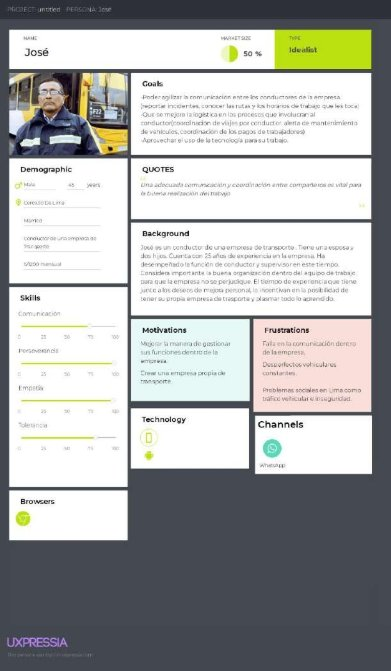

**Figura 8.**  *User Persona del segundo segmento objetivo: Empresarios.* 

2. **User Task Matrix** 

Una Matriz de Tareas de Usuario es una herramienta utilizada en el diseño de experiencia de usuario (UX) y desarrollo de productos para organizar y visualizar las tareas que los usuarios realizan en un sistema o plataforma. Esta matriz ayuda a identificar las diversas acciones que los usuarios llevarán a cabo en el producto, así como la frecuencia y la importancia de cada una de estas tareas (Patnaik, 2017). 

**Figura 9.** 

*User Task Matrix para el primer y segundo User Persona.* 

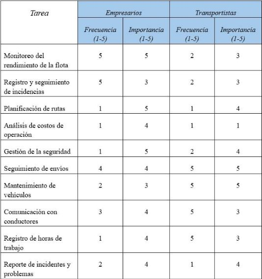

**Diferencias:** Los empresarios se centran más en tareas relacionadas con la gestión general de la flota, como monitoreo del rendimiento, registro de incidencias y planificación de rutas.  

Los transportistas, por otro lado, se centran en tareas más operativas, como seguimiento de envíos, mantenimiento de vehículos y comunicación con conductores.  

**Coincidencias:** Ambos grupos reconocen la importancia de la seguridad en la gestión de flotas, lo que se refleja en tareas como el registro de incidencias y la implementación de medidas de seguridad. Tanto los empresarios como los transportistas valoran la eficiencia operativa, como se evidencia en tareas como el monitoreo del rendimiento y la planificación de rutas. 

3. **User Journey Mapping** 

Según Patnaik (2017), un Mapeo de Viaje es una técnica utilizada en el diseño de experiencia de usuario (UX) para visualizar y comprender la experiencia que tiene un usuario al interactuar con un producto o servicio a lo largo del tiempo. El proceso de creación de un Journey Map implica mapear los diferentes puntos de contacto entre el usuario y el producto o servicio, desde el inicio hasta la finalización de su interacción. Esto puede incluir todas las etapas del viaje del usuario, desde el descubrimiento inicial del producto hasta la compra, el uso continuo y el soporte posterior a la venta. 

**Figura 10.** 

*User Journey Mapping del primer User Persona.* 

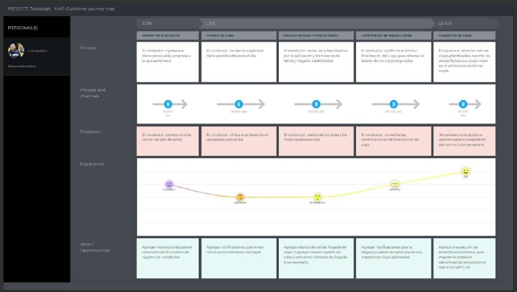

**Figura 11.** 

*User Journey Mapping del segundo User Persona.* 

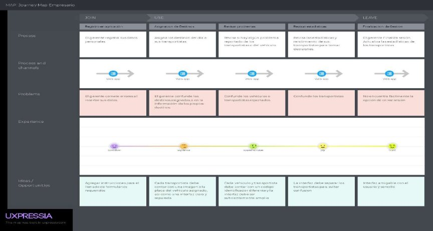

4. **Empathy Mapping** 

Un Mapeo de Empatía es una herramienta utilizada en el diseño de experiencia de usuario (UX) y el desarrollo de productos para comprender mejor las necesidades, deseos, emociones y comportamientos de los usuarios. El objetivo principal del Empathy Mapping es fomentar la empatía entre los miembros del equipo de diseño y los usuarios finales del producto o servicio (Patnaik, 2017).*** 

**Figura 12.** 

*User Empathy Mapping del primer User Persona.* 

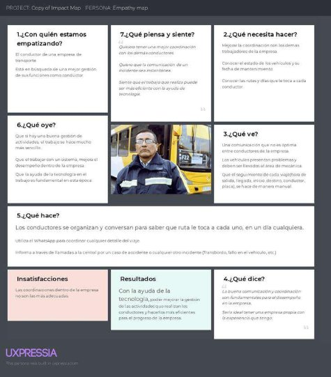

**Figura 13.** 

*User Empathy Mapping del segundo User Persona.* 

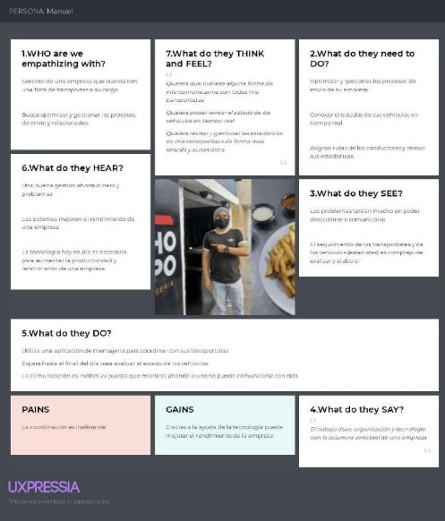

5. **As-is Scenario Mapping** 

**Figura 14.** 

*As-is Scenario Mapping del primer User Persona.* 

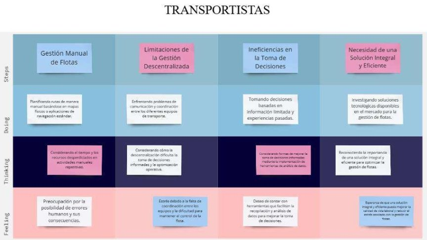

**Figura 15.** 

*As-is Scenario Mapping del segundo User Persona.* 

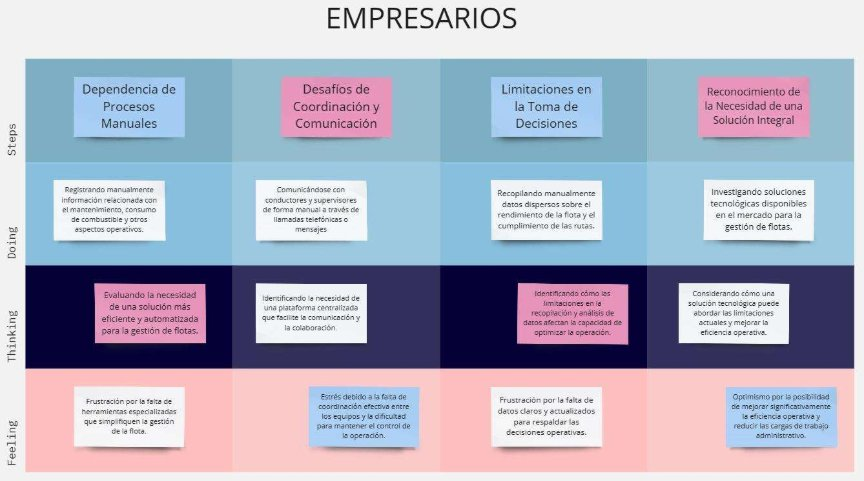

4. **Ubiquitous Language** 

   Ubiquitous Language (o *Lenguaje Ubicuo*) es un conjunto de términos compartidos y consistentes que se utilizan en todo un equipo de desarrollo (diseñadores, programadores, analistas, stakeholders, etc.) para describir el dominio del problema. Es muy común en metodologías como *Domain-Driven Design (DDD)*. 

|**Término** |**Definición** |
| - | - |
|Administrador |Persona encargada de gestionar la academia y supervisar la flota de transporte. |
|Transportista |Encargado de operar los vehículos, realizar rutas y reportar incidencias. |
|Conductor |Persona que conduce los autobuses y está en contacto directo con los atletas. |
|Unidad (Vehículo) |Autobús o transporte asignado para movilizar a los atletas. |
|Ruta |Trayecto predefinido que sigue una unidad para trasladar usuarios. |
|Incidencia |Evento anómalo o problema reportado durante el servicio de transporte. |
|Planificación de Rutas |Proceso de definir y optimizar los recorridos de los vehículos. |
|Panel de Control |Interfaz dentro de la aplicación que muestra métricas y estado de la flota. |

3. **Capítulo III: Requirements Specification** 
1. **To-Be Scenario Mapping** 

   Un "To-Be Scenario Mapping" es una técnica utilizada en el diseño de 
   experiencia de usuario (UX) y el análisis de procesos para visualizar y diseñar cómo debería ser un proceso o experiencia en el futuro deseado. El término "to-be" significa "será", lo que indica que este tipo de mapeo se enfoca en representar cómo debería funcionar un proceso o experiencia una vez que se hayan realizado mejoras o cambios. El To-Be Scenario Mapping implica la creación de un mapa visual que representa las etapas y acciones deseadas en un proceso o experiencia. Este mapa describe cómo deberían ser las interacciones, pasos, decisiones y puntos de contacto en el proceso futuro. 

**Figura 17** 

*Mapa de Escenario To-Be para nuestro primer User Persona.*

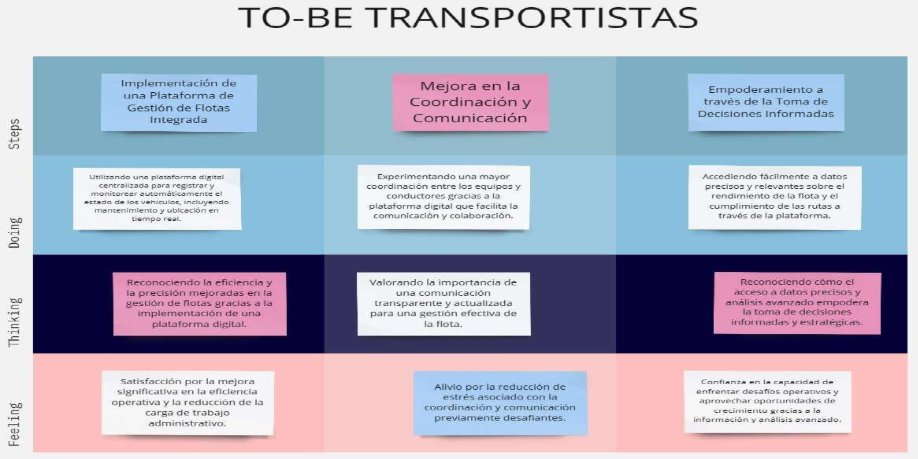

*Mapa de Escenario To-Be para nuestro segundo User Persona.* 

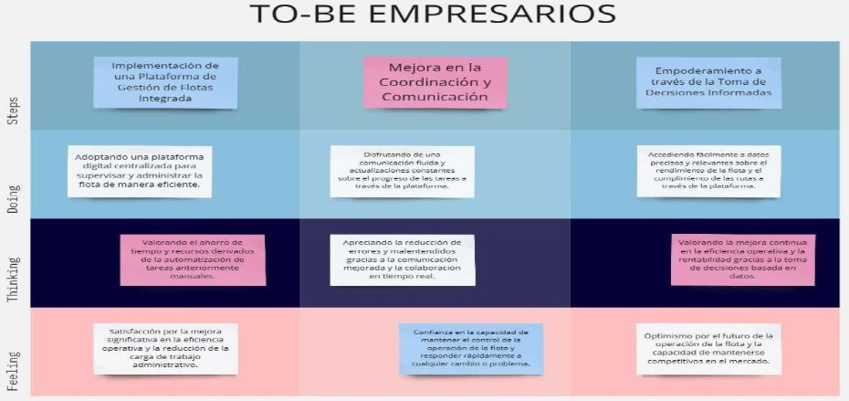

2. **User Stories** 

   En esta sección, presentaremos un análisis detallado de cada una de las historias de usuario asignadas a lo largo de todo el ciclo de vida del proyecto. El objetivo primordial es asegurar la completa satisfacción de nuestros segmentos de mercado mediante la comprensión y la satisfacción de sus necesidades y expectativas. Para ello, vamos a especificar los requisitos definidos, así como el conjunto de User Stories y Epics que hemos identificado como fundamentales para el éxito del proyecto. Es importante destacar que cada User Story estará acompañada de sus criterios de aceptación, lo que garantizará una comprensión clara de lo que se espera lograr. 

   Para comenzar este proceso de presentación, vamos a comenzar con una comprensión clara de lo que representan los Epics en nuestro contexto. Los Epics actúan como contenedores de alto nivel que encapsulan conjuntos de funcionalidades o características más amplias del producto. Son los pilares sobre los cuales se construirá la experiencia del usuario y se alcanzarán los objetivos del proyecto según sus métricas ya establecidas de forma ordenada y controlada (Patton et al., 2014). 

   Por lo tanto, presentaremos primero nuestro modelo de Epics, que servirá como guía y marco de referencia para comprender la naturaleza y el alcance de las historias de usuario que se presentarán a continuación. Este enfoque asegurará que se tenga una visión clara y completa de los diferentes tipos de historias de usuario, así como de sus divisiones y definiciones correspondientes, facilitando así una mejor comprensión y evaluación del proyecto en su conjunto. 

**Tabla 4.** 

*Tabla de épicas establecidas para las historias de usuarios.* 

|Epic ID |Título |Descripción |
| :- | - | - |
|EP01 |Información del sitio web |Como visitante quiero información detallada y precisa de lo que ofrece el sitio web para tomar mejores decisiones. |
|EP02 |Navegación de sitio web |Como visitante quiero una navegación fluida y detallada para tomar una decisión a conciencia |
|EP03 |Visualización de estadísticas de transportistas |Como gerente quiero tener un registro de actividades hechas por todos los transportistas para tener un control y seguimiento del rendimiento general de mis empleados. |
|EP04 |Visualización de estadísticas propias |Como transportista quiero ver las acciones hechas durante mi trabajo para tener un registro de las actividades hechas en mi labor. |
|EP05 |Gestión de envíos |Como gerente quiero registrar envíos a mis transportistas y tener un control de ello a través del tiempo para mejorar el rendimiento de los envíos de mi empresa. |
|EP06 |Gestión de vehículos |Como gerente quiero un registro de mis vehículos, así como quien está a cargo de ellos para tener un seguimiento de su estado a través del tiempo. |
|EP07 |Gestión de datos personales |Como usuario quiero manejar mi información personal para tenerla actualizada en todo momento. |
|EP08 |Reporte de problemas |Como transportista quiero reportar problemas que puedan suceder en mi labor para que se tomen las medidas necesarias. |

En esta próxima sección, presentaremos de forma detallada todas las historias de usuario establecidas en el proyecto de MoviGestion. Estas historias están  meticulosamente diseñadas con el objetivo de alcanzar el máximo nivel de satisfacción por parte de nuestros clientes, al mismo tiempo que nos permiten cumplir con todos los objetivos 

delineados en el proceso de planificación. Es crucial destacar que cada historia de usuario se categoriza según la sección correspondiente de la arquitectura de software en la que se requieran. 

Según Patton et al. (2014), una historia de usuario es una técnica utilizada en el desarrollo de software para describir una funcionalidad o característica desde la perspectiva del usuario final. En cada historia, se captura quién es el usuario, qué necesita hacer y por qué lo necesita. Esta descripción concisa y centrada en el usuario proporciona una guía clara para el equipo de desarrollo al diseñar y construir el producto, manteniendo siempre en mente las necesidades y expectativas del usuario final. 

**Tabla 5.** 

*Tabla de las historias de usuarios establecidas para todo el proyecto de MoviGestion.* 

<table><tr><th colspan="1" valign="top">Epic Id </th><th colspan="1" valign="top">Story Id </th><th colspan="1" valign="top">Título </th><th colspan="1" valign="top">Descripción </th><th colspan="1" valign="top">Criterios de aceptación </th></tr>
<tr><td colspan="1" rowspan="3" valign="top">EP03 </td><td colspan="1" rowspan="2" valign="top">US01 </td><td colspan="1" rowspan="2" valign="top">Visualización de paquetes entregados por un transportista </td><td colspan="1" rowspan="2" valign="top">Como gerente quiero visualizar el registro de paquetes entregados por un transportista para medir rendimiento del transportista </td><td colspan="1">Visualización del Registro de Paquetes Entregados - <b>Dado</b> el gerente está autenticado en la aplicación MoviGestion. <b>Cuando</b> el gerente accede al perfil del transportista cuyo rendimiento desea medir. <b>Entonces</b> se muestra un registro claro y detallado de todos los paquetes entregados por el transportista, incluyendo la fecha y hora de entrega, la descripción del paquete y cualquier otra información relevante. </td></tr>
<tr><td colspan="1">Filtrado y Ordenación de Registros - <b>Dado</b> el gerente está visualizando el registro de paquetes entregados por el transportista. <b>Cuando</b> el gerente necesita analizar los datos de manera específica. <b>Entonces</b> se proporcionan opciones para filtrar y ordenar los registros según diferentes criterios, como la fecha de entrega, el estado del paquete o el cliente, lo que permite al gerente acceder a la información relevante de manera rápida y eficiente. </td></tr>
<tr><td colspan="1" valign="top">US02 </td><td colspan="1" valign="top">Visualización de reportes de un transportista </td><td colspan="1">Como gerente quiero ver los reportes hechos por mis transportistas para tomar decisiones estratégicas en los próximos envíos. </td><td colspan="1" valign="top">Visualización de reportes - <b>Dado</b> que el gerente está autenticado en la aplicación. <b>Cuando</b> el gerente accede a la sección de reportes de la aplicación. <b>Entonces</b> se muestra un resumen claro y detallado de todos los reportes realizados por los transportistas </td></tr>
</table>

<table><tr><th colspan="1" rowspan="2"></th><th colspan="1" rowspan="2" valign="top">US03 </th><th colspan="1" rowspan="2" valign="top">Visualización de envíos asignados a un transportista </th><th colspan="1" rowspan="2" valign="top">Como gerente quiero ver los envíos asignados de un transportista para poder medir el rendimiento de mis empleados. </th><th colspan="1">Visualización de Envíos Asignados - <b>Dado</b> que el gerente está autenticado en la aplicación MoviGestion. <b>Cuando</b> el gerente accede al perfil del transportista cuyo rendimiento desea medir. <b>Entonces</b> se muestra un listado claro y completo de todos los envíos asignados al transportista, incluyendo detalles como el origen, destino, fecha de entrega programada y estado actual de cada envío. </th></tr>
<tr><td colspan="1">Acceso a Detalles de Envíos - <b>Dado</b> que el gerente está visualizando los envíos asignados de un transportista. <b>Cuando</b> el gerente selecciona un envío específico de la lista. <b>Entonces</b> se despliegan los detalles completos del envío seleccionado, incluyendo información detallada sobre la carga, instrucciones especiales del cliente y cualquier otra información relevante para la entrega. </td></tr>
<tr><td colspan="1" rowspan="3" valign="top">EP04 </td><td colspan="1" rowspan="2" valign="top">US04 </td><td colspan="1" rowspan="2" valign="top">Visualización de envíos asignados </td><td colspan="1" rowspan="2" valign="top">Como transportista, quiero poder ver los envíos que me han sido asignados, incluyendo detalles sobre los envíos y destinos correspondientes para poder organizar mejor el orden de mis tareas. </td><td colspan="1">Visualización de Envíos Asignados - <b>Dado</b> que el transportista está autenticado en la aplicación MoveGestion. <b>Cuando</b> el transportista accede a la sección de"Mis Envíos" en la aplicación. <b>Entonces</b> el transportista puede ver una lista clara y actualizada de todos los envíos que le han sido asignados, con detalles completos sobre cada envío </td></tr>
<tr><td colspan="1">Detalles Claros yAccesibles - Dado el transportista está viendolos envíos asignados.Cuando el transportista selecciona un envío específico de la lista.Entonces se muestran los detalles detallados del envío de manera clara y accesible, incluyendo la dirección de recogida, la dirección de entrega en un mapa, la fecha límite de entrega y cualquier instrucción especial asociada con el envío. </td></tr>
<tr><td colspan="1" valign="top">US05 </td><td colspan="1"></td><td colspan="1">Como transportista quiero visualizar los paquetes </td><td colspan="1">Visualización de Paquetes Entregados -<b>Dado</b> el transportista está autenticado en la aplicación MoveGestion. <b>Cuando</b> el transportista </td></tr>
</table>

<table><tr><th colspan="1" rowspan="6"></th><th colspan="1" rowspan="2"></th><th colspan="1" rowspan="2" valign="top">Visualización de paquetes entregados </th><th colspan="1" rowspan="2" valign="top">que he entregado para tener un comprobante de trabajo realizado </th><th colspan="1">accede a su perfil o panel de control. <b>Entonces</b> se muestra un registro claro y detallado de todos los paquetes que ha entregado. </th></tr>
<tr><td colspan="1">Acceso Fácil y Rápido a los Registros - <b>Dado</b> que el transportista está visualizando sus paquetes entregados. <b>Cuando</b> el transportista necesita acceder a registros específicos. <b>Entonces</b> se proporcionan opciones de búsqueda y filtrado para que el transportista pueda encontrar rápidamente los paquetes entregados en función de diferentes criterios, como la fecha de entrega o el estado del paquete </td></tr>
<tr><td colspan="1" rowspan="2" valign="top">US06 </td><td colspan="1" rowspan="2" valign="top">Visualización de reportes realizados </td><td colspan="1" rowspan="2" valign="top">Como transportista quiero visualizar los reportes que hice en mi labor para tener un historial de incidencia en mi trabajo. </td><td colspan="1">Visualización de Reportes Realizados - <b>Dado</b> que el transportista está autenticado en la aplicación MoveGestion. <b>Cuando</b> el transportista accede a la sección de"Mis Reportes" o "Historial De Incidencias". <b>Entonces</b> Se muestra una lista completa y organizada de todos los reportes que el transportista ha realizado durante su labor,incluyendo problemas técnicos, infracciones vehiculares, accidentes en la carretera y problemas con los paquetes </td></tr>
<tr><td colspan="1">Detalles Claros yAccesibles - <b>Dado</b> que el transportista está visualizando sus reportes realizados. <b>Cuando</b> el transportista selecciona un reporte específico de la lista. <b>Entonces</b> se muestran los detalles detallados del reporte de manera clara y accesible,incluyendo la fecha y horadel reporte, la descripción del incidente y cualquier otra información relevante asociada al reporte. </td></tr>
<tr><td colspan="1" rowspan="2" valign="top">US07 </td><td colspan="1" rowspan="2" valign="top">Visualización de ubicación del envío asignado </td><td colspan="1" rowspan="2" valign="top">Como transportista, quiero ver la ubicación del destino, para orientarme y seguir la ruta de manera eficiente. </td><td colspan="1">Visualizar ubicación del envío asignado - <b>Dado</b> que transportista tiene un envío asifnado. <b>Cuando</b> accede a la vista de detalle del envío. <b>Entonces</b> se muestra un mapa con la ubicación del destino. </td></tr>
<tr><td colspan="1">Envío con múltiples entregas intermedias - <b>Dado</b> que el conductor tiene un envío con múltiples paradas. <b>Cuando</b> accede al detalle del envío. <b>Entonces</b> marca cada una como completada conforme el conductor confirma la entrega. </td></tr>
</table>

<table><tr><th colspan="1" rowspan="2"></th><th colspan="1" rowspan="2" valign="top">US08 </th><th colspan="1" rowspan="2" valign="top">Visualización de temperatura y humedad </th><th colspan="1" rowspan="2" valign="top">Como transportista, quiero ver la ubicación, temperatura y humedad de mi vehículo asignado, para asegurarme de que el ambiente interno sea adecuado durante los envíos. </th><th colspan="1">Ver datos de su vehículo asignado - <b>Dado</b> que el conductor ha iniciado sesión y tiene un vehículo asignado. <b>Cuando</b> accede a la vista de su vehículo. <b>Entonces</b> el sistema muestra un mapa con la ubicación del vehículo y los datos en tiempo real de temperatura y humedad </th></tr>
<tr><td colspan="1">Advertencia por temperatura y/o humedad elevada - <b>Dado</b> que el sensor detecta temperatura y/o humedad superior al límite permitido. <b>Cuando</b> el conductor accede a la vista de su vehículo. <b>Entonces</b> el sistema despliega una advertencia destacada. </td></tr>
<tr><td colspan="1" rowspan="4" valign="top">EP05 </td><td colspan="1" rowspan="2" valign="top">US08 </td><td colspan="1" rowspan="2" valign="top">Asignación de envíos </td><td colspan="1" rowspan="2" valign="top">Como gerente, quiero poder asignar envíos a mis transportistas para distribuir eficientemente los envíos. </td><td colspan="1">Asignación Exitosa de Envíos - <b>Dado</b> que el gerente está autenticado en la aplicación MoviGestion. <b>Cuando</b> el gerente selecciona un envío para asignarlo a un transportista específico. Entonces el envío se asigna correctamente al transportista seleccionado en la aplicación. </td></tr>
<tr><td colspan="1">Asignación sin éxito de envío - <b>Dado</b> el gerente registra un envío sin éxito.<b>Cuando</b> el gerente completa el formulario de envío. <b>Entonces</b> se muestra un mensaje de error y es dirigido a la página principal </td></tr>
<tr><td colspan="1" rowspan="2" valign="top">US09 </td><td colspan="1" rowspan="2" valign="top">Visualización de historial de envíos </td><td colspan="1" rowspan="2" valign="top">Como gerente quiero ver el historial de envíos realizado para saber cuántos de estos fueron exitosos </td><td colspan="1">Visualización del Historial De Envíos - <b>Dado</b> que el gerente está autenticado en la aplicación MoviGestion. <b>Cuando</b> el gerente accede a la sección de historial de envíos. <b>Entonces</b> se muestra un registro completo y detallado de todos los envíos realizados, incluyendo información como la fecha de envío, origen, destino y estado de entrega de cada envío. </td></tr>
<tr><td colspan="1">Filtrado por Envíos Exitosos - <b>Dado</b> que el gerente está visualizando el historial de envíos. <b>Cuando</b> el gerente selecciona la opción para filtrar por envíos exitosos. <b>Entonces</b> se muestran únicamente los envíos que han sido completados con éxito, lo que </td></tr>
</table>

<table><tr><th colspan="1"></th><th colspan="1"></th><th colspan="1"></th><th colspan="1"></th><th colspan="1">permite al gerente identificar rápidamente la cantidad y los detalles de los envíos exitosos realizados en un período específico. </th></tr>
<tr><td colspan="1" rowspan="5" valign="top">EP06 </td><td colspan="1" rowspan="3" valign="top">US10 </td><td colspan="1" rowspan="3" valign="top">Asignación de flotas </td><td colspan="1" rowspan="3" valign="top">Como gerente, quiero asignar flotas a mis transportistas para que puedan realizar encargos. </td><td colspan="1">Asignación Exitosa de Flotas - Dado que el gerente está autenticado en la aplicación MoviGestion. <b>Cuando</b> el gerente selecciona una flota para asignarla a un transportista específico. <b>Entonces</b> la flota se asigna directamente al transportista seleccionado en la aplicación. </td></tr>
<tr><td colspan="1">Asignación de flotas sin éxito - <b>Dado</b> que el gerente asigna una flota para un transportista. <b>Cuando</b> el gerente registra el proceso. <b>Entonces</b> se muestra un mensaje de error y se redirige a la página principal </td></tr>
<tr><td colspan="1" valign="top">Asignación de flota a transportista con flota ya existente: <b>Dado</b> que el gerente asigna una flota a un transportista. <b>Cuando</b> el transportista ya tiene asignada una flota existente. <b>Entonces</b> se reemplaza la flota del transportista con la actual registrada </td></tr>
<tr><td colspan="1" rowspan="2" valign="top">US11 </td><td colspan="1" rowspan="2" valign="top">Gestión de inventario de flotas </td><td colspan="1" rowspan="2" valign="top">Como gerente, quiero añadir nuevas flotas a mi negocio para tener un control activo de mis flotas. </td><td colspan="1" valign="top">Añadir Nuevas Flotas - <b>Dado</b> que el gerente está autenticado en la aplicación MoviGestion. <b>Cuando</b> el gerente accede a la sección de gestión de flotas y selecciona la opción para añadir una nueva flota. <b>Entonces</b> se presenta un formulario claro y completo donde el gerente puede ingresar todos los detalles relevantes de la nueva flota como placa, modelo y número de serie del vehículo. </td></tr>
<tr><td colspan="1">Confirmación de Añadido Exitoso - <b>Dado</b> que</b> el gerente ha añadido una nueva flota con éxito. <b>Cuando</b> la operación de añadir la nueva flota se complete. <b>Entonces</b> se muestra un mensaje de confirmación claro y visible en la aplicación, informando al gerente que la nueva flota ha sido añadida con éxitos su negocio, lo que le permite tener un control activo y actualizado de todas sus flotas. </td></tr>
</table>

<table><tr><th colspan="1"></th><th colspan="1"></th><th colspan="1"></th><th colspan="1"></th><th colspan="1">Añadido fallido - <b>Dado</b> que el gerent<b>e</b> ha completado el formulario de añadido de flota. <b>Cuando</b> envíe el formulario. <b>Entonces</b> se mostrará un mensaje de error y será redirigido a la página principal </th></tr>
<tr><td colspan="1" rowspan="2"></td><td colspan="1"></td><td colspan="1"></td><td colspan="1"></td><td colspan="1" valign="bottom">Añadir flota existente:<b>Dado</b> que el gerente añade una flota. <b>Cuando</b> el gerente añada una flota con un número de serie ya existente. <b>Entonces</b> se mostrará un mensaje de error <b>Y</b> no se registrará la nueva flota. </td></tr>
<tr><td colspan="1"></td><td colspan="1"></td><td colspan="1"></td><td colspan="1"></td></tr>
<tr><td colspan="1" rowspan="3"></td><td colspan="1"></td><td colspan="1"></td><td colspan="1"></td><td colspan="1"></td></tr>
<tr><td colspan="1" rowspan="2" valign="top">US12 </td><td colspan="1" rowspan="2" valign="top">Visualización de ubicación, temperatura y humedad del vehículo </td><td colspan="1" rowspan="2" valign="top">Como gerente, quiero monitorear la ubicación, temperatura y humedad de todos los vehículos, para asegurar que los envíos se transportan en condiciones adecuadas. </td><td colspan="1" valign="top">Visualización de datos del vehículo - <b>Dado</b> que el gerente ha iniciado sesión. <b>Cuando</b> accede a la sección de vehículos y selecciona uno. <b>Entonces</b> se muestra el vehículo con su ubicación actual en un mapa y muestra la temperatura y humedad interna. </td></tr>
<tr><td colspan="1">Falla en sensores - <b>Dado</b> que el sensor de un vehículo ha dejado de transmitir datos. <b>Cuando</b> el gerente consulta la información de ese vehículo. <b>Entonces</b> el sistema muestra un ícono de alerta junto al vehículo afectado y un mensaje que indica: “Datos de temperatura/humedad no disponibles. Verificar sensor.” </td></tr>
<tr><td colspan="1" rowspan="3" valign="top">EP07 </td><td colspan="1" rowspan="2" valign="top">US13 </td><td colspan="1" rowspan="2" valign="top">Modificar perfil de gerente </td><td colspan="1" rowspan="2" valign="top">Como gerente quiero gestionar mis datos para que estén actualizados </td><td colspan="1">Acceso a la Gestión de Datos - <b>Dado</b> que el gerente está autenticado en la aplicación MoviGestion. <b>Cuando</b> el gerente accede a su perfil personal. <b>Entonces</b> se muestra la opción clara y accesible para gestionar sus datos personales </td></tr>
<tr><td colspan="1">Modificación de Datos - <b>Dado</b> que el gerente está en la sección de gestión de datos de su perfil. <b>Cuando</b> el gerente realiza cambios en sus datos, como nombre, número de contacto o dirección de correo electrónico. <b>Entonces</b> los cambios se reflejan de manera inmediata y precisa en su perfil, asegurando que la información esté actualizada. </td></tr>
<tr><td colspan="1" valign="top">US14 </td><td colspan="1">Modificar perfil de transportistas </td><td colspan="1"></td><td colspan="1">Modificación de DatosPersonales - <b>Dado que el transportista</b> está en la sección de gestión de datos personales de su perfil. <b>Cuando</b> el </td></tr>
</table>

Como transportista quiero  transportista realiza cambios en sus datos personales, como nombre, gestionar mis 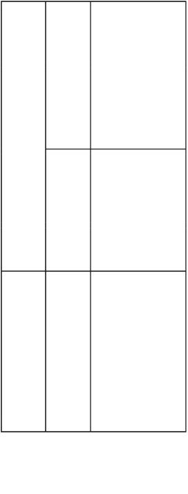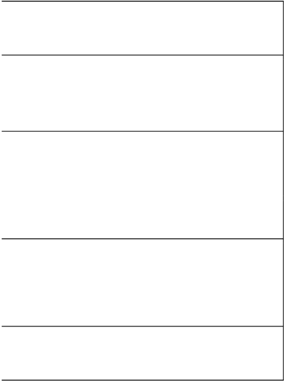datos para  número de contacto o dirección de correo electrónico. **Entonces** los que estén actualizados  cambios se reflejan de manera inmediata y precisa en su perfil, 

asegurando que la información esté actualizada 

Confirmación de Actualización Exitosa - **Dado que el transportista** ha modificado sus datos personales. **Cuando** la modificación se complete. **Entonces** se muestra un mensaje de confirmación que indica que los datos personales se han actualizado correctamente,proporcionando retroalimentación al transportista sobre el éxito de la operación 

US15  Registro de  Como gerente, quiero  Registro exitoso de conductor - **Dado** que el gerente accede al nuevos  registrar nuevos  formulario de registro y completa los campos obligatorios con datos 

conductores  conductores en el sistema,  válidos. **Cuando** presiona el botón “Crear conductor”. **Entonces** el para que puedan  sistema guarda el nuevo conductor y se muestra un mensaje de 

comenzar a operar en la  éxito: “Conductor registrado correctamente” 

plataforma 

Email duplicado - **Dado** que el gerente completa el formulario con un email ya registrado. **Cuando** intenta guardar el registro. **Entonces** el sistema muestra una alerta: “Este email ya está en uso” 

EP08  US16  Reporte de  Como transportista,  Registro de Infracciones Vehiculares - **Dado** que el transportista infracciones  quiero poder reportar  está autenticado en la aplicación MoviGestion. **Cuando** el 

infracciones vehiculares  transportista identifica una infracción vehicular durante su viaje. 

que ocurran durante mis  **Entonces** el transportista puede acceder a la función de reporte de viajes para que el gerente  infracciones vehiculares,proporcionar detalles sobre la infracción pueda tomar las medidas  observada y enviar el reporte con éxito a la plataforma para su del caso.  registro. 

Registro fallido de infracciones - **Dado que el transportista** envía un reporte de infracción . **Cuando** hay algún error en el envío. **Entonces** se muestra un mensaje de error y se redirige a la página principal 

US17  Reporte de  Como transportista,  Registro de Accidentes en la Carretera - **Dado** que el transportista accidentes en la 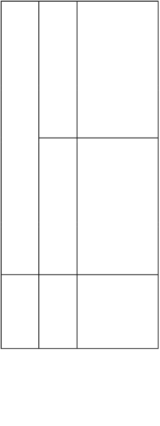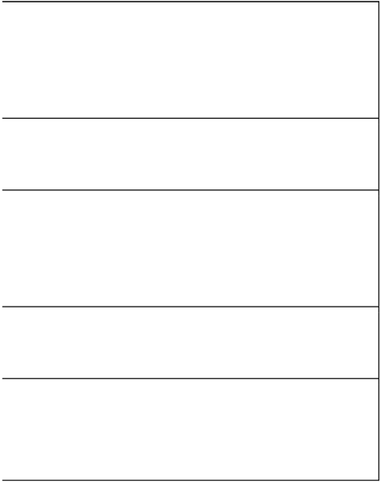 quiero poder reportar  está autenticado en la aplicación MoviGestion. **Cuando** el 

carretera  accidentes en la carretera  transportista se encuentra con un accidente en la carretera durante que ocurran durante mis  su viaje. **Entonces** el transportista puede acceder a la función de 

viajes para que el gerente  reporte de accidentes en la carretera, proporcionar detalles sobre el pueda organizar las  accidente presenciado y enviar el reporte con éxitos la plataforma futuras rutas.  para su registro 

Error en registro de accidentes - **Dado** que el transportista completa el formulario de accidentes. **Cuando** envía el formulario y hay problemas. **Entonces** se muestra un mensaje de error y se redirige a la página principal 

US18  Reporte de  Como transportista,  Registro de Problemas Con los Paquetes - **Dado** El transportista problemas con el  quiero poder reportar  está autenticado en la aplicación MoviGestion . **Cuando** el 

paquete  problemas con los  transportista detecta un problema con uno de los paquetes que está paquetes que transporto  transportando durante su viaje. **Entonces** el transportista puede 

durante mis viajes para  acceder a la función de reporte de problemas con los paquetes, que el gerente pueda  proporcionar detalles sobre el problema encontrado y enviar el reportarlo al cliente.  reporte con éxitos a la plataforma para su registro. 

Registro fallido de problema con el paquete - **Dado** el transportista envía un reporte de problema con el paquete. **Cuando** el registro presenta algún error. **Entonces** se mostrará un mensaje de error y se redirigirá a la página principal. 

US19  Reporte de  Como transportista,  Registro exitoso de problemas técnicos - **Dado que el** 

problemas  quiero poder reportar  **transportista** está autenticado en la aplicación. **Cuando** el técnicos  problemas técnicos que  transportista encuentre un problema técnico durante su viaje. 

surjan durante mis viajes  **Entonces** el transportista completa el formulario de reporte de para que el gerente pueda  problemas técnicos en la aplicación,proporcionando detalles sobre 

el problema yenviándolo con éxito para su registro. 

<table><tr><th colspan="1"></th><th colspan="1"></th><th colspan="1"></th><th colspan="1" valign="top">resolverlo lo antes posible. </th><th colspan="1" valign="top">Registro sin éxito de problemas técnicos - <b>Dado</b> que el transportista está autenticado en la aplicación. <b>Cuando</b> el transportista envía un registro de reporte no exitoso. <b>Entonces</b> se muestra un mensaje de"error" Y el transportistas enviado a la página principal. </th></tr>
<tr><td colspan="1" rowspan="4" valign="top">EP01 </td><td colspan="1" rowspan="2" valign="top">US20 </td><td colspan="1" rowspan="2" valign="top">Presentación de sitio web </td><td colspan="1" rowspan="2" valign="top">Como visitante del segmento gerente quiero un resumen rápido y asertivo sobre lo que ofrece el sitio web para tener una idea rápida sobre lo que ofrece el sitio web.  </td><td colspan="1" valign="top">Visualización del Resumen en el LandingPage - <b>Dado</b> que el visitante accede al landing page del sitio web. <b>Cuando</b> el visitante visualiza la sección de resumen rápido.<b>Entonces</b> se presenta un resumen claro y conciso de las principales características y beneficios del sitio web,destacando los puntos más relevantes de manera atractiva y fácil de entender. </td></tr>
<tr><td colspan="1">Información Asertiva y Relevante - <b>Dado</b> que el visitante está leyendo el resumen en el landingpage. <b>Cuando</b> el visitante revisa la información presentada. <b>Entonces</b> la información proporcionada se centra en los aspectos más importantes y distintivos del sitio web, ofreciendo una visión rápida y clara de lo que ofrece y cómo puede beneficiar al usuario. </td></tr>
<tr><td colspan="1" rowspan="2" valign="top">US21 </td><td colspan="1" rowspan="2" valign="top">Resumen de precios </td><td colspan="1" rowspan="2" valign="top">Como visitante del segmento gerente quiero una vista detallada del plan ofrecido por el sitio web para tomar una decisión de compra a conciencia. </td><td colspan="1">Acceso a la Información Del Plan - <b>Dado</b> que el visitante del segmento gerente está en el sitio web. <b>Cuando</b> el visitante busca información detallada sobre el plan ofrecido. <b>Entonces</b> se proporciona un acceso claro y visible a la página o sección que describe en detalle el plan ofrecido, ya sea a través del menú de navegación, enlaces destacados o botones de llamada a la acción </td></tr>
<tr><td colspan="1">Descripción Completa y Clara del Plan - <b>Dado que el visitante</b> está en la página de información del plan.<b>Cuando</b> el visitante lee la descripción del plan. <b>Entonces</b> se presenta una descripción completa y clara del plan ofrecido,incluyendo características,beneficios, limitaciones,términos y condiciones,precio y cualquier otra información relevante que </td></tr>
</table>

<table><tr><th colspan="1" rowspan="2"></th><th colspan="1"></th><th colspan="1"></th><th colspan="1"></th><th colspan="1" valign="bottom">permita al visitante entender completamentelo que está incluido en el plan. </th></tr>
<tr><td colspan="1"></td><td colspan="1"></td><td colspan="1"></td><td colspan="1"></td></tr>
<tr><td colspan="1" rowspan="3"></td><td colspan="1"></td><td colspan="1"></td><td colspan="1"></td><td colspan="1"></td></tr>
<tr><td colspan="1" rowspan="2" valign="top">US22 </td><td colspan="1" rowspan="2" valign="top">Información a pie de página </td><td colspan="1" rowspan="2" valign="top">Como visitante del segmento gerente quiero un resumen del sitio web al final de este para no perder tiempo buscando algún apartado de mi interés. </td><td colspan="1" valign="top">Resumen Claro y Conciso- <b>Dado</b> que el visitante del segmento gerente está en el landing page del sitio web. <b>Cuando</b> el visitante llega al final de la página. <b>Entonces</b> se presenta un resumen claro y conciso del sitio web, destacandolos aspectos más relevantes, como las características principales, los servicios ofrecidos, la información de contacto y cualquier otra información importante para el visitante. </td></tr>
<tr><td colspan="1">Navegación Rápida Secciones Clave - <b>Dado</b> que el visitante está revisando el resumen al final del landing page. <b>Cuando</b> el visitante busca acceder rápidamente a una sección específica del sitio web. <b>Entonces</b> se incluyen enlaces o botones que permiten al visitante navegar rápidamente a secciones clave del sitio web, como servicios, precios,testimonios, preguntas frecuentes o información de contacto, facilitando la exploración y la búsqueda de información relevante. </td></tr>
<tr><td colspan="1" rowspan="2" valign="top">EP02 </td><td colspan="1" rowspan="2" valign="top">US23 </td><td colspan="1" rowspan="2" valign="top">Ir a aplicación mobile directamente </td><td colspan="1" rowspan="2" valign="top">Como visitante del segmento gerente quiero que la página me permita dirigirme directamente a la aplicación mobile principal para ahorrar tiempo. </td><td colspan="1">Llamado a la Acción Claro- <b>Dado</b> que el visitante ha revisado el resumen en el landing page. <b>Cuando</b> el visitante desea obtener más información o realizar una acción específica. <b>Entonces</b> se presenta un llamado a la acción claro y visible que guía al visitante a explorar más a fondo el sitio web o tomar la acción deseada,como registrarse,suscribirse o contactar al equipo. </td></tr>
<tr><td colspan="1">Facilidad de Acceso Desde Dispositivos Móviles - <b>Dado</b> que el visitante del segmento gerente accede al sitio web desde un dispositivo móvil. <b>Cuando</b> el visitante desea dirigirse a la aplicación web principal. <b>Entonces</b> el enlace o botón para acceder a la aplicación web principal está optimizado para dispositivos móviles y es fácilmente accesible y usable en pantallas más </td></tr>
</table>

pequeñas, asegurando una experiencia de usuario fluida y sin inconvenientes. 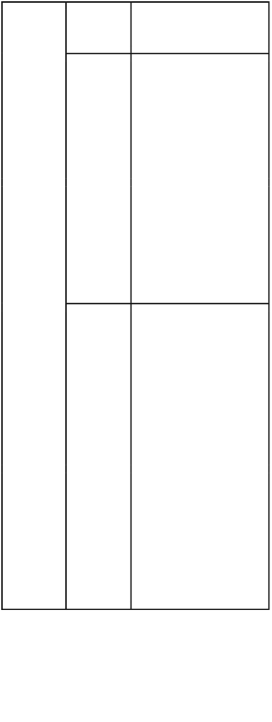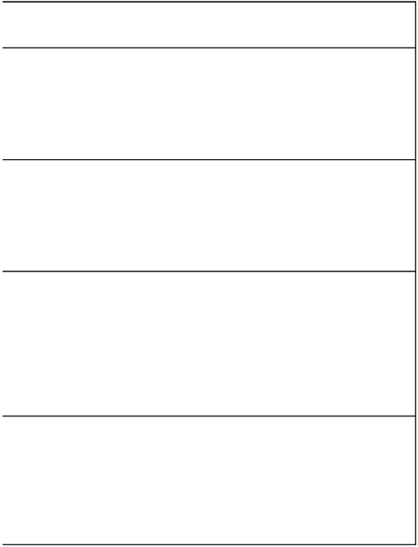

US24  Navegación de  Como visitante del  Contenido Informativo Claro y Detallado -**Dado** visitante del información  segmento gerente quiero  segmento gerente está en el sitio web. **Cuando** el visitante busca 

información precisa sobre  información sobre lo que ofrece el sitio web. **Entonces** se presenta lo que ofrece el sitio web  contenido claro, detallado y preciso que describe las 

para tomar una decisión  características,funcionalidades y beneficios del sitio web de manera mejor informada.  comprensible y convincente. 

Descripción de Características Destacadas - **Dado** que el visitante del segmento gerente está revisando la información del sitio web. **Cuando** el visitante busca comprender las características más destacadas. **Entonces** se proporciona una descripción específica de las características clave del sitio web, resaltando sus puntos fuertes y ventajas competitivas de manera clara y concisa. 

US25  Navegación de  Como visitante del  Visible y Accesible en el Sitio Web - **Dado** que el visitante del contacto  segmento gerente quiero  segmento gerente está en el sitio web. **Cuando** el visitante busca 

ver información de  información de contacto. **Entonces** la información de 

contacto del sitio creado  contacto,como dirección de correo electrónico, número de teléfono para sentir más confianza  y/o dirección física, se muestra claramente y de manera destacada del sitio web.  en una sección visible del sitio web, como en el encabezado, pie de 

página o una sección dedicada específicamente a la información de contacto 

Completa y Actualizada - **Dado** que el visitante busca información de contacto. **Cuando** el visitante revisa la información proporcionada. **Entonces** la información de contactos completa y precisa,incluyendo todos los detalles necesarios para que el visitante pueda comunicarse con el sitio web de manera efectiva.Además, se asegura de que la información esté actualizada y corresponda a la ubicación y horario de operación vigentes. 

Link Pivotal Tracker[:https://www.pivotaltracker.com/projects/270065](https://www.pivotaltracker.com/projects/2700650)

3. **Impact Mapping** 

**Figura 18** 

*Impact Mapping para nuestro primer User Persona.* 

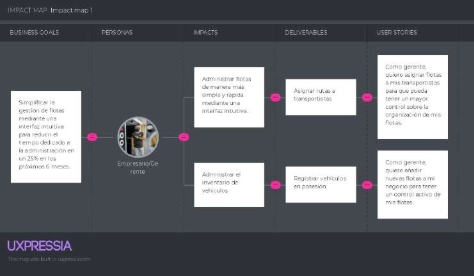

**Figura 19** 

*Impact Mapping para nuestro primer User Persona.* 

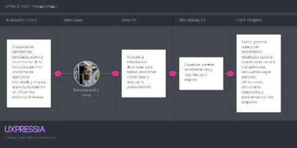

**Figura 20** 

*Impact Mapping para nuestro primer User Persona.* 

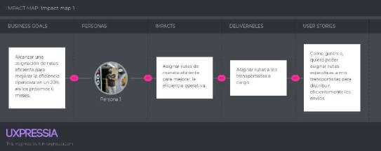

**Figura 21** 

*Impact Mapping para nuestro segundo User Persona.\* 

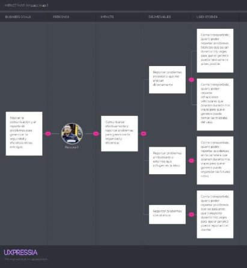

**Figura 22** 

*Impact Mapping para nuestro segundo User Persona.* 

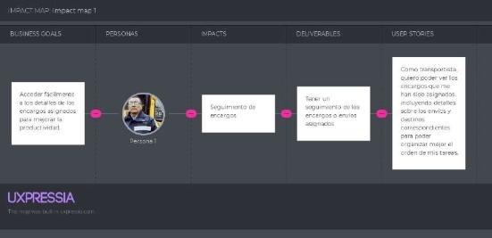

**Figura 23** 

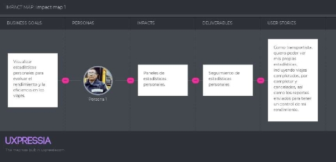

*Impact Mapping para nuestro segundo User Persona.* 

4. **Product Backlog** 

   En esta sección del proyecto vamos a esquematizar y completar el Product Backlog, un elemento fundamental en la gestión ágil de proyectos de desarrollo de software. El Product Backlog actúa como una lista dinámica y priorizada de todas las funcionalidades, mejoras y requisitos que deben ser desarrollados para el producto. Su orden se basa en la priorización del valor para el negocio y es clave para guiar el trabajo del equipo de desarrollo a lo largo del proyecto. 

   El Product Backlog se compone de historias de usuario, tareas técnicas y otras actividades relacionadas con el desarrollo del producto. Este orden sigue una lógica clara, colocando en primer lugar aquellas historias relacionadas con la experiencia del usuario en la Landing Page, seguidas de las funcionalidades esenciales de la aplicación web, y finalmente, las historias técnicas necesarias para el desarrollo del sistema (Patton et al., 2014). 

   Como parte de nuestra iniciativa para esta sección, hemos integrado un modelo de guía de tareas y actividades señaladas para cada integrante dentro del Product Backlog mediante el uso de la aplicación Pivotal Tracker. Los lectores pueden acceder al planeamiento del Product Backlog completo a través del siguiente enlace: [https://www.pivotaltracker.com/projects/2700650 ](https://www.pivotaltracker.com/projects/2700650)

**Figura 24.** 

*Modelo de trabajo realizado en la aplicación PivotalTracker para organizar todo el Product Backlog de MoviGestion.* 

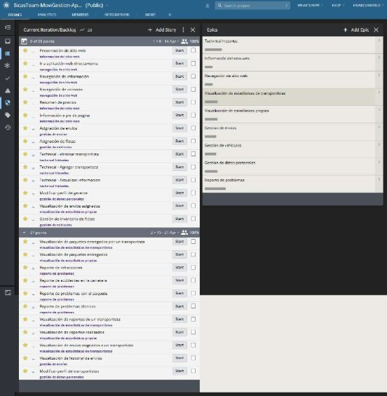

**Tabla 6.** 

*Tabla del Product Backlog establecido para el proyecto de MoviGestion.* 

|#Orde n |User Story Id |Título |Description |Story Points (1,2,3,5,8) |
| :- | :- | - | - | :- |
|1 |U17 |Presentación de sitio web |Como visitante del segmento gerente quiero un resumen rápido y asertivo sobre lo que ofrece el sitio web para tener una idea rápida sobre lo que ofrece el sitio web. |1 |
|2 |U20 |Ir a aplicación web directamente |Como visitante del segmento gerente quiero que la página me permita dirigirme directamente a la aplicación web principal para ahorrar tiempo. |1 |
|3 |U21 |Navegación de información |Como visitante del segmento gerente quiero información precisa sobre lo que ofrece el sitio web para tomar una decisión mejor informada. |1 |
|4 |U22 |Navegación de contacto |Como visitante del segmento gerente quiero ver información de contacto del sitio creado para sentir más confianza del sitio web. |1 |
|5 |U18 |Resumen de precios |Como visitante del segmento gerente quiero una vista detallada del plan ofrecido por el sitio web para tomar una decisión de compra a conciencia |1 |
|6 |U19 |Información a pie de página |Como visitante del segmento gerente quiero un resumen del sitio web al final de este para no perder tiempo buscando algún apartado de mi interés. |1 |
|7 |U07 |Asignación de envíos |Como gerente, quiero poder asignar envíos a mis transportistas para distribuir eficientemente los envíos. |3 |
|8 |U09 |Asignación de flotas |Como gerente, quiero asignar flotas a mis transportistas para que puedan realizar encargos. |3 |
|9 |U11 |Modificar perfil de gerente |Como gerente quiero gestionar mis datos para que estén actualizados |3 |
|10 |U04 |Visualización de envíos asignados |Como transportista, quiero poder ver los envíos que me han sido asignados, incluyendo detalles sobre los envíos y destinos correspondientes para poder organizar mejor el orden de mis tareas. |2 |

|11 |U10 |Gestión de inventario de flotas |Como gerente, quiero añadir nuevas flotas a mi negocio para tener un control activo de mis flotas. |2 |
| - | - | :- | :- | - |
|12 |U01 |Visualización de paquetes entregados por un transportista |Como gerente quiero visualizar el registro de paquetes entregados por un transportista para medir rendimiento del transportista |2 |
|13 |U05 |Visualización de paquetes entregados |Como transportista quiero visualizar los paquetes que he entregado para tener un comprobante de trabajo realizado |2 |
|14 |U13 |Reporte de infracciones |Como transportista, quiero poder reportar infracciones vehiculares que ocurran durante mis viajes para que el gerente pueda tomar las medidas del caso. |3 |
|15 |U14 |Reporte de accidentes en la carretera |Como transportista, quiero poder reportar accidentes en la carretera que ocurran durante mis viajes para que el gerente pueda organizar las futuras rutas. |3 |
|16 |U15 |Reporte de problemas con el paquete |Como transportista, quiero poder reportar problemas con los paquetes que transporto durante mis viajes para que el gerente pueda reportarlo al cliente. |3 |
|17 |U16 |Reporte de problemas técnicos |Como transportista, quiero poder reportar problemas técnicos que surjan durante mis viajes para que el gerente pueda resolverlo lo antes posible. |3 |
|18 |U02 |Visualización de reportes transportista |Como gerente quiero ver los reportes hechos por mis transportistas para tomar decisiones estratégicas en los próximos envíos. |2 |
|19 |U06 |Visualización de reportes realizados |Como transportista quiero visualizar los reportes que hice en mi labor para tener un historial de incidencia en mi trabajo. |2 |
|20 |U03 |Visualización de envíos asignados a un transportista |Como gerente quiero ver los envíos asignados de un transportista para poder medir el rendimiento de mis empleados. |2 |
|21 |U08 |Visualización de historial de envíos |Como gerente quiero ver el historial de envíos realizado para saber cuántos de estos fueron exitosos |2 |
|22 |U12 |Modificar perfil de transportistas |Como transportista quiero gestionar mis datos personales para que estén actualizados |3 |

4. **Capítulo IV: Solution Software Design** 
1. **Strategic-Level Domain-Driven Design** 
1. **EventStorming** 

Event Storming es una herramienta que nos permite descubrir el comportamiento de un negocio, recopilando eventos importantes del negocio, los actores principales, servicios de terceros y otros. Para la implementación de esta sección se realizaron entrevistas correspondientes a los segmentos objetivos, de esta manera pudimos identificar los eventos principales y desarrollar un entendimiento común 

Aquí mostramos los pasos respectivos para la elaboración correcta del Event Storming realizada en la herramienta Lucidchart: 

**Paso 1: Unstructured Exploration** 

En esta sección se realizó una lluvia de ideas de los eventos del dominio relacionados con el dominio empresarial que se está explorando. Nos permitió identificar los eventos clave y las interacciones entre ellos 

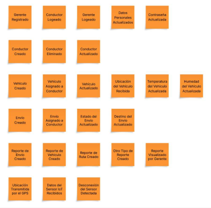

**Paso 2: Timelines** 

En esta sección, los eventos identificados previamente, son agrupados en subgrupos lo cual tiene como líder al evento principal (es quien encapsula la funcionalidad principal del grupo). Estos eventos comienzan con el flujo que describe el escenario empresarial exitoso (Happy path) y también escenarios alternativos 

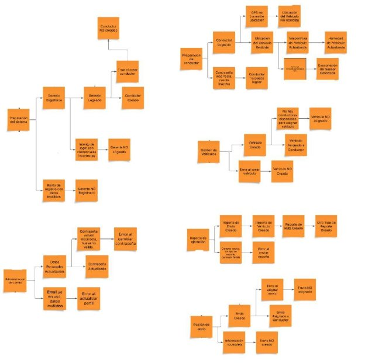

**Paso 3: Paint Points** 

Durante esta fase, identificamos puntos problemáticos o (Pair Points) que son áreas donde los usuarios pueden tener dificultades al momento de realizar una respectiva funcionalidad en la aplicación. Estos puntos son importantes para mejorar la experiencia de usuario e implementar una aplicación eficiente 

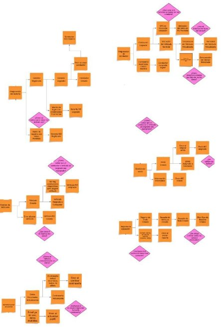

**Paso 4: Pivotal Points** 

En esta fase, nos enfocamos en identificar los puntos cruciales dentro del flujo del negocio, los cuales tienen un impacto significativo en la operatividad del sistema o el comportamiento del usuario. Estos puntos nos ayudan a priorizar qué áreas deben ser optimizadas o revisadas con mayor detalle, ya que pueden afectar el éxito de los procesos empresariales críticos** 

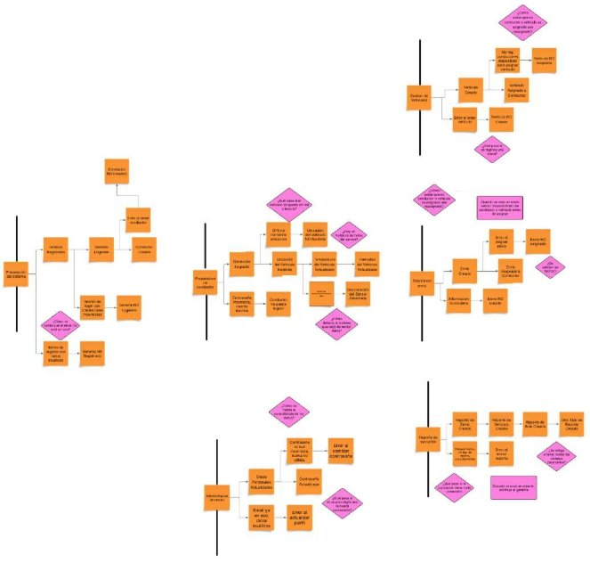

**Paso 5: Commands** 

Los comandos representan acciones que los actores del sistema pueden ejecutar. Durante este paso, mapeamos qué acciones desencadenan los eventos clave dentro del sistema y qué actores son responsables de ejecutarlas. Esto nos ayuda a estructurar la lógica de negocio alrededor de acciones claras y específicas, facilitando la implementación de las reglas del negocio** 

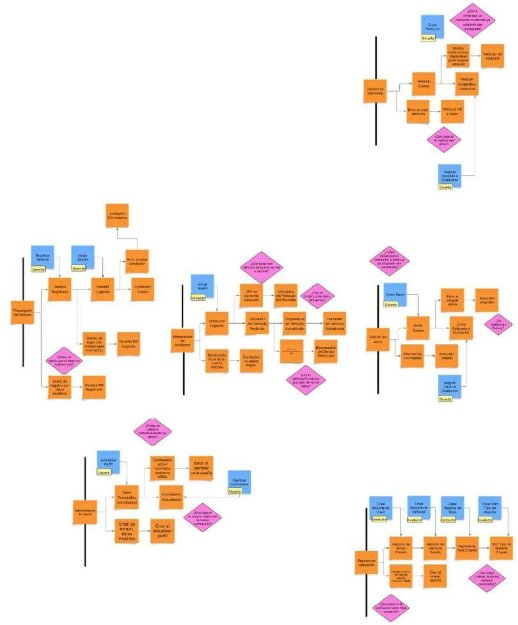

**Paso 6: Policies** 

En este paso, se identifican las políticas, que son reglas de negocio o condiciones que deben cumplirse para que un comando pueda ser ejecutado o un evento pueda suceder. Las políticas son esenciales para definir las restricciones del sistema y asegurar que el flujo de eventos sea coherente con las reglas del negocio. 

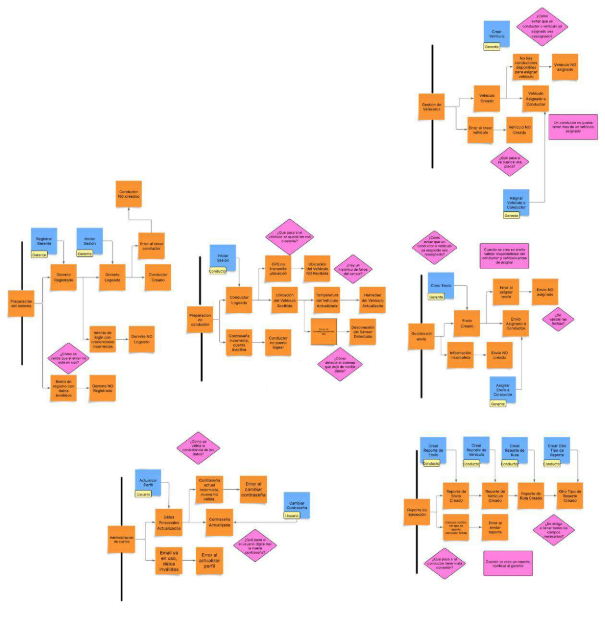

**Paso 7: Read Models** 

Los Read Models son vistas del estado del sistema, generalmente optimizadas para la consulta por parte de los usuarios o procesos. Durante este paso, definimos qué información necesita ser accesible en ciertos momentos y cómo debería ser presentada, asegurando que los actores puedan visualizar el estado del sistema de manera eficiente. 

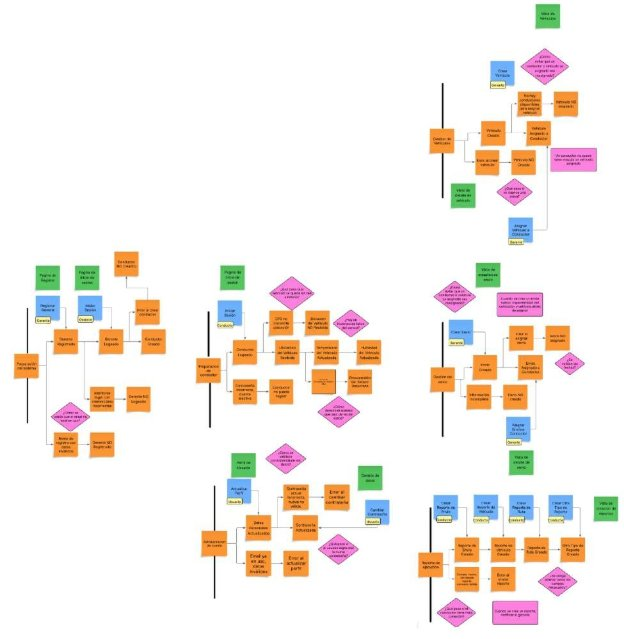

**Paso 8: External Systems** 

En esta fase, identificamos los sistemas externos que interactúan con nuestro dominio. Aquí mapeamos las conexiones con servicios de terceros o sistemas independientes que influyen en los eventos del negocio. Es crucial entender cómo estos sistemas externos afectan los flujos y asegurar que las integraciones sean correctas 

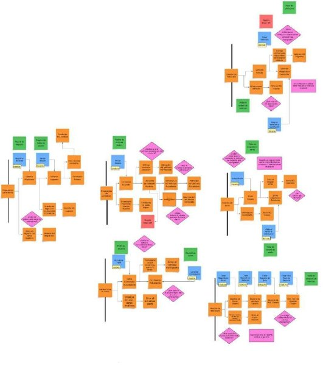

**Paso 9: Aggregates** 

En este último paso, agrupamos los eventos y comandos que pertenecen a un agregado específico para garantizar que todas 

las operaciones dentro de un contexto estén alineadas y mantengan la consistencia del sistema 

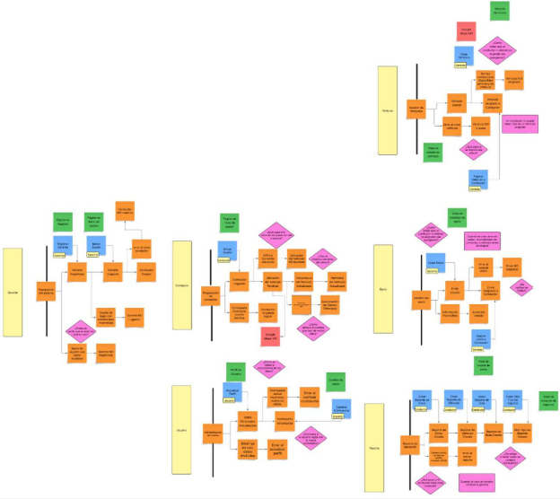

1. **Candidate Context Discovery** 

Nuestro equipo decidió usar la técnica **“start-with-simple”** ya que empezamos a observar que esta técnica se enfoca en identificar partes del sistema que claramente pertenecen juntas desde el punto de vista funcional, de usuario o de infraestructura. Ideal para sistemas bien entendidos 

Hemos identificado 4 Bounded Context 

- IAM: 

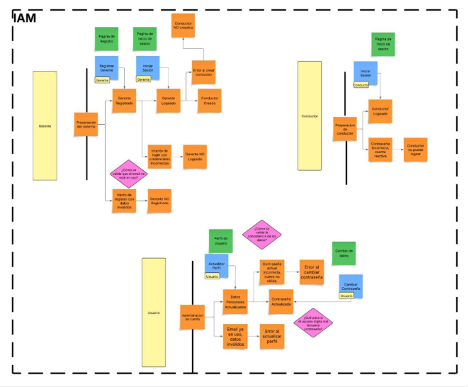

- Vehicles & Tracking: 
- Shipment: 

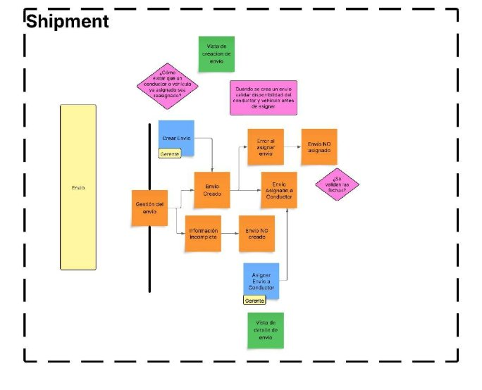

- Analytics: 

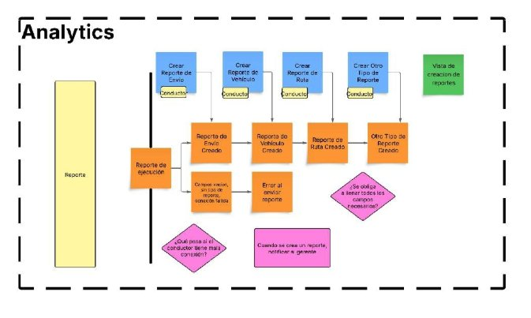

Link de Lucidchart:[ https://lucid.app/lucidchart/c3a56cf0-cb3f-4aa2-a9fb- b84400e5ec12/edit?viewport_loc=-11645%2C- 2705%2C13687%2C7929%2C0_0&invitationId=inv_c09779ac-741d-4f3e-9d56-15a2f9117ad9 ](https://lucid.app/lucidchart/c3a56cf0-cb3f-4aa2-a9fb-b84400e5ec12/edit?viewport_loc=-11645%2C-2705%2C13687%2C7929%2C0_0&invitationId=inv_c09779ac-741d-4f3e-9d56-15a2f9117ad9)

2. **Domain Message Flows Modeling** 

En esta sección, se describe el proceso utilizado para visualizar la interacción entre los diferentes bounded contexts que conforman el sistema. El objetivo principal es entender cómo estos contextos colaboran para resolver los casos de uso del negocio y satisfacer las necesidades de los usuarios. Para lograr esto, se aplicó la técnica de Domain Storytelling, que facilita la representación gráfica de los flujos de mensajes entre actores, contextos y sistemas, permitiendo identificar claramente las responsabilidades y los puntos de comunicación entre cada componente del dominio 

- IAM -> Vehicles & Tracking 

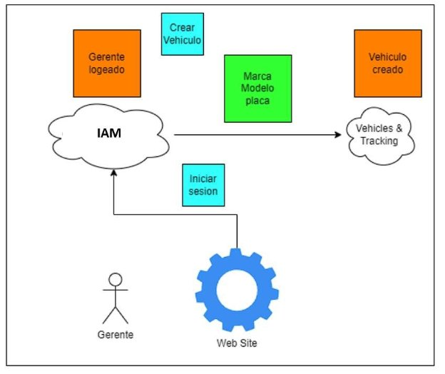

- IAM -> Analytics 

- IAM -> Analytics 

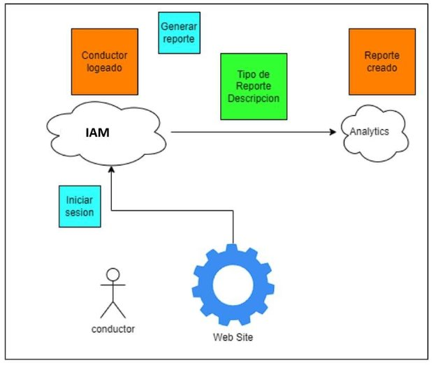

- IAM -> Shipment 

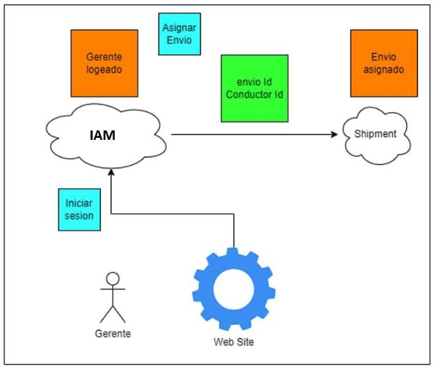

3. **Bounded Context Canvases** 

En esta parte del documento se describen las acciones realizadas por el equipo para estructurar los bounded contexts que fueron reconocidos a lo largo del proceso. El desarrollo de estos contextos fue llevado a cabo de forma iterativa, garantizando que cada uno representa fielmente los principios de diseño y el conocimiento del dominio. Para cada bounded context, se llevaron a cabo los siguientes pasos principales: 

- Definición General del Contexto: Se establecieron tanto el propósito como los límites de cada contexto, asegurando su coherencia con el ámbito del negocio. 
- Identificación de Reglas de Negocio y Lenguaje Común: Se extrajeron las principales reglas de negocio y se documentó el lenguaje compartido, con el objetivo de facilitar la comunicación entre los miembros del equipo. 
- Análisis de Capacidades: Se examinaron las funcionalidades que debía ofrecer cada contexto. 
- Organización por Capas: Cuando fue necesario, se implementó una estructura por capas para las capacidades definidas. 
- Identificación de Dependencias: Se detectaron las relaciones y conexiones con otros contextos y sistemas externos. 
- Revisión del Diseño: Se evaluó la arquitectura propuesta para garantizar un bajo acoplamiento y su alineación con los objetivos estratégicos del negocio. 

  Gracias a este enfoque, el equipo pudo construir los bounded contexts de forma sólida, asegurando que cada uno cumpliera con su función dentro del sistema global. 

Bounded Context Canvases IAM: 

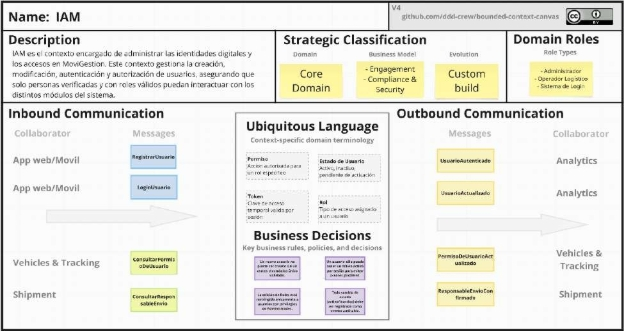

Bounded Context Canvases Vehicles & Tracking: 

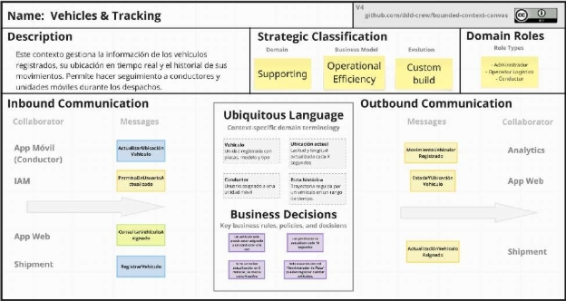

Bounded Context Canvases Shipment: 

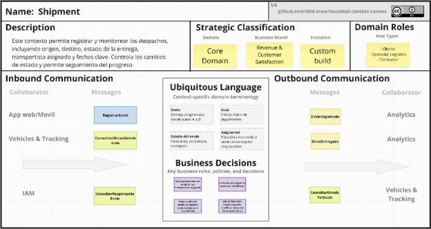

2. **Context Mapping** 

En esta sección, se analizan las relaciones entre los bounded contexts identificados y se asignan patrones de context mapping adecuados para cada uno: 

IAM ➔ Vehicles & Tracking / Shipment** 

**Descripción:** IAM actúa como Proveedor de identidad y permisos. Ambos contextos consumen esta información para garantizar seguridad antes de realizar acciones operativas. 

Vehicles & Tracking ➔ Shipment** 

**Descripción:** Shipment necesita saber la ubicación en tiempo real del vehículo asignado para monitorear el progreso del despacho. 

Vehicles & Tracking y Shipment ➔ Analytics** 

**Descripción:** Ambos publican eventos relevantes (movimientos, estados de envío) que Analytics recolecta para construir reportes operativos y dashboards de rendimiento. 

IAM ➔ Analytics** 

**Descripción:** Los eventos de autenticación, creación o actualización de usuarios también son capturados por Analytics para rastrear actividad en el sistema. 

**Preguntas estratégicas de reflexión:** 

- **¿Qué pasaría si movemos capacidades de gestión de usuarios fuera de IAM?** Se evaluó separar Registro de Usuarios en un contexto independiente. Sin embargo, se descartó para no complicar el flujo de autenticación y autorización, que debe ser centralizado. 
- **¿Qué pasaría si descomponemos Vehicles & Tracking en dos contextos: gestión de vehículos vs. tracking?** 

  Se consideró dividirlo, pero el tracking está intrínsecamente vinculado a la entidad Vehículo, y separarlos aumentaría latencia y complejidad de sincronización. Se decidió mantenerlos juntos. 

- **¿Qué pasaría si partimos Analytics en un contexto de "Reportes" y otro de "Dashboards"?** 

  Se analizó, pero dada la escala actual del sistema, dividir Analytics complicaría innecesariamente los flujos de eventos. Se mantiene un solo contexto por ahora. 

- **¿Qué pasaría si tomamos el manejo de asignaciones (usuarios a vehículos/envíos) en un contexto separado?** 

  Se pensó en un "Contexto de Asignaciones", pero resultaría en dependencias redundantes entre IAM, Vehicles & Tracking y Shipment. Se decidió que cada contexto maneje sus propias asignaciones. 

- **¿Qué pasaría si creamos un shared service para usuarios entre IAM y Shipment?** 

  Se descartó porque IAM ya es el proveedor centralizado de identidad y permisos, y mover lógica fuera de él introduciría inconsistencias. 

- **¿Qué pasaría si aislamos los core capabilities de IAM en un nuevo contexto?** 

  Se concluyó que IAM ya está correctamente enfocado en su Core Capability (Identity Management), por lo que no se fragmenta más. 

**Conclusion del analisis:** 

- No se crean nuevos bounded contexts adicionales. 
- Se mantienen 4 bounded contexts. 
- Se refuerza que IAM actúa como Supplier para Vehicles & Tracking y Shipment. 
- Analytics actúa como Subscriber de eventos generados por los otros contextos. 

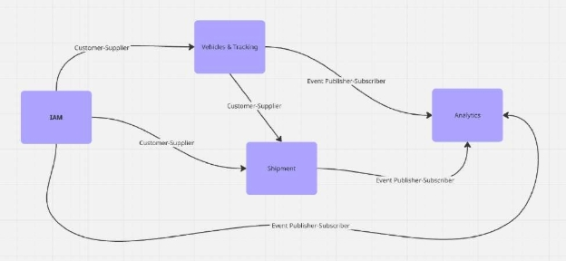

3. **Software Architecture** 
1. **Software Architecture System Landscape Diagram** 

El  diagrama  muestra  todo  el  entorno  de  MoviGestión.  Dentro  del  recuadro punteado están las personas de la empresa: el gerente (Business Owner) y el conductor, quienes  usan  la  plataforma  MoviGestión  para  crear  envíos,  asignar  vehículos  y  ver reportes. Fuera del recuadro están dos sistemas externos: los sensores instalados en los vehículos, que envían su ubicación y datos de temperatura a la plataforma, y la API de Google Maps, que la plataforma consulta para mostrar los mapas y las rutas. 

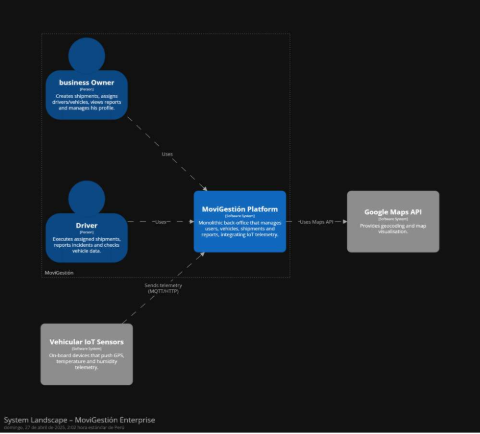

2. **Software Architecture Context Level Diagrams** 

El diagrama de contexto muestra cómo se conecta la plataforma MoviGestión con su entorno directo: el Business Owner y el Driver usan la plataforma para gestionar envíos, vehículos  y  reportes; los sensores IoT instalados en  los vehículos  le envían datos de ubicación, temperatura y humedad; y la plataforma consulta la API de Google Maps para obtener y mostrar rutas y mapas. Así, de un vistazo se ve quién interactúa con la plataforma y qué servicios externos la alimentan o le dan soporte. 

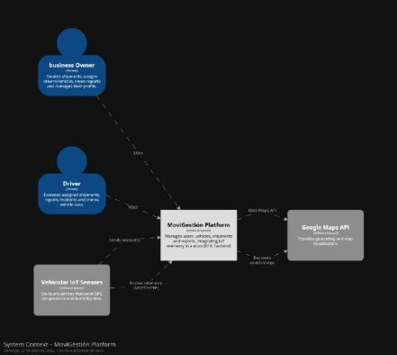

3. **Software Architecture Container Level Diagrams** 

El diagrama de contenedores detalla cómo se reparte la solución MoviGestión en piezas internas: el Manager Web App (React) y la Driver Mobile App (Flutter) son las dos interfaces; ambas se conectan por REST/HTTPS al API Gateway, que dirige todas las peticiones  al  Backend  (Spring  Boot).  El  backend  contiene  los  módulos  de  envíos, vehículos,  conductores,  reportes,  identidad  y  telemetría,  consulta  la  Relational  DB (PostgreSQL) para guardar y leer datos y, además, usa la Google Maps API para obtener rutas y mapas. Los Vehicular IoT Sensors externos envían directamente la telemetría (GPS, temperatura, humedad) al backend. 

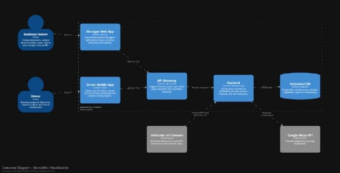

4. **Software Architecture Deployment Diagrams** 

El diagrama de despliegue muestra cómo se ejecuta MoviGestión en producción: el Manager Web App y la Driver Mobile App se conectan por HTTPS al API Gateway alojado en la subred pública de una AWS VPC; el gateway envía las peticiones al Backend (Spring Boot) que corre en la subred privada, donde también reside el PostgreSQL que guarda usuarios, vehículos, envíos, reportes y telemetría. Los sensores IoT instalados en cada vehículo envían sus datos directamente al backend (MQTT/HTTP), y éste consulta la Google Maps API vía HTTPS para geocodificación y rutas. Así, de un vistazo se ve dónde vive cada componente, en qué nodos se despliega y cómo fluyen los datos dentro y fuera de la nube. 

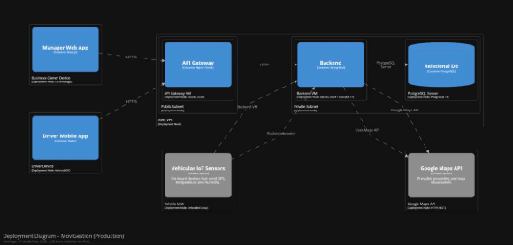

2. **Tactical-Level Domain-Driven Design** 
1. **Bounded Context: IAM** 

   Se encarga de gestionar la identidad digital de los usuarios y controlar su acceso a recursos del sistema. Proporciona servicios de autenticación (verificación de identidad) y autorización (control de permisos) de forma segura y escalable. Su responsabilidad es manejar usuarios, roles, permisos y sesiones de manera centralizada, siguiendo principios de seguridad. 

1. **Domain Layer** 

Contiene la lógica de negocio pura y las entidades principales relacionadas a la identidad y gestión de accesos, encapsulando el comportamiento y las reglas de negocio. 

**Aggregate 1: User** 

|**Nombre** |**Categoría** |**Descripción** |
| - | - | - |
|User |Entity |Representa una identidad de usuario en el sistema IAM, incluyendo credenciales seguras, estado de verificación de email y el **único** rol asignado. Es la raíz de un agregado que mantiene la consistencia de los datos del usuario. |

**Attributes** 

|**Nombre** |**Tipo de dato** |**Visibilidad** |**Descripción** |
| - | :- | - | - |
|id |UUID |Private |Identificador único del usuario. |
|name |String |Private |Nombre completo del usuario. |
|email |Email |Private |Objeto de valor encapsulando la dirección de correo electrónico y su validación. |
|passwordHash |String |Private |Contraseña hasheada del usuario. |
|isEmailVerifie d |Boolean |Private |Estado de verificación del correo electrónico. |
|status |Enum |Private |Estado del usuario. |
|roleId |UUID |Private |Referencia al ID del único rol asignado al usuario. |
|createdAt |Date |Private |Fecha de creación. |
|updatedAt |Date |Private |Fecha de actualización. |

**Methods** 

|**Nombre** |**Tipo de retorno** |**Visibilidad** |**Descripción** |
| - | - | - | - |
|create(...) |User |Public |Crea una nueva instancia de User, aplicando validaciones iniciales. |
|changePassword( newPassword, PasswordEncoder ) |Void |Public |Actualiza la contraseña del usuario después de verificar las reglas de negocio. |
|updateProfile(ne wName, newEmail, emailService) |Void |Public |Actualiza el nombre y email del usuario.  |

|assignRole(UUID roleId) |Void |Public |Establece o cambia el rol asignado al usuario al roleId proporcionado |
| :- | - | - | :- |
|removeRole(UUI D roleId) |Void |Public |Remueve un rol. |
|isPasswordValid( rawPassword, passwordEncoder ) |Boolean |Public |Verifica si una contraseña plana coincide con el hash almacenado. |

**Aggregate 2: Role** 

|**Nombre** |**Categoría** |**Descripción** |
| - | - | - |
|Role |Entity |Define un tipo de usuario con un conjunto específico de permisos. |

**Attributes** 

|**Nombre** |**Tipo de dato** |**Visibilidad** |**Descripción** |
| - | :- | - | - |
|id |UUID |Private |Identificador único del rol. |
|name |String |Private |Nombre único del rol asignado. |
|description |String |Private |Descripción del rol. |
|permissions |Set<Permissi on> |Private |Conjunto de value objects Permission asociados a este rol. |

**Methods** 

|**Nombre** |**Tipo de dato** |**Visibilidad** |**Descripción** |
| - | :- | - | - |
|create(name , description) |Role |Public |Crea una nueva instancia de Role. |

|changeNam e(new Name) |Void |Public |Actualiza el nombre del rol. |
| :- | - | - | - |
|changeDesc ription(new Description ) |Void |Public |Actualiza la descripción del rol. |
|addPermissi on(Permissi on permission) |Void |Public |Añade un Objeto de Valor Permission al conjunto de rol. |
|removePer mission(Per mission permission) |Void |Public |Remueve un Objeto de Valor Permission del conjunto del rol. |
|hasPermissi on(String permission Name) |Boolean |Public |Verifica si el rol contiene un permiso específico |

**Aggregate 3: Session** 

|**Nombre** |**Categoría** |**Descripción** |
| - | - | - |
|Session |Entity |Representa una sesión de usuario activa para mantener el estado de autenticación, manejar tokens (acceso y refresco) y controlar el tiempo de vida de la sesión. |

**Attributes** 

|**Nombre** |**Tipo de dato** |**Visibilidad** |**Descripción** |
| - | :- | - | - |
|id |UUID |Private |Identificador único de la sesión. |
|userId |String |Private |Identificador del usuario asociado |

|accessToken |String |Private |Token principal usado para autenticar peticiones. |
| - | - | - | :- |
|refreshToken |String |Private |Token usado para obtener nuevos Access Tokens sin reautenticar. |
|creationTime |Date |Private |Marca de tiempo de creación de la sesión. |
|expiresAt |Date |Private |Fecha de expiración de la sesión. |
|isValid |Boolean |Private |Indica si la sesión ha sido explícitamente invalidada |

**Methods** 

|**Nombre** |**Tipo de dato** |**Visibilidad** |**Descripción** |
| - | :- | - | - |
|create(userId, accessToken, refreshToken, expiresAt |Session |Public |Crea una nueva instancia de Session. |
|invalidate() |Void |Public |Marca la sesión como inválida. |
|refresh(newAc cessToken, newRefreshTo ken, newExpiresAt) |Void |Public |Actualiza los tokens y el tiempo de expiración de la sesión. |
|isValid(current Time: Date) |Boolean |Public |Verifica si la sesión no está expirada y no ha sido invalidada. |
|getAccessToke n() |String |Public |Retorna el Access Token actual de la sesión. |

**Value Object: Email** 

|**Nombre** |**Categoría** |**Descripción** |
| - | - | - |
|Email |Value Object |Encapsula una dirección de correo electrónico en formato string. |

**Attributes** 

|**Nombre** |**Tipo de dato** |**Visibilidad** |**Descripción** |
| - | :- | - | - |
|value |String |Private |La dirección de correo electrónico en formato string. |

**Methods** 

|**Nombre** |**Tipo de dato** |**Visibilidad** |**Descripción** |
| - | :- | - | - |
|of(string value) |Email |Public |Crea una instancia inmutable de Email después de validar su formato. |
|getValue() |String |Public |Retorna la dirección como string |
|equals(object other) |Boolean |Public |Compara si dos emails son iguales |
|hashCode() |int |Public |Calcula el hashcode basado en el valor |
|toString() |String |Public |Retorna la representación en cadena. |

**Value Object: Permission** 

|**Nombre** |**Categoría** |**Descripción** |
| - | - | - |
|Permission |Value Object |Representa una capacidad específica dentro del sistema. Es inmutable. |

**Attributes** 

|**Nombre** |**Tipo de dato** |**Visibilidad** |**Descripción** |
| - | :- | - | - |
|value |String |Private |Representación única del permiso. |

**Methods** 

|**Nombre** |**Tipo de** |**Visibilidad** |**Descripción** |
| - | - | - | - |

||**dato** |||
| :- | - | :- | :- |
|of(string value) |Email |Public |Crea una instancia inmutable de Permission después de validar su formato. |
|getValue() |String |Public |Retorna el valor del permiso |
|equals(object other) |Boolean |Public |Compara si dos Permission tienen el mismo valor |
|hashCode() |int |Public |Calcula el hashcode basado en el valor |
|toString() |String |Public |Retorna la representación en cadena. |

2. **Interface Layer** 

Esta capa es responsable de la recepción y formato de peticiones/respuestas externas (API REST), validación básica del formato y los datos de entrada, manejo de errores a nivel de API y delegación de la lógica de negocio a la capa de Aplicación. 

**Controller 1: AuthController** 

|**Nombre** |**Categoría** |**Descripción** |
| - | - | - |
|AuthController |Controller |Controlador para los endpoints relacionados con la autenticación de usuarios y la gestión del ciclo de vida de las sesiones (registro, login, logout, refresco). |

**Attributes** 

|**Nombre** |**Tipo de dato** |**Visibilidad** |**Descripción** |
| - | - | - | - |
|authService |AuthService |Private |Servicio de la capa de Aplicación para lógica de autenticación/sesiones. |
|userMapper |UserMapper |Private |Mapper para convertir entre DTOs y objetos usados por Application/Domain |
|sessionMap per |SessionMapp er |Private |Mapper para convertir entre DTOs y objetos de Sesión. |

**Endpoints** 

|**Ruta** |**Método** |**Descripción** |
| - | - | - |
|/api/iam/registe r |POST |Registra un nuevo usuario en el sistema. |
|/api/iam/login |POST |Autentica a un usuario con email y contraseña, creando una nueva sesión. |
|/api/iam/logout |POST |Invalida la sesión activa del usuario. |
|/api/iam/refresh -session |POST |Obtiene un nuevo access token utilizando un refresh token válido |

**Controller 2: UserController** 

|**Nombre** |**Categoría** |**Descripción** |
| - | - | - |
|UserController |Controller |Controlador para operaciones de gestión de usuarios (CRUD). |

**Attributes** 

|**Nombre** |**Tipo de dato** |**Visibilidad** |**Descripción** |
| - | - | - | - |
|userService |UserService |Private |Servicio de la capa de Aplicación para lógica de gestión de usuarios. |
|userMapper |UserMapper |Private |Mapper para convertir entre DTOs y objetos de Usuario. |

**Endpoints** 

|**Ruta** |**Método** |**Descripción** |
| - | - | - |
|/api/iam/users |GET |Retorna una lista paginada o completa de usuarios existentes. |
|/api/iam/users/{i d} |GET |Retorna los datos de un usuario específico por su ID. |
|/api/iam/users/{i|PUT |Actualiza datos de un usuario existente por su ID. |

|d} |||
| - | :- | :- |
|/api/iam/users/{i d} |DELETE |Elimina un usuario del sistema por su ID. |
|/api/iam/users/{i d}/assign-role |POST |Asigna un rol específico a un usuario por su ID. |

**Controller 3: RoleController** 

|**Nombre** |**Categoría** |**Descripción** |
| - | - | - |
|RoleController |Controller |Controlador para operaciones de gestión de roles (CRUD) |

**Attributes** 

|**Nombre** |**Tipo de dato** |**Visibilidad** |**Descripción** |
| - | - | - | - |
|roleService |RoleService |Private |Servicio de la capa de Aplicación para lógica de gestión de roles. |
|roleMapper |RoleMapper |Private |Mapper para convertir entre DTOs y objetos de Rol. |

**Endpoints** 

|**Ruta** |**Método** |**Descripción** |
| - | - | - |
|/api/iam/roles |POST |Crea un nuevo rol. |
|/api/iam/roles |GET |Lista todos los roles existentes. |
|/api/iam/roles/{i d} |GET |Obtiene los datos de un rol específico por su ID. |
|/api/iam/roles/{i d} |PUT |Actualiza los datos de un rol existente |
|/api/iam/roles/{i d} |DELETE |Elimina un rol existente por su ID. |

**DTOs** 

|**Nombre** |**Descripción** |
| - | - |
|RegisterRequestDto |{ name: String, email: String, password: String } |
|LoginRequestDto |{ email: String, password: String } |
|LoginResponseDto |{ accessToken: String, refreshToken: String, expiresIn: Long, userId: UUID } |
|LogoutRequestDto |{ refreshToken: String }  |
|UserIdDto |{ userId: UUID } |
|UserUpdateDto |{ name: String, email: String, status: String, roleId: UUID } |
|UserResponseDto |{ id: UUID, name: String, email: String, isEmailVerified: Boolean, status: String, roleId: UUID, createdAt: Date, updatedAt: Date }  |
|AssignRoleRequestDto |{ roleId: UUID } |
|RoleCreateDto |{ name: String, description: String, permissions: List<String> } |
|RoleUpdateDto |name: String, description: String, permissions: List<String>  |
|RoleResponseDto |{ id: UUID, name: String, description: String, permissions: List<String> } |
|CheckPermissionResponseDto |{ hasPermission: Boolean } |

3. **Application Layer** 

En la capa de Application Layer se ubican los servicios que contienen la lógica de negocio relacionada con usuarios y roles. 

**Service 1: AuthService** 

|**Nombre** |**Categoría** |**Descripción** |
| - | - | - |

|AuthService |Service |Servicio de aplicación responsable de los casos de uso relacionados con la autenticación de usuarios y la gestión de sesiones y tokens. |
| - | - | :- |

**Dependencies**  

|**Nombre** |**Tipo de Objeto** |**Visibilidad** |**Descripción** |
| - | :- | - | - |
|userRepositor y |UserReposit ory |Private |Acceso a la persistencia de Usuarios. |
|sessionRepos itory |SessionRepo sitory |Private |Acceso a la persistencia de Sesiones. |
|roleRepositor y |RoleReposit ory |Private |Necesario para obtener el rol por defecto o validar roles asignados. |
|passwordEnc oder |PasswordEnc oder |Private |Servicio técnico para hashear y verificar contraseñas. |
|jwtProvider |JwtProvider( Infrastructur e) |Private |Servicio técnico para generar y validar JWTs |
|emailService |EmailService |Private |Servicio técnico para enviar emails. |
|userFactory |UserFactory |Private |Ayuda a construir objetos User complejos si el constructor de User no es suficiente. |
|sessionFactor y |SessionFacto ry |Private |Ayuda a construir objetos Session |

**Methods** 

|**Nombre** |**Tipo de retorno** |**Visibilidad** |**Descripción** |
| - | - | - | - |
|registerUser( RegisterUser Command command) |UserIdDto |Public |Implementa el caso de uso de registro de usuario. |
|authenticateU ser(LoginQue ry query) |LoginResponse Dto |Public |Implementa el caso de uso de autenticación. |

|logoutUser(L ogoutComma nd command) |Void |Public |Implementa el caso de uso de cierre de sesión. |
| :- | - | - | :- |
|refreshSessio n(RefreshSes sionComman d command) |LoginResponse Dto |Public |Implementa el caso de uso de refresco de sesión. |
|checkUserPer mission(Chec kPermission Query query) |Boolean |Public |Implementa el caso de uso para verificar si un usuario tiene un permiso. (Podría ser también un Domain Service). |

**Service 2: UserService** 

|**Nombre** |**Categoría** |**Descripción** |
| - | - | - |
|UserService |Service |Servicio de aplicación responsable de los casos de uso de gestión de usuarios (CRUD y asignación de rol) por parte de administradores u otros procesos internos. |

**Dependencies** 

|**Nombre** |**Tipo de Objeto** |**Visibilidad** |**Descripción** |
| - | :- | - | - |
|userRepository |UserRepository |Private |Acceso a la persistencia de Usuarios. |
|roleRepository |RoleRepository |Private |Necesario para validar roles o obtener sus datos. |
|passwordEncod er |PasswordEncod er  |Private |Necesario si se permite cambiar contraseña vía update. |
|authenticationS ervice |Authentication Service |Private |Para usar el servicio de dominio de verificación de permisos. |
|userMapper |UserMapper  |Private |Para mapear entre DTOs/objetos de aplicación y objetos de Dominio/respuesta. |

**Methods** 

|**Nombre** |**Tipo de dato** |**Visibilidad** |**Descripción** |
| - | - | - | - |
|listAllUsers(. ..) |List<UserRespo nseDto> |Public |Listar todos los usuarios (con paginación/filtros). |
|getUserById( UUID userId) |UserResponseDt o |Public |Obtener un usuario por su ID. |
|updateUser( UUID userId, UserUpdateC ommand command) |UserResponseDt o |Public |Actualizar datos de un usuario. |
|deleteUser(U UID userId) |Void |Public |Eliminar un usuario. |
|assignRoleTo User(Assign RoleComman d command) |Void |Public |Asignar un rol a un usuario. |

**Service 3: RoleService** 

|**Nombre** |**Categoría** |**Descripción** |
| - | - | - |
|RoleService |Service |Servicio de aplicación responsable de los casos de uso de gestión de roles (CRUD y manejo de permisos) por parte de administradores. |

**Dependencies** 

|**Nombre** |**Tipo de Objeto** |**Visibilidad** |**Descripción** |
| - | :- | - | - |
|roleRepository |RoleRepository  |Private |Acceso a la persistencia de Roles. |
|userRepository |UserRepository |Private |Necesario para verificar si un rol está en uso antes de eliminarlo. |
|authenticationS ervice |Authentication Service |Private |Para usar el servicio de dominio de verificación de permisos. |
|roleMapper |RoleMapper |Private |Para mapear entre DTOs/objetos de aplicación y objetos de |

||||Dominio/respuesta. |
| :- | :- | :- | - |

**Methods** 

|**Nombre** |**Tipo de dato** |**Visibilidad** |**Descripción** |
| - | - | - | - |
|createRole(C reateRoleCo mmand command) |RoleResponseDt o |Public |Crear un nuevo rol. |
|listAllRoles(. ..) |List<RoleRespo nseDto> |Public |Listas todos los roles. |
|getRoleById( UUID roleId) |RoleResponseDt o |Public |Obtener un rol por su ID. |
|updateRole( UUID roleId, UpdateRoleC ommand command) |RoleResponseDt o |Public |Actualizar datos de un rol. |
|deleteRole(U UID roleId) |Void |Public |Eliminar un rol. |

**Commands y Queries** 

- RegisterUserCommand 
- LoginQuery 
- LogoutCommand 
- RefreshSessionCommand 
- CheckPermissionQuery 
- UserUpdateCommand 
- AssignRoleCommand 
- CreateRoleCommand 
- UpdateRoleCommand 
4. **Infrastructure Layer** 

En la capa de Infrastructure Layer, se encuentran los repositorios que permiten la persistencia de las entidades de usuarios y roles en la base de datos. **JpaUserRepositoryImpl** 

|**Nombre** |**Categoría** |**Implementa** |**Descripción** |
| - | - | - | - |
|JpaUserRe positoryIm pl |Repositor y Implement ationv |UserRepository |Implementación concreta de la interfaz UserRepository utilizando JPA y, típicamente, Spring Data JPA. Maneja el mapeo entre la entidad de dominio User y la tabla/colección de la base de datos subyacente. |

**Funcionalidad clave** 

- Busca y carga entidades User por ID, email, etc.** 
- Guarda (inserta/actualiza) entidades User.** 
- Elimina entidades User.** 
- Verifica la existencia de usuarios por email o ID. 
- Verifica la existencia de usuarios por roleId (para validaciones al borrar roles).** 

**JpaRoleRepositoryImpl** 

|**Nombre** |**Categoría** |**Implementa** |**Descripción** |
| - | - | - | - |
|JpaUserRepo sitoryImpl |Repository Implementation |RoleRepository |Implementación concreta de la interfaz RoleRepository utilizando JPA y Spring Data JPA. Maneja el mapeo entre el agregado de dominio Role y la base de datos. |

**Funcionalidad clave** 

- Busca y carga agregados Role por ID, nombre, etc.** 
- Guarda (inserta/actualiza) agregados Role.** 
- Elimina agregados Role.** 
- Verifica la existencia de roles por nombre o ID. 

**JpaSessionRepositoryImpl** 

|**Nombre** |**Categoría** |**Implementa** |**Descripción** |
| - | - | - | - |
|JpaSessionRe positoryImpl |Repository Implementation |UserRepository |Implementación concreta de la interfaz SessionRepository utilizando JPA y Spring Data JPA. Maneja el mapeo entre el agregado de dominio Session y la base de datos. |

**Funcionalidad clave** 

- Busca y carga agregados Session por ID, refreshToken, etc. 
- Guarda (inserta/actualiza) agregados Session. 
- Elimina agregados Session. 
- Puede tener métodos para encontrar sesiones válidas o expiradas. 

**BCryptPasswordEncoderImpl** 

|**Nombre** |**Categoría** |**Implementa** |**Descripción** |
| - | - | - | - |
|JpaUserRepo sitoryImpl |Security Service Implementation |UserRepository |Implementación concreta de la interfaz UserRepository utilizando JPA y, típicamente, Spring Data JPA. Maneja el mapeo entre la entidad de dominio User y la tabla/colección de la base de datos subyacente. |

**Funcionalidad clave** 

- String encode(CharSequence rawPassword): Genera el hash de una contraseña 

  plana. 

- boolean matches(CharSequence rawPassword, String encodedPassword): Verifica si una contraseña plana coincide con un hash dado. 

**JwtProviderImpl** 

|**Nombre** |**Categoría** |**Implementa** |**Descripción** |
| - | - | - | - |
|JpaUserRepo sitoryImpl |Repository Implementation |Password Encoder |Implementación concreta de una interfaz PasswordEncoder (definida en una capa superior o estándar de framework) que utiliza el algoritmo BCrypt para hashear y verificar contraseñas de forma segura. |

Funcionalidad clave 

- String generateAccessToken(UserDetails userDetails, ...): Crea y firma un JWT para autenticación. 
- String generateRefreshToken(SessionId sessionId, ...): Crea y firma un JWT para refresco de sesión. 
- Métodos para extraer información (ej. userId, sessionId, roles) de un token válido. 

5. **Bounded Context Software Architecture Component Level Diagrams** 
5. **Bounded Context Software Architecture Code Level Diagrams** 
1. **Bounded Context Domain Layer Class Diagrams** 

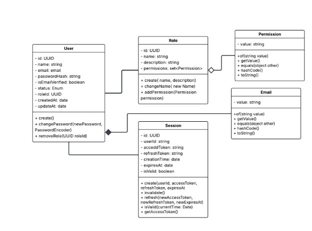

2. **Bounded Context Database Design Diagram** 

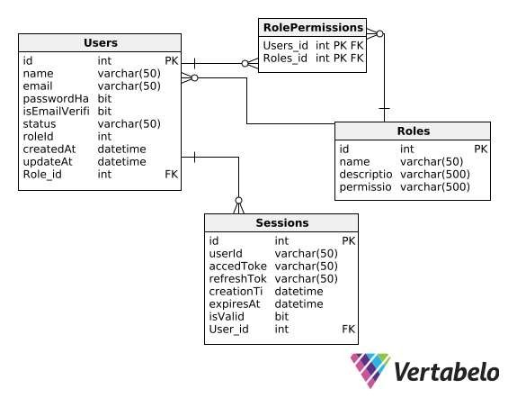

2. **Bounded Context: Vehicles & Tracking** 

   Este bounded context centraliza la gestión de los vehículos de la flota, sus características, rutas asignadas, informes de infracciones y reportes de velocidad mediante geolocalización en tiempo real, asegurando el monitoreo y control de las unidades. 

1. **Domain Layer** 

**Aggregate 1: Vehicles** 

|**Nombre** |**Categoría** |**Descripción** |
| - | - | - |
|Vehicles |Entity / Aggregate |Representa al vehículo en sí; es la entidad principal que gestiona sus rutas, reportes y sensores. |

**Attributes** 

|**Nombre** |**Tipo de dato** |**Visibilidad** |**Descripción** |
| - | :- | - | - |
|vehicleId |UUID |Private |Identificador único del vehículo en el sistema. |
|vehiclePlate |String |Private |Matrícula o placa del vehículo. |
|brand |String |Private |Marca del vehículo (ej: Toyota, Volvo). |
|model |String |Private |Modelo del vehículo (ej: Corolla, FH16). |
|year |Int |Private |Año de fabricación del vehículo. |
|status |String |Private |Estado actual del vehículo (ej: activo, en mantenimiento). |
|speedSensor |SpeedSens or |Private |Objeto que almacena información del sensor de velocidad. |
|humeditySenso r |HumedityS ensor |Private |Objeto que almacena información del sensor de humedad. |
|gpsSensor |GPSSensor |Private |Objeto que almacena información del sensor GPS. |
|driverHistory |List<Drive rhistory> |Private |Historial de conductores asociados al vehículo. |
|vehicleRoutes |List<Vehic leRoute> |Private |Rutas asignadas o recorridas por el vehículo. |
|vehicleReports |List<Repor tVehicle> |Private |Lista de reportes generales sobre el vehículo. |

**Methods** 

|**Nombre** |**Tipo de retorno** |**Visibilidad** |**Descripción** |
| - | - | - | - |
|generateVehicleR eport() |ReportV ehicle |Public |Genera un reporte de condiciones generales del vehículo. |
|assignDriver(Driv erHistory |Void |Public |Asigna o actualiza el historial de conductor para el vehículo. |

|driverHistory) ||||
| - | :- | :- | :- |
**Aggregate 2: VehicleRoute** 

|**Nombre** |**Categoría** |**Descripción** |
| - | - | - |
|Vehicle Route |Entity |Representa las rutas asignadas a un vehículo, indicando su recorrido planificado o histórico. |

**Attributes** 

|**Nombre** |**Tipo de dato** |**Visibilidad** |**Descripción** |
| - | :- | - | - |
|routeId |UUID |Private |Identificador único de la ruta. |
|vehicleId |UUID |Private |Identificador del vehículo asociado a la ruta. |
|startLocation |String |Private |Punto de partida de la ruta. |
|endLocation |String |Private |Punto de destino de la ruta. |
|waypoints |List<string > |Private |Lista de puntos intermedios o paradas durante la ruta. |
|estimatedTime |Integer |Private |Tiempo estimado en minutos para completar la ruta. |
|distance |Double |Private |Distancia total de la ruta en kilómetros. |
|status |String |Private |Estado de la ruta (Ej: "Programada", "En curso", "Completada", "Cancelada"). |
|startTime |DateTime |Private |Hora y fecha de inicio programado de la ruta. |
|endTime |DateTime |Private |Hora y fecha de finalización programada o real de la ruta. |

**Methods** 

|**Nombre** |**Tipo de retorno** |**Visibilidad** |**Descripción** |
| - | - | - | - |
|startRoute() |Void |Public |Inicia la ruta actualizando el estado a "En |

||||curso" y registrando la hora de inicio. |
| :- | :- | :- | - |
|completeRoute() |Void |Public |Finaliza la ruta, actualizando el estado a "Completada" y registrando la hora de fin. |
|updateWaypoints( newWaypoints: List<String>) |Void |Public |Actualiza la lista de puntos intermedios de la ruta. |
|calculateDistance () |Double |Public |Calcula y devuelve la distancia total de la ruta basándose en las coordenadas. |
|getRouteDuration () |Integer |Public |Retorna la duración total (en minutos) entre el inicio y el final de la ruta. |
|isRouteActive() |Boolean |Public |Verifica si la ruta está actualmente en estado "En curso". |

**Aggregate 3: RouteTracking** 

|**Nombre** |**Categoría** |**Descripción** |
| - | - | - |
|RouteTr acking |Entity  |Representa la ubicación en tiempo real y el seguimiento de las rutas. |

**Attributes** 

|**Nombre** |**Tipo de dato** |**Visibilidad** |**Descripción** |
| - | :- | - | - |
|trackingId |UUID |Private |Identificador único del seguimiento de ruta. |
|vehicleId |UUID |Private |Identificador del vehículo que está siendo rastreado. |
|currentLocatio n |String |Private |Ubicación actual del vehículo (puede ser en coordenadas o nombre de lugar). |
|speed |Double |Private |Velocidad actual del vehículo en km/h. |
|timestamp |DateTime |Private |Fecha y hora del último registro de seguimiento. |
|routeId |UUID |Private |Ruta asignada en la cual se está realizando el seguimiento. |

|isOverSpeedin g |Boolean |Private |Indica si el vehículo está excediendo el límite de velocidad permitido |
| :- | - | - | :- |

**Methods** 

|**Nombre** |**Tipo de retorno** |**Visibilidad** |**Descripción** |
| - | - | - | - |
|updateLocation(n ewLocation: String) |Void |Public |Actualiza la ubicación actual del vehículo. |
|detectOverSpeed( limit: Double) |Boolean |Public |Detecta si la velocidad actual supera el límite establecido. |
|getTrackingSum mary() |String |Public |Devuelve un resumen textual del estado actual de seguimiento. |
|isOnRoute() |Boolean |Public |Verifica si el vehículo aún sigue dentro de la ruta asignada. |
|refreshTimestamp () |Void |Public |Actualiza el timestamp al momento actual para el nuevo dato registrado. |

**Value Object: GPSSensor** 

|**Nombre** |**Categoría** |**Descripción** |
| - | - | - |
|GPSSen sor |Value Object |Representa el dispositivo GPS que rastrea la localización del vehículo en tiempo real. |

**Attributes** 

|**Nombre** |**Tipo de dato** |**Visibilidad** |**Descripción** |
| - | :- | - | - |
|gpsId |UUID |Private |Identificador único del sensor GPS. |
|vehicleId |UUID |Private |Identificador del vehículo que está siendo geolocalizado. |
|latitude |Double |Private |Latitud actual registrada por el GPS. |
|longitude |Double |Private |Longitud actual registrada por el GPS. |

|accuracy |Double |Private |Precisión de la ubicación registrada (en metros). |
| - | - | - | :- |
|timestamp |DateTime |Private |Hora en la que se registró la ubicación. |

**Methods** 

|**Nombre** |**Tipo de retorno** |**Visibilidad** |**Descripción** |
| - | - | - | - |
|updateCoordinate s(newLat: Double, newLong: Double) |Void |Public |Actualiza las coordenadas geográficas actuales. |
|getLocation() |String |Public |Devuelve la ubicación actual como un string formateado. |
|getAccuracy() |Double |Public |Obtiene la precisión del último registro de ubicación. |
|refreshTimestamp () |Void |Public |Actualiza el tiempo del último registro de datos. |

**Value Object: SpeedSensor** 

|**Nombre** |**Categoría** |**Descripción** |
| - | - | - |
|SpeedSe nsor |Value Object |Representa el sensor de velocidad del vehículo, almacenando datos de medición. |

**Attributes** 

|**Nombre** |**Tipo de dato** |**Visibilidad** |**Descripción** |
| - | :- | - | - |
|speedSensorId |UUID |Private |Identificador único del sensor de velocidad. |
|vehicleId |UUID |Private |Identificador del vehículo que está siendo rastreado. |
|currentSpeed |Double |Private |Velocidad actual detectada por el sensor |

||||(km/h). |
| :- | :- | :- | - |
|speedLimit |Double |Private |Límite de velocidad permitido. |
|timestamp |DateTime |Private |Fecha y hora del último dato registrado. |

**Methods** 

|**Nombre** |**Tipo de retorno** |**Visibilidad** |**Descripción** |
| - | - | - | - |
|updateSpeed(new Speed: Double) |Void |Public |Actualiza la velocidad medida por el sensor. |
|isOverSpeeding() |Boolean |Public |Verifica si se supera el límite de velocidad. |
|setSpeedLimit(li mit: Double) |Void |Public |Establece un nuevo límite de velocidad. |
|refreshTimestamp () |Void |Public |Actualiza el tiempo del último dato de velocidad. |

**Value Object: HumiditySensor** 

|**Nombre** |**Categoría** |**Descripción** |
| - | - | - |
|Humidit ySensor |Value Object |Representa el sensor de humedad instalado en el vehículo. |

**Attributes** 

|**Nombre** |**Tipo de dato** |**Visibilidad** |**Descripción** |
| - | :- | - | - |
|humidityId |UUID |Private |Identificador único del sensor de humedad. |
|vehicleId |UUID |Private |ID del vehículo al que está asociado el sensor. |
|humidity |Float |Private |Porcentaje de humedad relativa actual (0- 100%). |
|status |String |Private |Estado del sensor ("Active", "Inactive", "Error", etc.). |

|timestamp |DateTime |Private |Hora del último registro de humedad. |
| - | - | - | - |
|minThreshold |Float |Private |Valor mínimo aceptable de humedad. |
|maxThreshold |Float |Private |Valor máximo aceptable de humedad. |

**Methods** 

|**Nombre** |**Tipo de retorno** |**Visibilidad** |**Descripción** |
| - | - | - | - |
|updateCoordinate s(newLat: Double, newLong: Double) |Void |Public |Actualiza las coordenadas geográficas actuales. |
|getLocation() |String |Public |Devuelve la ubicación actual como un string formateado. |
|getAccuracy() |Double |Public |Obtiene la precisión del último registro de ubicación. |
|refreshTimestamp () |Void |Public |Actualiza el tiempo del último registro de datos. |

2. **Interface Layer Controller 1: VehicleController** 

|**Nombre** |**Categoría** |**Descripción** |
| - | - | - |
|VehicleControl ler |Controller |Controlador para los endpoints relacionados con la gestión del ciclo de vida de vehículos y sus componentes IoT (registro, actualización, monitoreo y desactivación de vehículos). |

**Attributes** 

|**Nombre** |**Tipo de dato** |**Visibilidad** |**Descripción** |
| - | - | - | - |

|vehicleServ ice |VehicleServi ce |Private |Servicio de la capa de Aplicación para lógica de gestión del ciclo de vida de vehículos. |
| :- | :- | - | :- |
|vehicleMap per |VehicleMapp er |Private |Mapper para convertir entre DTOs y objetos usados por Application/Domain |

**Endpoints** 

|**Ruta** |**Método** |**Descripción** |
| - | - | - |
|/vehicles |POST |Crea un nuevo vehículo en el sistema. |
|/vehicles/{id} |PUT |Actualiza la información de un vehículo existente. |
|/vehicles/{id} |GET |Recupera la información de un vehículo usando su ID. |
|/vehicles |GET |Obtiene todos los vehículos registrados en el sistema. |

**Controller 2: RouteController** 

|**Nombre** |**Categoría** |**Descripción** |
| - | - | - |
|RouteControlle r |Controller |Controlador para gestionar las operaciones relacionadas con las rutas de vehículos, incluyendo creación, actualización, seguimiento en tiempo real y análisis histórico de trayectorias. |

**Attributes** 

|**Nombre** |**Tipo de dato** |**Visibilidad** |**Descripción** |
| - | - | - | - |
|routeServic e |RouteService |Private |Servicio de la capa de Aplicación para las rutas de vehículos.  |
|routeMappe r |RouteMappe r |Private |Mapper para convertir entre DTOs y objetos usados por Application/Domain |

**Endpoints** 

|**Ruta** |**Método** |**Descripción** |
| - | - | - |
|/routes |POST |Crea una nueva ruta para un vehículo. |
|/routes/{id} |PUT |Actualiza la información de una ruta existente. |
|/routes/{id} |GET |Recupera los detalles de una ruta específica. |
|/routes |GET |Obtiene todas las rutas activas o completadas. |

**Controller 3: TrackingController** 

|**Nombre** |**Categoría** |**Descripción** |
| - | - | - |
|TrackingContr oller |Controller |Controlador encargado del monitoreo en tiempo real de vehículos, gestionando la recopilación de datos GPS, actualización continua de ubicaciones, detección de desviaciones de ruta, generación de alertas inmediatas y visualización dinámica de flotas en mapas interactivos. |

**Attributes** 

|**Nombre** |**Tipo de dato** |**Visibilidad** |**Descripción** |
| - | - | - | - |
|trackingSer vice |TrackingServ ice |Private |Servicio de la capa de Aplicación para el monitoreo en tiempo real de vehículos. |
|trackingMa pper |TrackingMap per |Private |Mapper para convertir entre DTOs y objetos usados por Application/Domain |

**Endpoints** 

|**Ruta** |**Método** |**Descripción** |
| - | - | - |
|/tracking/{id} |GET |Recupera el seguimiento en tiempo real de una ruta. |
|/tracking/{id}/u pdate |POST |Actualiza la ubicación y velocidad de un vehículo en seguimiento. |
|/tracking/{id}/s peed-warning |GET |Verifica si el vehículo ha superado el límite de velocidad. |

**DTOs** 

|**Nombre** |**Descripción** |
| - | - |
|RegisterVehicleRequestDto |{ licensePlate: String, brand: String, model: String, status: String } |
|UpdateVehicleRequestDto |{ vehicleId: UUID, licensePlate: String, brand: String, model: String, status: String } |
|VehicleResponseDto |{ vehicleId: UUID, licensePlate: String, brand: String, model: String, status: String } |
|RegisterRouteRequestDto |{ vehicleId: UUID, startLocation: String, endLocation: String, status: String } |
|UpdateRouteRequestDto |{ routeId: UUID, vehicleId: UUID, startLocation: String, endLocation: String, status: String } |
|RouteResponseDto |{ routeId: UUID, vehicleId: UUID, startLocation: String, endLocation: String, status: String } |
|TrackingRequestDto |{ trackingId: UUID, vehicleId: UUID, currentLocation: String, currentSpeed: Double, overSpeeding: Boolean } |
|TrackingResponseDto |{ trackingId: UUID, vehicleId: UUID, currentLocation: String, currentSpeed: Double, overSpeeding: Boolean } |
|SpeedWarningRequestDto |{ vehicleId: UUID, speedLimit: Double, currentSpeed: Double } |
|SpeedWarningResponseDto |{ vehicleId: UUID, speedLimit: Double, isOverSpeeding: Boolean } |

3. **Application Layer Service 1: VehicleService** 

|**Nombre** |**Categoría** |**Descripción** |
| - | - | - |
|VehicleServic e |Service |Servicio que coordina la lógica relacionada con los vehículos. Maneja la creación, actualización y eliminación de vehículos. |

**Dependencies** 

|**Nombre** |**Tipo de Objeto** |**Visibilidad** |**Descripción** |
| - | :- | - | - |
|vehicleReposito ry |VehicleReposit ory |Private |Repositorio que interactúa con la base de datos para persistir la información de los vehículos. |
|vehicleMapper |VehicleMapper |Private |Mapea objetos de tipo VehicleDto a entidades del dominio y viceversa. |
|notificationServ ice |NotificationSer vice |Private |Servicio que maneja la notificación de eventos relacionados con los vehículos, como la creación o actualización. |

**Methods** 

|**Nombre** |**Tipo de dato** |**Visibilidad** |**Descripción** |
| - | - | - | - |
|registerVehic le |void |Public |Registra un nuevo vehículo en el sistema. |
|updateVehicl e |void |Public |Actualiza los detalles de un vehículo ya registrado. |
|deleteVehicle |void |Public |Elimina un vehículo del sistema. |

**Service 2: RouteService** 

|**Nombre** |**Categoría** |**Descripción** |
| - | - | - |
|RouteService |Service |Servicio que maneja la creación, actualización y eliminación de rutas en el sistema de bicicletas y vehículos. |

**Dependencies** 

|**Nombre** |**Tipo de Objeto** |**Visibilidad** |**Descripción** |
| - | :- | - | - |
|routeRepository |RouteRepositor y |Private |Repositorio que maneja la persistencia de datos relacionados con las rutas. |
|routeMapper |RouteMapper |Private |Mapea objetos de tipo RouteDto a entidades del dominio y viceversa. |
|auditService |AuditService |Private |Servicio que maneja el registro de auditoría para la creación y modificación de rutas. |

**Methods** 

|**Nombre** |**Tipo de dato** |**Visibilidad** |**Descripción** |
| - | - | - | - |
|createRoute |void |Public |Crea una nueva ruta en el sistema. |
|updateRoute |void |Public |Actualiza los detalles de una ruta existente. |
|deleteRoute |void |Public |Elimina una ruta del sistema. |

4. **Infrastructure Layer VehicleRepositoryImpl** 

|**Nombre** |**Categoría** |**Implementa** |**Descripción** |
| - | - | - | - |
|VehicleRep ositoryImpl |Repositori o |VehicleReposito ry |Implementación del repositorio para acceder a la base de datos de vehículos. |

**Funcionalidades clave:** 

- Busca y carga vehículos por ID, nombre, tipo, etc. 
- Guarda (inserta/actualiza) vehículos. 
- Elimina vehículos. 
- Verifica la existencia de vehículos por ID. 
- Filtra vehículos por estado o tipo. 

**TrackingRepositoryImpl** 

|**Nombre** |**Categoría** |**Implementa** |**Descripción** |
| - | - | - | - |
|TrackingRe positoryIm pl |Repositori o |TrackingReposit ory |Implementación del repositorio para acceder a los registros de tracking de los vehículos. |

**Funcionalidades clave:** 

- Busca y carga datos de seguimiento por ID de vehículo. 
- Guarda (inserta/actualiza) registros de tracking. 
- Elimina registros de tracking. 
- Verifica la existencia de registros de tracking por ID de vehículo. 
- Filtra registros de tracking por rango de fecha. 

**VehicleTrackingServiceImpl** 

|**Nombre** |**Categoría** |**Implementa** |**Descripción** |
| - | - | - | - |
|VehicleTra ckingServic eImpl |Servicio |VehicleTrackin gService |Servicio que maneja la lógica de negocio para gestionar vehículos y su seguimiento. |

**Funcionalidades clave:** 

- Obtiene el historial de posiciones de un vehículo dentro de un rango de tiempo. 
- Calcula la ruta recorrida por un vehículo basado en los datos de tracking. 
- Actualiza la información de seguimiento de un vehículo en tiempo real. 

- Verifica la disponibilidad de un vehículo para su seguimiento. 
- Envía alertas relacionadas con el estado de los vehículos, como el exceso de velocidad o la detención prolongada. 

**GeoLocationServiceImpl** 

|**Nombre** |**Categoría** |**Implementa** |**Descripción** |
| - | - | - | - |
|GeoLocatio nServiceIm pl |Servicio |GeoLocationSer vice |Servicio que maneja la lógica para obtener y calcular las ubicaciones geográficas de los vehículos. |

**Funcionalidades clave:** 

- Obtiene la ubicación geográfica actual de un vehículo usando GPS. 
- Calcula la distancia entre dos ubicaciones geográficas. 
- Determina la ruta más corta entre dos puntos usando datos de ubicación. 
- Proporciona información de tráfico en tiempo real para optimizar rutas. 
- Actualiza la ubicación del vehículo en tiempo real en el sistema de seguimiento. 
5. **Bounded Context Software Architecture Component Level Diagrams** 

6. **Bounded Context Software Architecture Code Level Diagrams** 
1. **Bounded Context Domain Layer Class Diagrams** 

**4.2.2.6.2.  Bounded Context Database Design Diagram** 

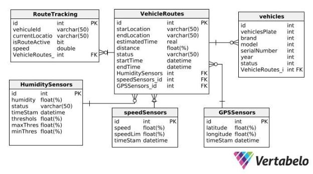

3. **Bounded Context: Shipment** 

   El bounded context de envíos gestiona el seguimiento de paquetes, asignaciones de transporte, costos asociados y destinos de entrega, permitiendo una trazabilidad eficiente de la carga dentro del sistema. 

1. **Domain Layer** 

**Aggregate 1: Packet** 

|**Nombre** |**Categoría** |**Descripción** |
| - | - | - |
|Packet |Aggregate |Representa un paquete siendo transportado, incluyendo detalles como el estado, destino y asignación a vehículos. |

**Attributes** 

|**Nombre** |**Tipo de dato** |**Visibilidad** |**Descripción** |
| - | :- | - | - |
|id |UUID |Private |Identificador único del paquete. |
|destination |String |Private |Dirección de destino del paquete. |
|weight |Float |Private |Peso del paquete, necesario para calcular el costo de transporte. |
|status |String |Private |Estado del paquete (pendiente, en tránsito, entregado, etc.). |
|deliveryDate |Date |Private |Fecha de entrega del paquete, si ya fue entregado. |
|vehicleAssigne d |Vehicle |Private |Vehículo asignado al transporte del paquete. |

**Methods** 

|**Nombre** |**Tipo de retorno** |**Visibilidad** |**Descripción** |
| - | - | - | - |

|assignVehicle |Void |Public |Asigna un vehículo al paquete. |
| - | - | - | - |
|updateStatus |Void |Public |Actualiza el estado del paquete (en tránsito, entregado, etc.). |
|calculateShipping Cost |Float |Public |Calcula el costo de envío basado en el peso, distancia y otros parámetros del paquete. |

**Value Object : Items** 

|**Nombre** |**Categoría** |**Descripción** |
| - | - | - |
|Items |Value Object |Representa los artículos dentro de un paquete, tales como producto, cantidad, valor, etc. |

**Attributes** 

|**Nombre** |**Tipo de dato** |**Visibilidad** |**Descripción** |
| - | :- | - | - |
|id |UUID |Private |Identificador único del item. |
|itemName |String |Private |Nombre del artículo dentro del paquete. |
|quantity |Integer |Private |Cantidad de artículos en el paquete. |
|value |Float |Private |Valor del artículo, usado para estimar el seguro o el valor del paquete. |
|description |String |Private |Descripción del ítem. |

**Methods** 

|**Nombre** |**Tipo de retorno** |**Visibilidad** |**Descripción** |
| - | - | - | - |
|calculateValue |Float |Public |Calcula el valor total de los artículos dentro del paquete (cantidad \* valor por artículo). |
|updateQuantity |Void |Public |Actualiza la cantidad de artículos en el paquete. |
|getItemName |String |Public |Devuelve el nombre del artículo. |

**Entity: HasShipped** 

|**Nombre** |**Categoría** |**Descripción** |
| - | - | - |
|HasShip ped |Entity |Relaciona un paquete con su estado de envío, incluyendo la fecha de envío y los detalles de seguimiento. |

**Attributes** 

|**Nombre** |**Tipo de dato** |**Visibilidad** |**Descripción** |
| - | :- | - | - |
|packetId |UUID |Private |ID del paquete que está siendo enviado. |
|shippingDate |Date |Private |Fecha en la que el paquete fue enviado. |
|trackingId |String |Private |Número de seguimiento del paquete |
|status |String |Private |Estado del envío (en tránsito, entregado, retrasado). |
|deadline |Date |Private |Tiempo límite para la entrega. |

**Methods** 

|**Nombre** |**Tipo de retorno** |**Visibilidad** |**Descripción** |
| - | - | - | - |
|updateShippingSt atus |Void |Public |Actualiza la cantidad de artículos en el paquete. |
|getShippingDetail s |String |Public |Obtiene los detalles completos del envío (fecha, estado, trackingId). |

**Entity: TransportationCost** 

|**Nombre** |**Categoría** |**Descripción** |
| - | - | - |
|Transpo rtationC ost |Entity |Representa el costo de transporte de un paquete, incluyendo tarifas basadas en peso, distancia, etc. |

**Attributes** 

|**Nombre** |**Tipo de dato** |**Visibilidad** |**Descripción** |
| - | :- | - | - |
|cost |Float |Private |Costo total del transporte del paquete. |
|weightFactor |Float |Private |Factor que depende del peso del paquete. |
|distanceFactor |Float |Private |Factor que depende de la distancia a recorrer. |
|costType |String |Private |Tipo de costo (pago por distancia, pago por peso, etc.). |

**Methods** 

|**Nombre** |**Tipo de retorno** |**Visibilidad** |**Descripción** |
| - | - | - | - |
|calculateCost |Float |Public |Calcula el costo de transporte basándose en el peso, distancia y tipo de costo. |
|updateCost |Void |Public |Actualiza el costo del transporte si ocurren cambios en los parámetros. |
|getCostDetails |String |Public |Devuelve un resumen detallado del costo de transporte. |

**Entity: Managers** 

|**Nombre** |**Categoría** |**Descripción** |
| - | - | - |
|Manage rs |Entity |Representa a los gestores responsables de la logística y seguimiento de los envíos. |

**Attributes** 

|**Nombre** |**Tipo de dato** |**Visibilidad** |**Descripción** |
| - | :- | - | - |
|id |UUID |Private |Identificador único del manager. |
|fullName |String |Private |Nombre del manager. |

|lastName |String |Private |Apellido del manager. |
| - | - | - | - |
|email |String |Private |Correo electrónico del manager. |
|phone |String |Private |Número de teléfono del manager. |
|assignedRoutes |List<Route > |Private |Rutas asignadas al manager para supervisar y gestionar. |

**Methods** 

|**Nombre** |**Tipo de retorno** |**Visibilidad** |**Descripción** |
| - | - | - | - |
|assignRoute |Void |Public |Asigna una ruta al manager. |
|updateManagerIn fo |Void |Public |Actualiza la información del manager, como su nombre o correo. |
|getManagerDetail s |String |Public |Devuelve los detalles del manager, incluyendo rutas y contacto. |

**Entity: Carriers** 

|**Nombre** |**Categoría** |**Descripción** |
| - | - | - |
|Carriers |Entity |Representa a los transportistas (empresas o individuos) encargados del transporte de los paquetes. |

**Attributes** 

|**Nombre** |**Tipo de dato** |**Visibilidad** |**Descripción** |
| - | :- | - | - |
|id |UUID |Private |Identificador único del transportista. |
|companyName |String |Private |Nombre de la empresa de transporte o nombre del transportista. |
|contactDetails |String |Private |Información de contacto (teléfono, correo, etc.). |
|vehicles |List<Vehic|Private |Lista de vehículos disponibles para el |

||le> ||transporte. |
| :- | - | :- | - |

**Methods** 

|**Nombre** |**Tipo de retorno** |**Visibilidad** |**Descripción** |
| - | - | - | - |
|assignVehicle |Void |Public |Asigna un vehículo al transportista para el transporte de paquetes. |
|updateCarrierInfo |Void |Public |Actualiza la información del transportista, como su nombre o datos de contacto. |
|getCarrierDetails |String |Public |Devuelve los detalles del transportista y los vehículos disponibles. |

2. **Interface Layer Controller 1: PacketController** 

|**Nombre** |**Categoría** |**Descripción** |
| - | - | - |
|PacketControll er |Controller |Controlador encargado de la gestión de paquetes, incluyendo la creación, modificación y consulta de los mismos. |

**Attributes** 

|**Nombre** |**Tipo de dato** |**Visibilidad** |**Descripción** |
| - | - | - | - |
|packetServi ce |PacketServic e |Private |Servicio de la capa de Aplicación para lógica de gestión paquetes. |
|packetMapp er |PacketMappe r |Private |Mapper para convertir entre DTOs y objetos usados por Application/Domain |

**Endpoints** 

|**Ruta** |**Método** |**Descripción** |
| - | - | - |

|/api/packets |POST |Crea un nuevo paquete en el sistema. |
| - | - | - |
|/api/packets/{id } |GET |Obtiene la información de un paquete específico por su ID. |
|/api/packets/{id } |PUT |Actualiza la información de un paquete existente. |

**Controller 2: ItemsController** 

|**Nombre** |**Categoría** |**Descripción** |
| - | - | - |
|ItemsController |Controller |Controlador encargado de gestionar los artículos dentro de los paquetes. |

**Attributes** 

|**Nombre** |**Tipo de dato** |**Visibilidad** |**Descripción** |
| - | - | - | - |
|itemsServic e |ItemsService |Private |Servicio de la capa de Aplicación para lógica de gestión de artículos dentro de los paquetes. |
|itemsMappe r |ItemsMapper |Private |Mapper para convertir entre DTOs y objetos usados por Application/Domain |

**Endpoints** 

|**Ruta** |**Método** |**Descripción** |
| - | - | - |
|/api/items |POST |Crea un nuevo artículo dentro de un paquete. |
|/api/items/{id} |GET |Obtiene la información de un artículo dentro de un paquete por su ID. |
|/api/items/{id} |PUT |Actualiza la información de un artículo dentro de un paquete. |

**DTOs** 

|**Nombre** |**Descripción** |
| - | - |
|RegisterPacketRequestDto |{ licensePlate: String, brand: String, model: String, status: String } |
|UpdatePacketRequestDto |{ packetId: UUID, licensePlate: String, brand: String, model: String, status: String } |
|PacketResponseDto |{ packetId: UUID, licensePlate: String, brand: String, model: String, status: String } |
|RegisterItemRequestDto |{ packetId: UUID, description: String, quantity: Integer, weight: Double } |
|UpdateItemRequestDto |{ itemId: UUID, packetId: UUID, description: String, quantity: Integer, weight: Double } |
|ItemResponseDto |{ itemId: UUID, description: String, quantity: Integer, weight: Double } |

3. **Application Layer Service 1: PacketService** 

|**Nombre** |**Categoría** |**Descripción** |
| - | - | - |
|PacketService |Servicio |Maneja la lógica de negocio relacionada con la creación, actualización, eliminación y consulta de paquetes. |

**Dependencies** 

|**Nombre** |**Tipo de Objeto** |**Visibilidad** |**Descripción** |
| - | :- | - | - |
|PacketReposito ry |Repositorio |Privada |Interfaz para interactuar con la base de datos de paquetes. |
|HasShippedSer vice |Servicio |Privada |Servicio que gestiona la información sobre el estado de los paquetes enviados. |

|Transportation CostService |Servicio |Privada |Servicio que calcula los costos asociados al transporte de paquetes. |
| :- | - | - | :- |

**Methods** 

|**Nombre** |**Tipo de dato** |**Visibilidad** |**Descripción** |
| - | - | - | - |
|createPacket |Packet |Público |Crea un nuevo paquete con los datos proporcionados. |
|updatePacket |Packet |Público |Actualiza los detalles de un paquete existente. |
|getPacketByI d |Packet |Público |Recupera un paquete por su ID. |
|deletePacket |Void |Público |Elimina un paquete dado su ID. |

**Service 2: ItemService** 

|**Nombre** |**Categoría** |**Descripción** |
| - | - | - |
|ItemService |Servicio |Maneja la lógica de negocio relacionada con los ítems de los paquetes, incluyendo la creación, actualización y consulta. |

**Dependencies** 

|**Nombre** |**Tipo de Objeto** |**Visibilidad** |**Descripción** |
| - | :- | - | - |
|ItemRepository |Repositorio |Privada |Interfaz para interactuar con la base de datos de ítems. |
|PacketService |Servicio |Privada |Servicio que gestiona la información relacionada con los paquetes. |

**Methods** 

|**Nombre** |**Tipo de dato** |**Visibilidad** |**Descripción** |
| - | - | - | - |
|createItem |Item |Público |Crea un nuevo ítem dentro de un paquete. |

|updateItem |Item |Público |Actualiza los detalles de un ítem existente. |
| - | - | - | - |
|getItemById |Item |Público |Recupera un ítem por su ID. |
|deleteItem |Void |Público |Elimina un ítem dado su ID. |

**Service 3: TransportationCostService** 

|**Nombre** |**Categoría** |**Descripción** |
| - | - | - |
|Transportatio nCostService |Servicio |Calcula los costos asociados al transporte de paquetes, considerando peso, distancia y otros factores. |

**Dependencies** 

|**Nombre** |**Tipo de Objeto** |**Visibilidad** |**Descripción** |
| - | :- | - | - |
|Transportation CostRepository |Repositorio |Privada |Interfaz para interactuar con la base de datos de costos de transporte. |
|PacketService |Servicio |Privada |Servicio que gestiona la información relacionada con los paquetes, necesaria para calcular los costos. |

**Methods** 

|**Nombre** |**Tipo de dato** |**Visibilidad** |**Descripción** |
| - | - | - | - |
|calculateTran sportationCos t |Double |Público |Calcula el costo de transporte de un paquete en base a distancia, peso y otros factores. |
|getCostByPa cketId |Double |Público |Obtiene el costo de transporte de un paquete dado su ID. |

**Service 4: CarrierService** 

|**Nombre** |**Categoría** |**Descripción** |
| - | - | - |
|CarrierServic e |Servicio |Gestiona la creación, actualización y consulta de los transportistas encargados de entregar los paquetes. |

**Dependencies** 

|**Nombre** |**Tipo de Objeto** |**Visibilidad** |**Descripción** |
| - | :- | - | - |
|CarrierReposito ry |Repositorio |Privada |Interfaz para interactuar con la base de datos de transportistas. |
|PacketService |Servicio |Privada |Servicio que gestiona la información de los paquetes asignados a los transportistas. |

**Methods** 

|**Nombre** |**Tipo de dato** |**Visibilidad** |**Descripción** |
| - | - | - | - |
|createCarrier |Carrier |Público |Crea un nuevo transportista. |
|updateCarrier |Carrier |Público |Actualiza los detalles de un transportista existente. |
|getCarrierByI d |Carrier |Público |Recupera un transportista por su ID. |
|deleteCarrier |Void |Público |Elimina un transportista dado su ID. |

4. **Infrastructure Layer PacketRepositoryImpl** 

|**Nombre** |**Categoría** |**Implementa** |**Descripción** |
| - | - | - | - |
|PacketRepo sitoryImpl |Repositori o |PacketRepositor y |Maneja el acceso y almacenamiento de los paquetes en la base de datos. |

**Funcionalidades clave:** 

- Busca paquetes por ID. 
- Guarda (inserta/actualiza) paquetes. 
- Elimina paquetes. 
- Lista todos los paquetes. 

**ItemRepositoryImpl** 

|**Nombre** |**Categoría** |**Implementa** |**Descripción** |
| - | - | - | - |
|ItemReposi toryImpl |Repositori o |ItemRepository |Maneja el acceso y almacenamiento de ítems de los paquetes. |

**Funcionalidades clave:** 

- Busca ítems por ID. 
- Guarda (inserta/actualiza) ítems. 
- Elimina ítems. 
- Lista ítems por ID de paquete. 

**TransportationCostRepositoryImpl** 

|**Nombre** |**Categoría** |**Implementa** |**Descripción** |
| - | - | - | - |
|Transportat ionCostRep ositoryImpl |Repositori o |TransportationC ostRepository |Administra los datos de costos de transporte asociados a los paquetes. |

**Funcionalidades clave:** 

- Busca costos de transporte por ID de paquete. 
- Guarda (inserta/actualiza) costos de transporte. 
- Lista todos los costos registrados. 

**CarrierRepositoryImpl** 

|**Nombre** |**Categoría** |**Implementa** |**Descripción** |
| - | - | - | - |
|CarrierRep|Repositori|CarrierReposito|Maneja el acceso y almacenamiento de |

|ositoryImpl |o |ry |transportistas. |
| - | - | - | - |

**Funcionalidades clave:** 

- Busca carriers por ID. 
- Guarda (inserta/actualiza) carriers. 
- Elimina carriers. 
- Lista todos los carriers. 

5. **Bounded Context Software Architecture Component Level Diagrams** 
5. **Bounded Context Software Architecture Code Level Diagrams** 
1. **Bounded Context Domain Layer Class Diagrams** 

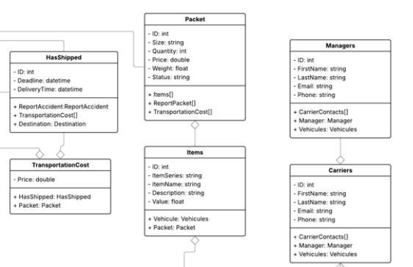

2. **Bounded Context Database Design Diagram** 
4. **Bounded Context: Analytics** 

   Este bounded context procesa, analiza y genera reportes basados en los datos de operación, como desempeño de los vehículos, incidentes, patrones de velocidad y envíos, proporcionando métricas e insights valiosos para la toma de decisiones. 

1. **Domain Layer** 

En la capa de dominio de contexto de “Analytics”, se encuentra el modelo de **Reporte**. Reporte representa todos los tipos de reporte y resultados de estos que se pueden acceder dentro de la aplicación. 

**Aggregate : Reporte** 

|Nombre |Categoría |Propósito |
| - | - | - |
|Reporte |Entity |Representa la gestión de reportes de la aplicación |

**Atributos** 

|Nombre |Tipo de dato |Visibilidad |Descripción |
| - | - | - | - |
|IDReporte |Long |Private |Identificador único del reporte generado |
|TipoReporte |Enum |Private |Tipo específico del reporte (Envío, Vehículo, Ruta, Otro). |
|Descripción |Text |Private |
Texto que describe detalles del incidente 

o evento reportado. 
|
|FechaCreación |LocalDateTi me |Private |Fecha y hora en que el reporte fue creado |
|EstadoReporte |Enum |Private |
Estado del reporte: creado correctamente 

o con error 
|
|ConductorID |Long |Private |Identificador del conductor que genera el reporte. |
|Ubicación |GeoPoint |Private |Coordenadas GPS donde ocurrió el evento (latitud, longitud). |

**Métodos:** 

|Nombre |Descripción |
| - | - |
|ReporteDeEnvioCreado |Se genera exitosamente un reporte relacionado a un envío asignado |
|ReporteDeVehiculoCreado |Se crea un reporte vinculado a un problema o característica del vehículo. |
|ReporteDeRutaCreado |Se registra un reporte sobre incidentes o irregularidades en la ruta |

|OtroTipoDeReporteCreado |Se genera un reporte que no pertenece a las categorías estándar. |
| - | :- |
|ErrorAlCrearReporte |Ocurre un fallo durante la creación del reporte (ej: validación o conectividad) |
|ReporteNotificadoAGerente |Se notifica exitosamente al gerente sobre la creación de un nuevo reporte. |

2. **Interface Layer** 

En la capa de interfaz, se crearon los controladores, que permiten la interacción entre la aplicación web y el sistema de reportes 

**Controller/Endpoints HTTP** 

|Endpoint HTTP |Método |Descripción  |
| - | - | - |
|/reportes/envio |POST |Recibe solicitud para crear un reporte de tipo Envío |
|/reportes/vehiculo |POST |Recibe solicitud para crear un reporte de tipo Vehículo |
|/reportes/ruta |POST |Recibe solicitud para crear un reporte de tipo Ruta |
|/reportes/otro |POST |Recibe solicitud para crear un reporte de tipo Otro |
|/reportes |GET |Permite consultar todos los reportes existentes (opcionalmente filtrados por tipo o fecha) |
|/reportes/{id} |GET |Permite consultar el detalle de un reporte específico |

**Request DTOs** 

|DTO |Descripción |
| - | - |
|CrearReporteRequestDTO |Contiene los datos necesarios para crear un reporte (tipo, descripción, ubicación opcional). |

|FiltroReporteRequestDTO |Contiene filtros opcionales para listar reportes (por tipo, fecha, estado, etc.). |
| - | :- |

**Response DTOs** 

|DTO |Descripción |
| - | - |
|ReporteResponseDTO |Contiene la información de un reporte (ID, tipo, descripción, fecha, estado, conductorID, ubicación). |
|ListaReportesResponseDTO |Contiene una lista paginada o completa de ReporteResponseDTO. |

3. **Application Layer** 

**Services** 

|Application Service |Metodo Publico |Descripción Breve |
| - | - | - |
|ReporteApplicationService |crearReporteEnvio(request) |Crea un nuevo reporte de tipo Envío. |
|ReporteApplicationService |crearReporteVehiculo(request) |Crea un nuevo reporte de tipo Vehículo. |
|ReporteApplicationService |crearReporteRuta(request) |Crea un nuevo reporte de tipo Ruta. |
|ReporteApplicationService |crearOtroTipoReporte(request) |Crea un nuevo reporte de tipo Otro. |
|ReporteApplicationService |obtenerReportePorId(id) |Obtiene el detalle de un reporte específico. |
|ReporteApplicationService |listarReportes(filtros) |Obtiene una lista de reportes, opcionalmente filtrada. |

4. **Infrastructure Layer** 

**Repositorio** 

|Componente |Descripción |
| - | - |
|ReporteRepositoryMySQLImpl |Implementa la persistencia de reportes usando MySQL (lectura y escritura). |

**Mapeadores** 

|Componente |Descripción |
| - | - |
|ReporteMapper |Convierte CrearReporteRequestDTO en Reporte (Aggregate) y viceversa para ReporteResponseDTO. |

**Conexion base de datos** 

|**Componente** |**Descripción breve** |
| - | - |
|**ConexionBaseDatosMySQL** |**Módulo de conexión y transacciones con el servidor MySQL** |

5. **Bounded Context Software Architecture Component Level Diagrams** 

6. **Bounded Context Software Architecture Code Level Diagrams** 
1. **Bounded Context Domain Layer Class Diagrams** 

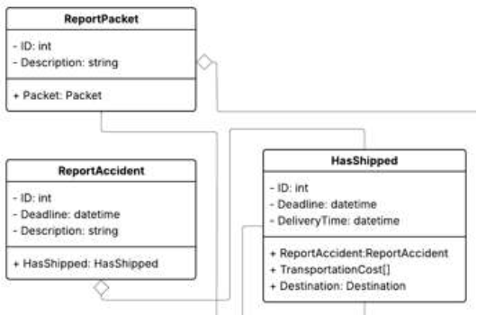

**4.2.4.6.2.  Bounded Context Database Design Diagram** 

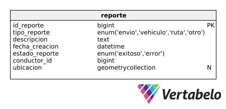

**Conclusiones** 

El sistema responde a una necesidad concreta del rubro de transporte: gestionar eficientemente conductores, vehículos, envíos y condiciones ambientales en tiempo real. Se planteó como solución una plataforma IoT centralizada que permite a los gerentes tener control operativo y a los conductores ejecutar tareas de forma organizada. 

Se aplicó Event Storming para identificar eventos clave, flujos de interacción y comandos del sistema. Esto permitió modelar el comportamiento del dominio de forma realista y alineada a los usuarios reales (Gerente y Conductor). 

Se optó por una solución monolítica para la primera versión, considerando que el tamaño del sistema y el equipo lo permitían. Sin embargo, se identificaron fronteras de contexto claras que podrían escalar a una arquitectura de microservicios si fuera necesario en el futuro. 

Con la arquitectura definida, los bounded contexts identificados y los diagramas generados, el equipo ya cuenta con una guía clara para comenzar el desarrollo técnico de cada módulo del sistema 

**Bibliografía** 

Berné, M. (2023, 8 marzo). Criterios de aceptación: ejemplos para elaborarlos. Blog. [https://www.scrummanager.com/blog/2023/03/criterios-de-aceptacion-definicion-y-ejemplos/ ](https://www.scrummanager.com/blog/2023/03/criterios-de-aceptacion-definicion-y-ejemplos/)

Conventional commits. (s. f.). Conventional Commits. [https://www.conventionalcommits.org/en/v1.0.0/ ](https://www.conventionalcommits.org/en/v1.0.0/)

Markdown - La guía definitiva en español. (2022, 14 febrero). Markdown.[ https://markdown.es/ ](https://markdown.es/)

Tune, N. (2018, 1 agosto). Domain-Driven Architecture Diagrams - Strategy, Architecture, Continuous Delivery, and DDD - Medium. Medium. 

**Anexos** 

Figma App Web:[ https://www.figma.com/file/UznJufoIMBwWow9ny8cXO5/Web- Application_BicasTeam?type=design&node- id=126%3A98&mode=design&t=QAcsG0V5XHFwF6rg-1 ](https://www.figma.com/file/UznJufoIMBwWow9ny8cXO5/Web-)

Figma Mobil:[ https://www.figma.com/file/gu0SdYkebsOKLB8p5YvOzL/BicasTeam- OpenSource?type=design&node-id=0%3A1&mode=design&t=nmvBnCRmQ5e71hnB-1 ](https://www.figma.com/file/gu0SdYkebsOKLB8p5YvOzL/BicasTeam-)

Figma Landing Page: [https://www.figma.com/design/oSwWYfZnNSnswDhg3Hj8Hi/BicasTeam- AppWeb?t=FCRbBKO45tcdatbn-1 ](https://www.figma.com/design/oSwWYfZnNSnswDhg3Hj8Hi/BicasTeam-AppWeb?t=FCRbBKO45tcdatbn-1)

PivotalTracker-ProductBacklo[g: https://www.pivotaltracker.com/projects/2700650 ](https://www.pivotaltracker.com/projects/2700650)

Link de Lucidchart:[ https://lucid.app/lucidchart/c3a56cf0-cb3f-4aa2-a9fb- b84400e5ec12/edit?viewport_loc=-11645%2C- 2705%2C13687%2C7929%2C0_0&invitationId=inv_c09779ac-741d-4f3e-9d56-15a2f9117ad9 ](https://lucid.app/lucidchart/c3a56cf0-cb3f-4aa2-a9fb-b84400e5ec12/edit?viewport_loc=-11645%2C-2705%2C13687%2C7929%2C0_0&invitationId=inv_c09779ac-741d-4f3e-9d56-15a2f9117ad9)
